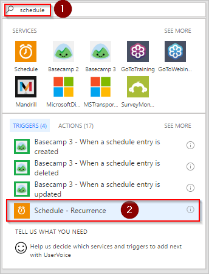
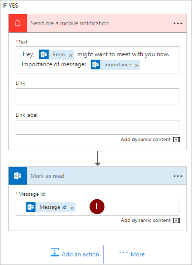

# Bir öğe listesini düzenli aralıklarla işlemek için Microsoft Flow’daki Her birine uygula eylemini kullanın.
Birçok tetikleyici, bir olaya (örneğin, gelen kutunuza yeni bir e-posta gelmesi) bağlı olarak anında akış başlatabilir. Bu tetikleyiciler kullanışlı olsa da bazen önceden tanımlanmış bir zamanlamaya göre bir veri kaynağını sorgulayan ve veri kaynağındaki öğelerin özelliklerine göre belirli eylemler gerçekleştiren bir akış çalıştırmak istersiniz. Bunu yapmak için akışınız bir zamanlamaya (günde bir kere gibi) göre başlatılabilir ve **Her birine uygula** gibi bir döngü eylemini kullanarak bir öğe listesini işleyebilir. Örneğin, **Her birine uygula** eylemini kullanarak bir veritabanından alınan kayıtları ya da Microsoft SharePoint’ten alınan bir öğe listesini güncelleştirebilirsiniz.

Bu kılavuzda, 15 dakikada bir çalışan ve aşağıdakini yapan bir akış oluşturacağız:

1. Office 365 Outlook Gelen Kutunuzdaki son 10 okunmamış iletiyi getirir.
2. 10 iletinin her birini denetleyerek konusunda **hemen toplanıyoruz** ifadesi geçip geçmediğini doğrular.
3. E-postanın müdürünüz tarafından ya da yüksek önem derecesiyle gönderilip gönderilmediğini denetler.
4. Konusunda **hemen toplanıyoruz** yazan ve müdürünüz tarafından ya da yüksek önem derecesiyle gönderilen tüm e-postaları okundu olarak işaretler ve bir anında iletme bildirimi gönderir.

Bu kılavuzda oluşturacağımız akışın ayrıntıları bu diyagramda gösterilmiştir:

## Önkoşullar
Bu kılavuzdaki adımların başarılı bir şekilde uygulanabilmesi için gereksinimler şunlardır:

* [Microsoft Flow](https://flow.microsoft.com)’u kullanmak için kayıtlı bir hesap.
* Bir Office 365 Outlook hesabı.
* [Android](https://aka.ms/flowmobiledocsandroid), [iOS](https://aka.ms/flowmobiledocsios) veya [Windows Phone](https://aka.ms/flowmobilewindows) için Microsoft Flow mobil uygulaması.
* Office 365 Outlook’a ve anında iletme bildirimi hizmetine bağlantı.

## Akış oluşturma
1. [Microsoft Flow](https://flow.microsoft.com)’da oturum açın:
2. **Akışlarım** sekmesini seçin ve boş bir akış oluşturun:
   
    
3. Zamanlamayla ilgili tüm hizmetleri ve tetikleyicileri bulmak için arama kutusuna "zamanlama" yazın.
4. Akışınızın bir sonraki adımda sağlayacağınız bir zamanlamaya göre çalıştırılacağını belirtmek için **Zamanlama - Yineleme** tetikleyicisini seçin:
   
    
5. Zamanlamayı her 15 dakikada bir çalışacak biçimde ayarlayın:
   
    
6. **+ Yeni adım**’ı seçip **Eylem ekle**’yi seçin ve sonra Microsoft Outlook ile ilgili tüm eylemleri aramak için arama kutusuna **outlook** yazın.
7. **Office 365 Outlook - E-postaları al** eylemini seçin:
   
    
8. Bunu yaptığınızda **E-postaları al** kartı açılır. **E-postaları al** kartını Gelen Kutusu klasörünün en üstündeki 10 okunmamış e-postayı seçecek şekilde yapılandırın. Ekler akışta kullanılmayacağından ekleri dahil etmeyin:
   
    
   
   > [!NOTE]
   > Bu noktada, gelen kutunuzdan bazı e-postaları getiren basit bir akış oluşturmuş oldunuz. Bu e-postalar bir dizi halinde döndürülür; **Her birine uygula** eylemi için bir dizi gerektiğinden, tam olarak ihtiyacınız olan şey de budur.
   > 
   > 

## Eylem ve koşul ekleme
1. **+ Yeni adım**’ı, **Diğer**’i ve sonra **Her birine uygula ekle** eylemini seçin:
   
    
2. **Her birine uygula** kartındaki **Önceki adımlardan bir çıkış seçin** kutusuna **Gövde** belirtecini ekleyin. Bu, **Her birine uygula** eyleminde kullanılacak e-postaların gövdelerini alır:
   
    
3. **Koşul ekle**’yi seçin:
   
    
4. **Koşul** kartını her e-postanın konusunda “hemen toplanıyoruz” sözcüklerini arayacak şekilde yapılandırın:
   
   * **Nesne Adı** kutusuna **Konu** belirtecini ekleyin.
   * **İlişki** listesinden **İçerir**’i seçin.
   * **Değer** kutusuna **hemen toplanıyoruz** yazın.
     
     
5. **Diğer**’i seçip **EVET İSE, HİÇBİR ŞEY YAPMA** dalından **Koşul ekle**’yi seçin. Bunu yaptığınızda **Koşul 2** kartı açılır. Bu kartı aşağıdaki gibi yapılandırın:
   
   * **Nesne Adı** kutusuna **Önem** belirtecini ekleyin.
   * **İlişki** listesinden **Eşittir**’i seçin.
   * **Değer** kutusuna **Yüksek** yazın.
     
     
6. **EVET İSE, HİÇBİR ŞEY YAPMA** bölümünden **Eylem ekle**’yi seçin. Bunu yaptığınızda açılan **Eylem seçin** kartında, arama koşulunun (yüksek önem derecesiyle gönderilen **hemen toplanıyoruz** e-postası) doğru olması durumunda gerçekleşmesi gereken eylemi tanımlayabilirsiniz:
   
    
7. **Bildirim** sözcüğünü arayın ve **Bildirimler - Bana mobil bildirim gönder** eylemini seçin:
   
    
8. **Bana mobil bildirim gönder** kartında, bir e-postanın konusu "hemen toplanıyoruz" ifadesini içeriyorsa gönderilecek anında iletme bildirimin ayrıntılarını sağlayın ve **Eylem ekle**’yi seçin:
   
    
9. Arama terimi olarak **okundu** yazın ve **Office 365 Outlook - Okundu olarak işaretle** eylemini seçin. Bunu yaptığınızda, anında iletme bildirimi gönderildikten sonra e-posta okundu olarak işaretlenir:
   
    
10. **Okundu olarak işaretle** kartının **İleti Kimliği** kutusuna **İleti Kimliği** belirtecini ekleyin. **İleti Kimliği** belirtecini bulmak için **Daha fazla görüntüle**’yi seçmeniz gerekebilir. Bu, okundu olarak işaretlenecek iletinin kimliğini belirtir:
    
     
11. **Koşul 2** kartına dönün ve **HAYIR İSE, HİÇBİR ŞEY YAPMA** dalında:
    
    * **Eylem ekle**’yi seçip arama kutusuna **yöneticiyi al** yazın.
    * Sonuç listesinden **Office 365 Kullanıcıları - Yöneticiyi al** eylemini seçin.
    * **Yöneticiyi Al** kartının **Kullanıcı** kutusuna *tam* e-posta adresinizi girin.
      
      
12. **Diğer**’i seçip **HAYIR İSE** dalından **Koşul ekle**’yi seçin. Bunu yaptığınızda **Koşul 3** kartı açılır. Kartı, e-postayı gönderenin e-posta adresinin (Kimden belirteci), müdürünüzün e-posta adresi (E-posta belirteci) ile aynı olup olmadığını denetleyecek şekilde yapılandırın:
    
    * **Nesne Adı** kutusuna **Kimden** belirtecini ekleyin.
    * **İlişki** listesinden **İçerir**’i seçin.
    * **Değer** kutusuna **E-posta** belirtecini girin.
      
      
13. **Koşul 3** kartının **EVET İSE, HİÇBİR ŞEY YAPMA** bölümünden **Eylem ekle**’yi seçin. Bunu yaptığınızda açılan **EVET İSE** kartında, arama koşulunun (müdürünüz tarafından gönderilen e-posta) doğru olması durumunda gerçekleşmesi gereken eylemi tanımlayabilirsiniz:
    
     
14. **Bildirim** sözcüğünü arayın ve **Bildirimler - Bana mobil bildirim gönder** eylemini seçin:
    
     
15. **Bana mobil bildirim gönder 2** kartında, e-posta müdürünüzden geldiyse gönderilecek anında iletme bildiriminin ayrıntılarını sağlayın ve **Eylem ekle**’yi seçin:
    
     
16. **Office 365 Outlook - Okundu olarak işaretle** eylemini ekleyin. Bunu yaptığınızda, anında iletme bildirimi gönderildikten sonra e-posta okundu olarak işaretlenir:
    
     
17. **Okundu olarak işaretle 2** kartına **İleti Kimliği** belirtecini ekleyin. **İleti Kimliği** belirtecini bulmak için **Daha fazla görüntüle**’yi seçmeniz gerekebilir. Bu, okundu olarak işaretlenecek iletinin kimliğini belirtir:
    
     
18. Akışınızı adlandırın ve sonra oluşturun:
    
     

Buraya kadar iyi takip ettiyseniz, akışınız şu diyagrama benzemelidir:

## Akışı çalıştırma
1. Kendinize, konusunda **hemen toplanıyoruz** yazan yüksek önem dereceli bir e-posta gönderin (veya kuruluşunuzdaki bir kişiden böyle bir e-posta göndermesini isteyin).
2. E-postanın gelen kutunuzda ve okunmamış olduğunu doğrulayın.
3. Microsoft Flow’da oturum açın, **Akışlarım**’ı ve sonra **Şimdi çalıştır**’ı seçin:
   
    
4. Akışı gerçekten çalıştırmak istediğinizi onaylamak için **Akışı çalıştır**’ı seçin:
   
    
5. Birkaç dakika sonra başarılı çalıştırma işleminin sonuçlarını görmeniz gerekir:
   
    

## Çalıştırma işleminin sonuçlarını görüntüleme
Artık akışı başarıyla çalıştırdığınıza göre mobil cihazınızda anında iletme bildirimini almanız gerekir.

1. Mobil cihazınızda Microsoft Flow uygulamasını açıp **Etkinlik** sekmesini seçin. Toplantıyla ilgili anında iletme bildirimini görürsünüz:
   
    
2. Bildirimin içeriğini tam olarak görmek için bildirimi seçmeniz gerekebilir. Bildirimin aşağıdakine benzeyen tam halini görürsünüz:
   
    
   
   > [!NOTE]
   > Anında iletme bildirimini almazsanız mobil cihazınızın çalışan bir veri bağlantısı olduğunu doğrulayın.
   > 
   > 

