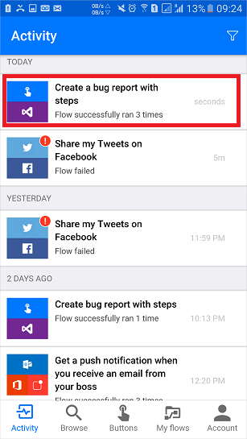

# Kullanıcı girişli düğme akışları tanıtımı
Rutin görevleri yalnızca bir düğmeye dokunarak çalıştırmak için düğme akışı oluşturun. Kullanıcıya akış çalıştırıldığında kullanılacak belirli ayrıntıları sağlama izni vererek akışınızı özelleştirin. Bu konuda, kullanıcıdan giriş alan bir düğme akışı oluşturma ve sonra bu düğme akışını çalıştırma işlemleri gösterilerek kullanıcı girişinin nasıl sağlandığı vurgulanır.

Microsoft Flow web sitesinde veya Microsoft Flow mobil uygulamasında bir düğme akışı oluşturabilirsiniz. Bu konu için, web sitesini kullanacaksınız.

### Önkoşullar
* Microsoft Flow web sitesinde bir hesap.

## Şablonu açma
1. [Microsoft Flow web sitesinde](https://flow.microsoft.com) oturum açın, arama kutusuna **Visual Studio** yazın ve sonra Visual Studio ile ilgili tüm şablonları bulmak için arama simgesine tıklayın veya dokunun:
   
      
2. **Visual Studio’da Önceliği 2 olan bir Hata açın** şablonunu seçin:
   
      
3. **Bu şablonu kullan** düğmesini seçin:
   
      
   
    Bu şablon Visual Studio Team Services (VSTS) ve Anında iletme bildirimi hizmetlerini kullanır. Bu hizmetlere bağlantınız yoksa hizmetlerde oturum açmanız gerekir. **Oturum açın** düğmesi yalnızca bir hizmette oturum açmanız gerektiğinde görüntülenir.
4. Gerekli tüm hizmetlerde oturum açtıktan sonra, **Devam** düğmesini seçin:
   
      
5. (isteğe bağlı) Portalın üst tarafındaki kutuya istediğiniz bir ad girerek akışın adını değiştirin:
   
    

## Kullanıcı girişini özelleştirme
1. Tetikleyici kartında, **Düzenle**’yi seçin:
   
      
2. Özel giriş alanlarını eklemek üzere sayfayı genişletmek için **+** simgesini seçin:
   
    
3. Akışınız çalıştırıldığında kullanılabilir olmasını istediğiniz her özel alan için **Giriş başlığı** ve **Giriş açıklaması** girin.  
   
    Bu örnekte, bu akışı kullanan herkesin hatayı yeniden oluşturmak için gereken adımları girebilmesi ve hatanın önem derecesini değerlendirebilmesi amacıyla iki özel giriş alanı (**Hatayı yeniden oluşturma adımları** ve **Hatanın önem derecesi**) oluşturacaksınız:  
   
    

## Hatayı özelleştirme
1. **Yeni iş öğesi oluştur** kartının başlık çubuğuna dokunun:
   
      
2. VSTS ortamınız için uygun seçimleri yapın ve sonra **Düzenle**’yi seçin:
   
    Örneğin, **ornegim** yazarak ornegim.visualstudio.com’a bağlanın.
   
      
3. Bu kartın diğer alanlarını göstermek üzere **Gelişmiş seçenekleri göster**’i seçin:
   
      
4. İmleci **Hata başlığı** belirtecinin başına getirin ve sonra **Başlık** metin alanına "Önem Derecesi: " yazın.
5. İmleç hala başlık metin alanındayken, **Hata önem derecesi** belirtecini seçin ve sonra " -- " yazın.  
6. **Açıklama** metin alanında, imlecinizi **Hata açıklaması** belirtecinin hemen sonrasına getirin ve sonra yeni bir satır başlatmak için Enter tuşuna basın.
7. İmlecinizi yeni satıra yerleştirin ve sonra **Hatayı yeniden oluşturma adımları** belirtecini seçin:
   
    

## Anında iletme bildirimini özelleştirme
1. **Anında iletme bildirimi gönder** kartını genişletmek için başlık çubuğuna dokunun.
2. Dinamik içerik belirteçleri listesinde, **Daha fazla görüntüle**’yi seçin ve sonra **Bağlantı** metin alanına **URL** belirtecini ekleyin.
3. **Bağlantı etiketi** metin alanında, **Kimlik** belirtecini ekleyin:
   
      
4. Akışınızı oluşturmak için menüde **Akış oluştur**’a dokunun:    

## Akışınızı çalıştırma
Bu kılavuzda, az önce oluşturduğunuz düğme akışını çalıştırmak için Microsoft Flow mobil uygulamasını kullanacaksınız. Bir başlığı, açıklaması, yeniden oluşturma adımları ve önem derecesi olan bir hata oluşturmak için gereken tüm kullanıcı girişlerini sağlayacaksınız.  

1. Microsoft Flow mobil uygulamasında, **Düğmeler** sekmesine dokunun ve sonra **Adımlar ile hata raporu oluştur** düğmesine dokunun.
   
      
2. Raporladığınız hatanın başlığını girin ve sonra **İleri**’ye dokunun. Örnek:
   
      
3. Raporladığınız hatanın açıklamasını girin ve sonra **İleri**’ye dokunun. Örnek:
   
      
4. Raporladığınız hatayı yeniden oluşturma adımlarını girin ve sonra **İleri**’ye dokunun. Örnek:
   
      
5. Raporladığınız hatanın önem derecesini girin ve sonra **İleri**’ye dokunun.  
      
   
    Akış çalıştırılır.
6. (isteğe bağlı) Sonuçları göstermek için **Etkinlik** sekmesine dokunun.
   
      
7. (isteğe bağlı) Akış çalıştırmasının ayrıntılı sonuçlarını, **Yeni iş öğesi oluştur** adımına dokunarak görüntüleyebilirsiniz.
   
      

## Sonraki adımlar
* [Düğme akışları paylaşma](share-buttons.md)
* [Akışlar hakkında bilgi edinin](guided-learning/learning-introducing-flow.md)  
* [Düğme akışları hakkında bilgi edinin](introduction-to-button-flows.md)  
* [Tetikleyici belirteç içeren düğme akışları hakkında bilgi edinin](introduction-to-button-trigger-tokens.md)  

