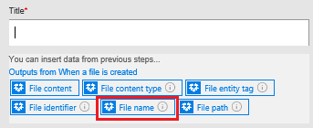
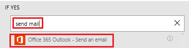
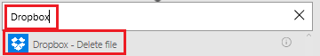
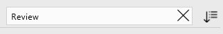

# Microsoft Flow'u ve Microsoft Common Data Service'ı kullanarak bir onay döngüsü oluşturma
Common Data Service, bilgilerin akıştan bağımsız olarak bir veritabanında depolandığı akışlar oluşturmanızı sağlayabilir. Bunun en iyi örneği onaylardır. Onay durumunu bir varlıkta depolarsanız, ek olarak akışınız da çalışabilir.

Bu örnekte, kullanıcının Dropbox'a dosya eklemesiyle başlayan bir onay işlemi oluşturacaksınız. Dosya eklendiğinde, dosya ile ilgili bilgiler bir uygulamada görüntülenir. Burada, gözden geçirenler değişikliği onaylayıp reddedebilir. Gözden geçiren, değişikliği onayladığında veya reddettiğinde bildirim e-postası gönderilir ve reddedilen dosyalar Dropbox'tan silinir.

Bu bölümdeki adımları uygulayarak şunları oluşturacaksınız:

* Dropbox'a eklenen her dosyayla ilgili bilgilerin yanı sıra, dosyaların durumuyla (onaylandı, reddedildi veya beklemede) ilgili bilgiler içeren bir **özel varlık**.
* Dropbox'a bir dosya eklendiğinde özel varlığa bilgi ekleyen, dosya onaylandığında veya reddedildiğinde e-posta gönderen ve reddedilen dosyaları silen bir **akış**. Bu adımlarda bir akışı sıfırdan nasıl oluşturacağınız gösterilmektedir ancak bir şablon kullanarak da buna benzer bir akış oluşturabilirsiniz.
* gözden geçirenin, Dropbox'a eklenen dosyaları onaylayıp reddedebileceği bir **uygulama**. Bu uygulamayı, özel varlıkta bulunan alanlara göre otomatik olarak oluşturmak için PowerApps'i kullanacaksınız.

**Önkoşullar**

* [Microsoft Flow](sign-up-sign-in.md)’a ve [PowerApps](https://powerapps.microsoft.com/tutorials/signup-for-powerapps/)'e kaydolun.
* [Bağlantılarınızı yönetme](https://powerapps.microsoft.com/tutorials/add-manage-connections/) bölümünde açıklanan şekilde, Dropbox ve Office 365 Outlook'a yönelik bağlantılar oluşturun.

## Varlığı oluşturma
1. [powerapps.com](https://web.powerapps.com)'da oturum açın.
2. Sol gezinti çubuğu varsayılan olarak görüntülenmezse sol üst köşede bulunan ve üç yatay çizgiden oluşan simgeye tıklayın veya dokunun.
   
    
3. Sol gezinti çubuğunda, **Yönet**'e ve ardından **Varlıklar**'a tıklayın veya dokunun.
   
    
4. İstenirse **Veritabanımı oluştur**'a tıklayın veya dokunun.
   
    
5. Sağ üst köşenin yakınında bulunan **Yeni varlık**'a tıklayın veya dokunun.
   
    
   
    Tarayıcı pencereniz ekranı kaplamıyorsa bu düğme farklı bir yerde görünebilir.
6. **Varlık adı** alanında, boşluk içermeyen ve veritabanınızdaki diğer varlık adlarından farklı bir ad belirtin.
   
    Bu örneği tümüyle uygulamak için, adı **ReviewDropboxFiles** olarak belirtin.
   
    
7. **Görünen ad** alanında bir kolay ad belirtin.
   
    
8. **İleri**'ye tıklayın veya dokunun.
   
    

## Varlığa alan ekleme
1. Sağ üst köşede bulunan **Alan ekle**'ye tıklayın veya dokunun.
   
    
2. Alanlar listesinin en altında görünen boş satırda, **Approver** alanının özelliklerini ayarlayın. (Bu özellikleri ayarladıktan sonra Tab tuşuna basarak bir sonraki sütuna geçebilirsiniz.)
   
   * **Görünen Ad** sütununa **Approver** (Onaylayan) yazın.
   * **Ad** sütununa **ApproverEmail** (Onaylayan E-postası) yazın.
   * **Tür** sütununda **Email** (E-posta) seçeneğine tıklayın veya dokunun.
   * **Gerekli** sütununda onay kutusunu seçin.
     
     
3. Bir sonraki satırda, **Status** (Durum) alanının özelliklerini ayarlayın:
   
   * **Görünen Ad** sütununa **Status** (Durum) yazın.
   * **Ad** sütununa **Status** (Durum) yazın.
   * **Tür** sütununda, **Text** (Metin) seçeneğine tıklayın veya dokunun.
   * **Özellikler** sütununda varsayılan değeri bırakın.
   * **Gerekli** sütununda onay kutusunu seçin.
     
     
4. Bir sonraki satırda, **FileID** (Dosya kimliği) alanının özelliklerini ayarlayın:
   
   * **Görünen Ad** sütununa **File identifier** (Dosya tanımlayıcısı) yazın.
   * **Ad** sütununa **FileID** (Dosya kimliği) yazın.
   * **Tür** sütununda, **Text** (Metin) seçeneğine tıklayın veya dokunun.
   * **Özellikler** sütununda varsayılan değeri bırakın.
   * **Benzersiz** sütununda onay kutusunu seçin.
   * **Gerekli** sütununda onay kutusunu seçin.
     
     
5. **FileID** (Dosya kimliği) alanı için sağ kenardaki üç noktaya (...) ve ardından **Başlık alanı olarak ayarla**'ya tıklayın veya dokunun.
   
    
6. Sol alt köşedeki **Oluştur**'a tıklayın veya dokunun.
   
    
7. (isteğe bağlı) Varlıklar listesi yeniden görüntülendiğinde, ekranı kaplamıyorsa tarayıcı pencerenize ekranı kaplatın ve ardından **Tür** sütun başlığına tıklayın veya dokunun. Liste, özel varlıklar (az önce oluşturduğunuz varlık gibi) üstte görüntülenecek şekilde sıralanır.

## Oturum açma ve akış oluşturma
1. [Microsoft Flow portalını](https://flow.microsoft.com) açın.
2. Ekranı kaplamıyorsa, tarayıcı pencerenize ekranı kaplatın ve ardından sağ üst köşede bulunan **Oturum aç**'a tıklayın veya dokunun.
   
    
3. Sağ üst köşedeki menüden, powerapps.com’da veritabanını oluşturduğunuz ortamı seçersiniz.
   
    **Not**: Aynı ortamı seçmezseniz varlığınızı göremezsiniz.
4. Sol üst köşenin yakınında bulunan **Akışlarım**'a tıklayın veya dokunun.
   
    
5. Sağ üst köşenin yakınında bulunan **Yeni akış oluştur**'a tıklayın veya dokunun.
   
    

## Dosya eklendiğinde başlama
1. **Daha fazla tetikleyici arayın** yazılı kutuya **Dropbox** yazın veya yapıştırın ve ardından **Dropbox - Bir dosya oluşturulduğunda**'ya tıklayın veya dokunun.
   
    
2. **Klasör** alanında klasör simgesine tıklayın veya dokunun ve ardından dosyaların ekleneceği klasöre göz atın.
   
    

## Varlığa veri ekleme
1. **Yeni adım**'a ve ardından **Eylem ekle**'ye tıklayın veya dokunun.
   
    
2. **Daha fazla eylem arayın** yazılı kutuya **Common Data Service** yazın veya yapıştırın, ardından **Common Data Service - Nesne oluştur**'a tıklayın ya da dokunun.
   
    
3. **The entity** (Varlık) alanına **Review** (Gözden geçir) yazın veya yapıştırın ve ardından **Review Dropbox files**'a.(Dropbox dosyalarını gözden geçir) tıklayın veya dokunun.
   
    
4. **Title** (Başlık) alanında, kutuya tıklayın veya dokunun ve ardından parametre belirteçleri listesindeki **Dosya adı**'na tıklayarak veya dokunarak bu belirteci alana ekleyin.
   
    
5. **Approver** (Onaylayan) alanına, dosyaları gözden geçirecek kişinin e-posta adresini yazın veya yapıştırın.
   
    **Not**: Akışı test etme işlemini daha kolay hale getirmek için kendi adresinizi belirtin. Bunu, daha sonra akış gerçek kullanım için hazır olduğunda değiştirebilirsiniz.
   
    
6. **Status** (Durum) alanına **Pending** (Beklemede) yazın veya yapıştırın.
   
    
7. **File identifier** (Dosya Tanımlayıcısı) alanında, kutuya tıklayın veya dokunun ve ardından parametre belirteçleri listesindeki **Dosya tanımlayıcısı**'na tıklayarak veya dokunarak bu belirteci alana ekleyin.
   
    

## Dosyanın gözden geçirilip geçirilmediğini denetleme
1. **Create object** (Nesne oluştur) eyleminin altında; **Yeni adım**'a, ardından **Daha fazla**'ya ve **Do until ekle**'ye tıklayın veya dokunun.
   
    
2. **Do until** eyleminin sol üst köşesinde, **Bir değer seçin** yazılı kutuya tıklayın veya dokunun.
   
    
   
    **Not**: Tarayıcı pencereniz ekranı kaplamıyorsa **Bir değer seçin** yazılı üst kutuya tıklayın veya dokunun.
3. **Create object çıkışları** (Nesne oluştur çıkışları) altında bulunan **Status**'a (Durum) tıklayarak veya dokunarak bu parametre belirtecini alana ekleyin.
   
    
4. **Do until** eyleminin ortasında bulunan listeyi açın ve ardından **eşit değildir**'e tıklayın veya dokunun.
   
    
5. **Do until** eyleminin sağ üst köşesinde, **Bir değer seçin** yazılı kutuya **Pending** (Beklemede) yazın veya yapıştırın.
   
    
   
    **Not**: Tarayıcı pencereniz ekranı kaplamıyorsa **Bir değer seçin** yazılı alt kutuya tıklayın veya dokunun.
6. **Do until** eyleminin altındaki **Eylem ekle**'ye tıklayın veya dokunun.
   
    
7. **Daha fazla eylem arayın** yazılı kutuya **Common** yazın ve ardından **Common Data Service - Nesne al**'a tıklayın veya dokunun.
   
    
8. **The namespace** (Ad alanı) alanında, veritabanınıza tıklayın veya dokunun.
9. **The entity** (Varlık) alanına **Review** (Gözden geçir) yazın veya yapıştırın ve ardından **Review Dropbox files**'a.(Dropbox dosyalarını gözden geçir) tıklayın veya dokunun.
   
    
10. **Object id** (Nesne kimliği) alanında, kutuya tıklayın veya dokunun ve ardından **Dosya tanımlayıcısı** parametre belirtecine tıklayarak veya dokunarak alana ekleyin.
    
     

## Öğenin onaylanıp onaylanmadığını denetleme
1. **Do-Until** eyleminin altında bulunan **Yeni adım**'a ve ardından **Koşul ekle**'ye tıklayın veya dokunun.
   
    
2. Koşulun sol üst köşesinde, **Bir değer seçin** yazılı kutuya tıklayın veya dokunun.
   
    
   
    **Not**: Tarayıcı pencereniz ekranı kaplamıyorsa **Bir değer seçin** yazılı üst kutuya tıklayın veya dokunun.
3. **Get object çıkışları** (Nesne al çıkışları) altında yer alan **Status** (Durum) parametre belirtecini alana eklemek için üzerine tıklayın veya dokunun.
   
    
4. Koşulun sağ üst köşesinde, **Bir değer seçin** yazılı kutuya **Approved** (Onaylandı) yazın veya kopyalayın.
   
    
   
    **Not**: Tarayıcı pencereniz ekranı kaplamıyorsa **Bir değer seçin** yazılı alt kutuya **Approved** (Onaylandı) yazın veya yapıştırın.

## Bildirim e-postası gönderme
1. **Evet ise, hiçbir şey yapma**'nın altında bulunan **Eylem ekle**'ye tıklayın veya dokunun.
   
    
2. **Daha fazla eylem arayın** yazılı kutuya **e-posta gönder** yazın veya yapıştırın ve ardından **Office 365 Outlook - E-posta gönder**'e tıklayın veya dokunun.
   
    
3. **Kime** alanına, bir öğe onaylandığında bildirim almasını istediğiniz kullanıcının adresini yazın veya yapıştırın.
   
    **Not**: Akışı test etme işlemini daha kolay hale getirmek için kendi adresinizi belirtin. Bunu, akış gerçek kullanım için hazır olduğunda değiştirebilirsiniz.
   
    
4. **Konu** altındaki kutuya tıklayın ve ardından **Dosya adı** parametre belirtecini alana eklemek için üzerine tıklayın veya dokunun.
   
    
5. **Gövde**'nin altına **Öğe onaylandı** yazın veya yapıştırın.
   
    
6. **Hayır ise, hiçbir şey yapma**'nın altında e-posta iletisinin gövdesini **Öğe reddedildi** olarak belirtmek dışında bu yordamın 1-5 adımlarını yineleyin.
   
    

## Reddedilen dosyaları silme
1. Reddetme e-postası alanları altındaki **Eylem ekle**'ye tıklayın veya dokunun.
   
    
2. **Daha fazla eylem arayın** yazılı kutuya **Dropbox** yazın veya yapıştırın ve ardından **Dropbox - Dosyayı sil**'e tıklayın veya dokunun.
   
    
3. **Dosya**'nın altındaki kutuya tıklayın veya dokunun ve ardından **Dosya tanımlayıcısı** parametre belirtecini alana eklemek için üzerine tıklayın veya dokunun.
   
    

## Akışı kaydetme
1. Ekranın üstünde, oluşturmakta olduğunuz akış için bir ad yazın veya yapıştırın ve ardından **Akış Oluştur**'a tıklayın veya dokunun.
   
    
2. **Kapat**'a ve ardından **Bitti**'ye tıklayın veya dokunun.
3. Dropbox'ta belirttiğiniz klasöre, biri onayı diğeri ise reddi test etmek için kullanılacak şekilde en az iki dosya ekleyin.

## Uygulamayı oluşturma
1. [powerapps.com](https://web.powerapps.com)'da oturum açın ve ardından sol gezinti çubuğunun altında bulunan **Yeni uygulama**'ya tıklayın veya dokunun.
   
    
2. Görüntülenen iletişim kutusunda, Windows için PowerApps Studio veya Web için PowerApps Studio'dan birini açma seçeneğine tıklayın veya dokunun.
3. Windows için PowerApps Studio'yu açtıysanız sol gezinti çubuğunda.bulunan **Yeni**'ye tıklayın veya dokunun.
4. **Verilerinizden uygulama oluşturun** altında, **Common Data Service** kutucuğunda bulunan **Telefon düzeni**'ne tıklayın veya dokunun.
   
    
5. **Search** (Ara) kutusuna **Review** (Gözden geçir) yazın veya yapıştırın.
   
    
6. **Choose an entity** (Varlık seçin) altında, **Review Dropbox Files**'a (Dropbox Dosyalarını Gözden Geçir) tıklayın veya dokunun.
   
    
7. Sağ alt köşenin yakınında bulunan **Connect**'e (Bağlan) tıklayın veya dokunun.
   
    
8. Tanıtım turunun açılış ekranı görüntülenirse PowerApps'i daha yakından tanımak için turu başlatın.(veya **Skip**'e (Atla) tıklayın veya dokunun).
   
    
   
    Sol üst köşenin yakınında bulunan soru işareti simgesine ve ardından **Take the intro tour**'a (Tanıtım turuna katıl) tıklayarak veya dokunarak tura daha sonra istediğiniz zaman katılabilirsiniz.
9. (isteğe bağlı) Ekranın alt kısmında bulunan kaydırıcıyı sürükleyerek uygulamayı daha kolay bir şekilde görebilirsiniz.
   
    

## Uygulamayı özelleştirme
1. Sağ gezinti çubuğunda, bir başlık ve açıklama içeren düzene tıklayın veya dokunun.
   
    
2. **BrowseScreen** alanında, daha büyük metin kutusu denetimini seçmek için arama çubuğunun tam altına tıklayın veya dokunun.
   
    
3. Sağ bölmede, daha altta bulunan listenin aşağı okuna tıklayarak veya dokunarak listeyi açın.
   
    
4. Daha altta bulunan listede, eklenen dosyaların dosya adlarını görüntülemek için **Title**'a (Başlık) tıklayın veya dokunun.
   
    
5. Sağ bölmede, daha üstte bulunan listeyi açın ve ardından her bir dosyanın durumunu görüntülemek için **Status**'a (Durum) tıklayın veya dokunun.
   
    

## Genel çözümü test etme
1. PowerApps'te, sol üst köşede bulunan oynat düğmesine tıklayarak veya dokunarak Önizleme modunu açın.
   
    
2. Listedeki ilk dosya ile ilgili ayrıntıları görüntülemek için oka tıklayın veya dokunun.
   
    
3. Sağ üst köşede, dosya ile ilgili ayrıntıları değiştirmek için kalem simgesine tıklayın veya dokunun.
   
    
4. **Status** (Durum) kutusuna **Approved** (Onaylandı) yazın veya yapıştırın.
   
    
5. Sağ üst köşede, değişikliklerinizi kaydedip ayrıntılar ekranına dönmek için onay işareti simgesine tıklayın veya dokunun.
   
    
   
    Birkaç dakika içinde dosyanın onaylandığını bildiren bir e-posta alırsınız.
6. Gözatma ekranına dönmek için sağ üst köşede bulunan geri düğmesine tıklayın veya dokunun.
   
    
7. Listedeki diğer dosya ile ilgili ayrıntıları görüntülemek için oka tıklayın veya dokunun.
   
    
8. Sağ üst köşede, dosya ile ilgili ayrıntıları değiştirmek için kalem simgesine tıklayın veya dokunun.
   
    
9. **Status** (Durum) kutusuna **Rejected** (Reddedildi) (veya **Aproved** ya da **Approoved** da dahil olmak üzere **Approved** (Onaylandı) dışında herhangi bir ifade) yazın veya yapıştırın.
   
    
10. Sağ üst köşede, değişikliklerinizi kaydedip ayrıntılar ekranına dönmek için onay işareti simgesine tıklayın veya dokunun.
    
     
    
     Birkaç dakika içinde dosyanın reddedildiğini ve dosyanın Dropbox'tan silineceğini belirten bir e-posta alırsınız.

