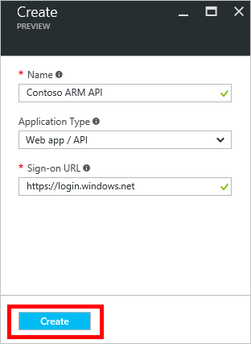

# Microsoft Flow’da Azure Active Directory’yi özel bağlayıcıyla kullanma
Azure Resource Manager (ARM), Azure’da bir çözümün bileşenlerini (veritabanları, sanal makineler ve web uygulamaları gibi bileşenler) yönetmenize olanak tanır. Bu öğreticide Azure Active Directory’de kimlik doğrulamasını etkinleştirme, ARM API’lerinden birini özel bağlayıcı olarak kaydetme ve sonra da bunu Microsoft Flow’a bağlama işlemleri gösterilir. Azure kaynaklarını bir akışın parçası olarak yönetmek istediğinizde, bu kullanışlı olabilir. ARM hakkında daha fazla bilgi için bkz. [Azure Resource Manager’a Genel Bakış](https://docs.microsoft.com/azure/azure-resource-manager/resource-group-overview).

## Önkoşullar
* Bir [Azure aboneliği](https://azure.microsoft.com/free/).
* Bir [Microsoft Flow hesabı](https://flow.microsoft.com).
* Bu öğreticide kullanılan [örnek OpenAPI dosyası](http://pwrappssamples.blob.core.windows.net/samples/AzureResourceManager.json).

## Azure Active Directory’de kimlik doğrulamasını etkinleştirme
İlk olarak, ARM API uç noktasını çağırırken kimlik doğrulamasını gerçekleştirecek bir Azure Active Directory (AAD) uygulaması oluşturmanız gerekir.

1. [Azure portalında](https://portal.azure.com) oturum açın.  Birden fazla Azure Active Directory kiracınız varsa sağ üst köşedeki kullanıcı adınıza bakarak doğru dizinde oturum açtığınızdan emin olun.
   
    
2. Soldaki menüde **Diğer hizmetler**’e tıklayın.  **Filtre** metin kutusuna **Azure Active Directory** yazın ve ardından **Azure Active Directory**’ye tıklayın.
   
    
   
    Azure Active Directory dikey penceresi açılır.   
3. Azure Active Directory dikey penceresindeki menüde **Uygulama kayıtları**’na tıklayın.
   
    
4. Kayıtlı uygulamalar listesinde **Ekle**’ye tıklayın.
   
       
5. Uygulamanız için bir ad girin, **Web uygulaması / API** seçeneğini işaretli durumda bırakın ve sonra **Oturum Açma URL’si** için `https://login.windows.net` yazın.  **Oluştur**’a tıklayın.  
   
    
6. Listede yeni uygulamaya tıklayın.
   
    
   
    Kayıtlı uygulama dikey penceresi açılır.  **Uygulama Kimliği**’ni not alın.  Daha sonra gerekli olacaktır.
7. Ayarlar dikey penceresi de açılmış olmalıdır.  Açılmadıysa **Ayarlar** düğmesine tıklayın.
   
    
8. Ayarlar dikey penceresinde **Yanıt URL'leri** öğesine tıklayın. URL listesine `https://msmanaged-na.consent.azure-apim.net/redirect` öğesini ekleyin ve **Kaydet**’e tıklayın.
   
    
9. Ayarlar dikey penceresine geri dönüp **Gerekli izinler**’e tıklayın.  Gerekli izinler dikey penceresinde **Ekle**’ye tıklayın.
   
    
   
    API erişimi ekle dikey penceresi açılır.
10. **API seçin**’e tıklayın. Açılan dikey pencerede Azure Hizmet Yönetim API'si ile ilgili seçeneğe ve **Seç**’e tıklayın.
    
    
11. **İzinleri seç**’e tıklayın.  *Temsilci izinleri* altında **Azure Hizmet Yönetimine kuruluş kullanıcıları olarak erişim** ve ardından **Seç**’e tıklayın.
    
    
12. API erişimi ekle dikey penceresinde **Bitti**’ye tıklayın.
13. Ayarlar dikey penceresine geri dönerek **Anahtarlar**’a tıklayın.  Anahtarlar dikey penceresinde anahtarınız için bir açıklama yazın, sona erme süresini seçin ve ardından **Kaydet**’e tıklayın.  Yeni anahtarınız görüntülenir.  Anahtar değerini not edin; bu da daha sonra gerekli olacak.  Azure portalını artık kapatabilirsiniz.
    
    

## Microsoft Flow'da bağlantı ekleme
Artık AAD uygulaması yapılandırıldığına göre, şimdi de özel bağlayıcıyı ekleyelim.

1. [Microsoft Flow web uygulamasında](https://flow.microsoft.com/) sayfanın sağ üst köşesindeki **Ayarlar** düğmesine tıklayın (dişli simgesiyle gösterilmiştir).  Ardından, **özel bağlayıcılara** tıklayın.
   
      
2. **Özel bağlayıcı oluştur**’a tıklayın.  
   
    API'nizin özellikleri sorulur.  
   
   | Özellik | Açıklama |
   | --- | --- |
   | Ad |Sayfanın üst kısmındaki **Adsız**’a tıklayın ve akışınıza bir ad verin. |
   | OpenAPI dosyası |[Örnek ARM OpenAPI dosyasına](http://pwrappssamples.blob.core.windows.net/samples/AzureResourceManager.json) göz atın. |
   | API simgesini karşıya yükleme |Simge için bir görüntü dosyası seçmek üzere **Karşıya Yükleme simgesine** tıklayın. Boyutu 1 MB’den az olan herhangi bir PNG veya JPG dosyasını kullanabilirsiniz. |
   | Açıklama |Özel bağlayıcınızın açıklamasını yazın (isteğe bağlı). |
   
      
   
    **Devam**’ı seçin.
3. OpenAPI dosyası kimlik doğrulaması için AAD uygulamamızı kullandığından, sonraki ekranda Flow’a uygulamamız hakkında bazı bilgiler vermemiz gerekiyor.  **İstemci kimliği** altında daha önce not aldığınız AAD **Uygulama Kimliğini** girin.  İstemci parolası için **anahtarı** kullanın.  Son olarak da **Kaynak URL’si** için `https://management.core.windows.net/` yazın.
   
   > [!IMPORTANT]
   > Kaynak URL’sini tam olarak yukarıdaki gibi sondaki eğik çizgiyle birlikte eklediğinizden emin olun.
   > 
   > 
   
    
   
    Güvenlik bilgilerini girdikten sonra, sayfanın en üstünde yer alan akış adının yanındaki onay işaretine (**&#x2713;**) tıklayarak özel bağlayıcıyı oluşturun.
4. Özel bağlayıcınız artık **özel bağlayıcılar** altında gösterilir.
   
      
5. Artık özel bağlayıcı kaydedildiğinden, uygulamalarınızda ve akışlarınızda kullanılabilmesi için bu özel bağlayıcıya bir bağlantı oluşturmalısınız.  Özel bağlayıcınızın adının sağındaki **+** öğesine tıklayın ve ardından oturum açma ekranını tamamlayın.

> [!NOTE]
> Örnek OpenAPI ARM işlemlerinin tümünü tanımlamaz ve şu anda yalnızca [Tüm abonelikleri listele](https://msdn.microsoft.com/library/azure/dn790531.aspx) işlemini içerir.  Bu OpenAPI dosyasını düzenleyebilir veya [çevrimiçi OpenAPI düzenleyicisini](http://editor.swagger.io/) kullanarak başka bir OpenAPI dosyası oluşturabilirsiniz.
> 
> Bu işlem AAD kullanılarak kimliği doğrulanmış herhangi bir RESTful API’sine erişim için kullanılabilir.
> 
> 

## Sonraki adımlar
Akış oluşturma hakkında daha ayrıntılı bilgi için bkz. [Microsoft Flow ile oluşturmaya başlama](get-started-logic-flow.md).

Özel bağlayıcılar hakkında soru sormak veya yorumda bulunmak için [topluluğumuza katılın](https://aka.ms/flow-community).

