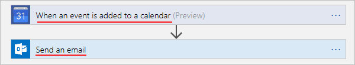

# <a name="openapi-extensions-for-custom-connectors-in-microsoft-flow"></a>Microsoft Flow’da özel bağlayıcılar için OpenAPI uzantıları
## <a name="introduction"></a>Giriş
Microsoft Flow, Azure Logic Apps veya Microsoft PowerApps için özel bağlayıcılar oluşturmak için, API’nizin işlem ve parametrelerini açıklayan, dilden bağımsız, makine tarafından okunabilir bir belge olan bir OpenAPI tanım dosyası sağlamanız gerekir. OpenAPI’nin kullanıma hazır işlevselliğinin yanı sıra, Logic Apps ve Flow için özel bağlayıcılar oluştururken bu OpenAPI uzantılarını da ekleyebilirsiniz:

* `summary`
* `x-ms-summary`
* `description`
* `x-ms-visibility`
* `x-ms-dynamic-values`
* `x-ms-dynamic-schema`

Bu uzantılar hakkında daha fazla ayrıntıyı aşağıda bulabilirsiniz:

<a name="summary"></a>

## <a name="summary"></a>özet
Eylem (işlem) için başlığı belirtir. </br>
Uygulandığı öğe: İşlemler </br>
Önerilen: `summary` için *tümce kullanımını* kullanın. </br>
Örnek: "Takvime bir olay eklendiğinde" veya "E-posta gönder"



``` json
"actions" {
  "Send_an_email": {
    /// Other action properties here...
    "summary": "Send an email",
    /// Other action properties here...
  }
},
```

## <a name="x-ms-summary"></a>x-ms-summary
Bir varlık için başlığı belirtir. </br>
Uygulandığı öğe: Parametreler, Yanıt Şeması </br>
Önerilen: `x-ms-summary` için *ilk harfler büyük* stilini kullanın. </br>
Örnek: "Takvim Kimliği", "Konu", "Olay Açıklaması" vb.


``` json
"actions" {
  "Send_an_email": {
    /// Other action properties here...
    "parameters": [ 
      {
        /// Other parameters here...
        "x-ms-summary": "Subject",
        /// Other parameters here...
      }
    ]
  }
},
```
<a name="description"></a>

## <a name="description"></a>açıklama
İşlemin işlevleri veya varlığın biçimiyle işlevi hakkında ayrıntılı bir açıklama belirtir. </br>
Uygulandığı öğe: İşlemler, Parametreler, Yanıt Şeması </br>
Önerilen: `description` için *tümce kullanımını* kullanın. </br>
Örnek: "Bu işlem takvime yeni bir etkinlik eklendiğinde tetiklenir", "E-postanın konusunu belirtin." vb.


``` json
"actions" {
  "Send_an_email": {
     "description": "Specify the subject of the mail",
     /// Other action properties here...
  }
},
```

<a name="visibility"></a>

## <a name="x-ms-visibility"></a>x-ms-visibility
Varlığın kullanıcıya sunulacak görünürlüğünü belirtir. </br>
Olası değerler: `important`, `advanced` ve `internal` </br>
Uygulandığı öğe: İşlemler, Parametreler, Şemalar

* `important` işlemleri ve parametreleri her zaman önce kullanıcıya gösterilir.
* `advanced` işlemleri ve parametreleri ek bir menü altında gizlenir.
* `internal` işlemleri ve parametreleri kullanıcıdan gizlenir.

> [!NOTE]
> `internal` ve `required` parametreler için, bu parametrelerin varsayılan değerini sağlamanız **gerekir**.
> 
> 

Örnek: **Daha fazla** menüsü ve **Gelişmiş seçenekleri göster** menüsü `advanced` işlemleri ve parametrelerini gizler.


``` json
"actions" {
  "Send_an_email": {
     /// Other action properties here...
     "parameters:": [
         {
           "name": "Subject",
           "type": "string",
           "description": "Specify the subject of the mail",
           "x-ms-summary": "Subject",
           "x-ms-visibility": "important",
           /// Other parameter properties here
         }
     ]
     /// Other action properties here...
  }
},
```

## <a name="x-ms-dynamic-values"></a>x-ms-dynamic-values
Kullanıcının bir işleme ilişkin giriş parametrelerini seçebilmesi için kullanıcıya doldurulmuş bir liste gösterir. </br>
Uygulandığı öğe: Parametreler </br>
Nasıl kullanılır: `x-ms-dynamic-values` nesnesini parametre tanımına ekleyin. Örneğin, bu [OpenAPI örneğine](https://procsi.blob.core.windows.net/blog-images/sampleDynamicSwagger.json) bakın.


### <a name="properties-for-x-ms-dynamic-values"></a>x-ms-dynamic-values için özellikler
| Ad | Gerekli veya isteğe bağlı | Açıklama |
| --- | --- | --- |
| **operationID** |Gerekli |Listeyi doldurmak için çağrılan işlem. |
| **value-path** |Gerekli |`value-collection` içinde parametrenin değerine başvuran nesnenin yol dizesi. `value-collection` belirtilmediyse, yanıt bir dizi olarak değerlendirilir. |
| **value-title** |İsteğe bağlı |`value-collection` içinde değerin açıklamasına başvuran nesnenin yol dizesi. `value-collection` belirtilmediyse, yanıt bir dizi olarak değerlendirilir. |
| **value-collection** |İsteğe bağlı |Yanıt yükünde nesne dizisini değerlendiren yol dizesi |
| **parametreler** |İsteğe bağlı |Özellikleri bir dynamic-values işlemini çağırmak için gereken giriş parametrelerini belirten nesne |

`x-ms-dynamic-values` içindeki özellikleri gösteren bir örneği aşağıda bulabilirsiniz:

``` json
"x-ms-dynamic-values": {
  "operationId": "PopulateDropdown",
  "value-path": "name",
  "value-title": "properties/displayName",
  "value-collection": "value",
  "parameters": {
     "staticParameter": "{value}",
     "dynamicParameter": {
        "parameter": "{value-to-pass-to-dynamicParameter}"
     }
  }
}
```

## <a name="example-all-the-openapi-extensions-up-to-this-point"></a>Örnek: Bu noktaya kadar olan tüm OpenAPI uzantıları
``` json
"/api/lists/{listID-dynamic}": {
    "get": {
        "description": "Get items from a single list - uses dynamic values and outputs dynamic schema",
        "summary": "Gets items from the selected list",
        "operationID": "GetListItems",
        "parameters": [
           {
             "name": "listID-dynamic",
             "type": "string",
             "in": "path",
             "description": "Select the list from where you want outputs",
             "required": true,
             "x-ms-summary": "Select List",
             "x-ms-dynamic-values": {
                "operationID": "GetLists",
                "value-path": "id",
                "value-title": "name"
             }
           }
        ]
    }
}
```

## <a name="x-ms-dynamic-schema"></a>x-ms-dynamic-schema
Geçerli parametre veya yanıt için şemanın dinamik olduğunu belirtir. Bu nesne bu alanın değeri tarafından tanımlanan, şemayı dinamik olarak keşfeden ve kullanıcı girişlerini toplamak veya kullanılabilir alanları göstermek için uygun kullanıcı arabirimini gösteren bir işlemi çağırabilir. 

Uygulandığı öğe: Parametreler, Yanıtlar

Nasıl kullanılır: `x-ms-dynamic-schema` nesnesini bir istek parametresine veya yanıt gövdesi tanımına ekleyin. Bir örnek için bu [OpenAPI örneğine](https://procsi.blob.core.windows.net/blog-images/sampleDynamicSwagger.json) bakın.

Bu örnekte, kullanıcının açılır listeden seçtiği öğeye bağlı olarak giriş formunun nasıl değiştiği gösterilmektedir:


Bu örnekte ise kullanıcının açılır listeden seçtiği öğeye bağlı olarak çıktıların nasıl değiştiği gösterilmektedir. Bu sürümde, kullanıcı "Otomobiller" öğesini seçer:


Bu sürümde, kullanıcı "Yemek" öğesini seçer:


### <a name="properties-for-x-ms-dynamic-schema"></a>x-ms-dynamic-schema için özellikler
| Ad | Gerekli veya isteğe bağlı | Açıklama |
| --- | --- | --- |
| **operationID** |Gerekli |Şemayı getirmek için çağrılan işlem |
| **parametreler** |Gerekli |Özellikleri bir dynamic-schema işlemini çağırmak için gereken giriş parametrelerini belirten nesne |
| **value-path** |İsteğe bağlı |Şemayı içeren özelliğe başvuran yol dizesi. </br>Belirtilmezse, yanıtın kök nesnesinin özelliklerindeki şemayı içerdiği varsayılır. |
|  | | |

Bir dinamik parametre örneği aşağıda bulabilirsiniz:

``` json
{
  "name": "dynamicListSchema",
  "in": "body",
  "description": "Dynamic schema for items in the selected list",
  "schema": {
    "type": "object",
    "x-ms-dynamic-schema": {
        "operationID": "GetListSchema",
        "parameters": {
          "listID": {
            "parameter": "listID-dynamic"
          }
        },
        "value-path": "items"
    }
  }
}
```

Bir dinamik yanıt örneği aşağıda bulabilirsiniz:

``` json
"DynamicResponseGetListSchema": {
   "type": "object",
   "x-ms-dynamic-schema": {
      "operationID": "GetListSchema",
      "parameters": {
         "listID": {
            "parameter": "listID-dynamic"
         }
      },
      "value-path": "items"
    }
}
```

## <a name="next-steps"></a>Sonraki adımlar
[Özel bağlayıcıyı kaydetme](register-custom-api.md).

[ASP.NET Web API’si kullanma](customapi-web-api-tutorial.md).

[Azure Resource Manager API’sini kaydetme](customapi-azure-resource-manager-tutorial.md).

