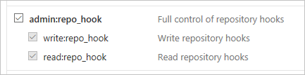

# <a name="use-webhooks-with-microsoft-flow"></a>Microsoft Flow ile web kancalarını kullanma
[Web kancaları](http://www.webhooks.org/) olay bildirimleri sağlamak için kullanılan basit HTTP geri aramalarıdır.  Microsoft Flow, akışları tetiklemek için web kancalarını kullanmanıza olanak sağlar.  Bu öğreticide web kancası tarafından tetiklenen bir akışın nasıl oluşturulduğu gösterilmektedir.

> [!NOTE]
> Web kancaları aracılığıyla bildirim gönderebilen bir hizmet örneği olarak GitHub kullanacağız, ancak burada gösterilen teknikler web kancaları kullanan herhangi bir hizmet için genişletilebilir.
> 
> 

## <a name="prerequisites"></a>Önkoşullar
Öğreticiyi tamamlamak için aşağıdakilere ihtiyacınız olacak:

* [Web kancaları](http://www.webhooks.org/) hakkında temel bilgiler.
* [OpenAPI Belirtimi](http://swagger.io/specification/) (Swagger) hakkında temel bilgiler.
* Bir [GitHub](https://www.github.com) hesabı.
* Bu öğretici için [örnek OpenAPI JSON dosyası](http://pwrappssamples.blob.core.windows.net/samples/githubWebhookSample.json).
* Alternatif olarak, OpenAPI dosyasını elle yazmak istemediğiniz durumlarda web kancası tetikleyicilerini tanımlamak için [tetikleyiciler kullanıcı arabirimini](customapi-webhooks.md#creating-webhook-triggers-from-the-ui) de kullanabilirsiniz.

## <a name="the-openapi-file"></a>OpenAPI dosyası
Web kancaları Microsoft Flow’da bir [özel bağlayıcı](register-custom-api.md) türü olarak uygulanır, bu nedenle web kancamızın şeklini tanımlamak için bir OpenAPI JSON dosyası sağlamamız gerekir.  OpenAPI, web kancasının çalışması açısından kritik olan üç tanım içerir:

1. Web kancasını oluşturma
2. API’den (bu durumda, GitHub) gelen kanca isteğini tanımlama
3. Web kancasını silme

### <a name="creating-the-webhook"></a>Web kancasını oluşturma
Web kancası GitHub tarafında `/repos/{owner}/{repo}/hooks` hedefinde bir HTTP POST tarafından oluşturulur.  OpenAPI’de tanımlanan tetikleyici kullanılarak yeni bir akış oluşturulduğunda veya tetikleyici her değiştirildiğinde Microsoft Flow’un bu URL’ye gönderim yapması gerekir.  Aşağıdaki örnekte, `post` özelliği GitHub’a gönderilecek istek şemasını içerir.

```json
"/repos/{owner}/{repo}/hooks": {
    "x-ms-notification-content": {
    "description": "Details for Webhook",
    "schema": {
        "$ref": "#/definitions/WebhookPushResponse"
    }
    },
    "post": {
    "description": "Creates a Github webhook",
    "summary": "Triggers when a PUSH event occurs",
    "operationId": "webhook-trigger",
    "x-ms-trigger": "single",
    "parameters": [
        {
        "name": "owner",
        "in": "path",
        "description": "Name of the owner of targetted repository",
        "required": true,
        "type": "string"
        },
        {
        "name": "repo",
        "in": "path",
        "description": "Name of the repository",
        "required": true,
        "type": "string"
        },
        {
        "name": "Request body of webhook",
        "in": "body",
        "description": "This is the request body of the Webhook",
        "schema": {
            "$ref": "#/definitions/WebhookRequestBody"
        }
        }
    ],
    "responses": {
        "201": {
        "description": "Created",
        "schema": {
            "$ref": "#/definitions/WebhookCreationResponse"
        }
        }
    }
    }
},
```

> [!IMPORTANT]
> `"x-ms-trigger": "single"` özelliği, Microsoft Flow’a bu web kancasını akış tasarımcısında kullanılabilir tetikleyiciler listesinde göstermesini bildiren bir şema uzantısı olduğundan, mutlaka dahil edilmelidir.
> 
> 

### <a name="defining-the-incoming-hook-request-from-the-api"></a>API’den gelen kanca isteğini tanımlama
Gelen kanca isteğinin şekli (GitHub’dan Microsoft Flow’a gelen bildirim), yukarıdaki örnekte gösterildiği gibi özel `x-ms-notification-content` özelliği içinde tanımlanır.  İsteğin tüm içeriğini içermesi gerekmez, yalnızca akışlarınızda kullanmak istediğiniz bölümler yeterlidir.

### <a name="deleting-the-webhook"></a>Web kancasını silme
OpenAPI’de Microsoft Flow’a web kancasının nasıl silineceğini bildiren bir tanım eklemek çok önemlidir.  Microsoft Flow, akıştaki tetikleyiciyi her güncelleştirdiğinizde veya akışınızı sildiğinizde web kancasını silmeyi dener.

```json
"/repos/{owner}/{repo}/hooks/{hook_Id}": {
    "delete": {
    "description": "Deletes a Github webhook",
    "operationId": "DeleteTrigger",
    "parameters": [
        {
        "name": "owner",
        "in": "path",
        "description": "Name of the owner of targetted repository",
        "required": true,
        "type": "string"
        },
        {
        "name": "repo",
        "in": "path",
        "description": "Name of the repository",
        "required": true,
        "type": "string"
        },
        {
        "name": "hook_Id",
        "in": "path",
        "description": "ID of the Hook being deleted",
        "required": true,
        "type": "string"
        }
    ]
    }
},
```

> [!IMPORTANT]
> Microsoft Flow’un bir web kancasını silebilmesi için API’nin web kancası oluşturulduğu zaman 201 yanıtında bir `Location` HTTP üst bilgisi içermesi **gerekir**.  `Location` üst bilgisi, HTTP DELETE ile kullanılacak web kancasının yolunu içermelidir.  Örneğin, GitHub’ın yanıtına eklenen `Location` şu biçimdedir: `https://api.github.com/repos/<user name>/<repo name>/hooks/<hook ID>`.
> 
> 

## <a name="authentication"></a>Kimlik doğrulaması
Microsoft Flow’a web kancası isteğini gönderen API, genellikle bir kimlik doğrulaması türüne sahiptir ve GitHub da buna dahildir.  Çeşitli kimlik doğrulaması türleri desteklenir.  Bu öğreticide, GitHub’ın kişisel erişim belirteçlerini kullanacağız.

1. Henüz yapmadıysanız [GitHub](https://www.github.com)’a gidin ve oturum açın.
2. Sağ üst köşede, **profil resminize** tıklayın ve ardından menüde **Ayarlar**’a tıklayın.
   
    
3. Soldaki menüde, **Geliştirici ayarları** altında, **Kişisel erişim belirteçleri**’ne tıklayın.
   
    
4. **Yeni belirteç oluştur** düğmesine tıklayın.
   
    
5. **Belirteç açıklaması** kutusuna bir açıklama girin.
6. **admin:repo_hook** onay kutusunu seçin.
   
    
7. **Belirteç oluştur** düğmesine tıklayın.
8. Yeni belirtecinizi not edin.
   
    
   
   > [!IMPORTANT]
   > Bu belirtece tekrar erişemeyeceksiniz. Öğreticinin sonraki adımlarında kullanmak üzere belirteci, Not Defteri gibi bir yere kopyalayıp yapıştırmanız gerekir.
   > 
   > 

## <a name="adding-the-webhook-to-microsoft-flow"></a>Web kancasını Microsoft Flow’a ekleme
Artık web kancasını özel bağlayıcı olarak Microsoft Flow’a eklemeye hazırız.

1. Henüz yapmadıysanız [Microsoft Flow web portalına](https://flow.microsoft.com) gidin ve oturum açın.
2. **Ayarlar** simgesine ve ardından **Özel Bağlayıcılar** seçeneğine tıklayın.
   
    
3. **Özel bağlayıcı oluştur** düğmesine tıklayın.
4. **OpenAPI’yi İçeri Aktar** kutusunda dosya klasörü simgesine tıklayın ve ardından örnek OpenAPI dosyasını seçin.
5. **Genel bilgiler** bölümünde **Karşıya simge yükle** bölümüne tıklayın ve ardından simge olarak kullanılacak bir görüntü dosyası seçin.
6. **Devam et**’e tıklayın.
   
    
7. Sonraki ekranda güvenlik ayarlarını yapılandıracağız.  **Kimlik doğrulaması türü** altında, **Temel kimlik doğrulaması**’nı seçin.
8. **Temel kimlik doğrulaması** bölümünde, etiket alanları için **Kullanıcı adı** ve **Parola** metnini girin.  Bunların yalnızca tetikleyici bir akışta kullanıldığı zaman görüntülenen etiketler olduğunu unutmayın.
   
    
9. Sayfanın üst kısmında, akışınıza bir ad verin ve **Bağlayıcı oluştur**’a tıklayın.
   
    

Yeni özel bağlayıcı artık özel bağlayıcılar sayfasındaki listede görünmelidir.

## <a name="creating-webhook-triggers-from-the-ui"></a>Kullanıcı arabiriminden web kancası tetikleyicileri oluşturma
1. Temel OpenAPI dosyanızı karşıya yükledikten / oluşturduktan sonra, özel bağlayıcı sihirbazının **Tanım** sekmesine gidin.
2. Sol taraftaki bölmede **+ Yeni tetikleyici**’ye tıklayın ve tetikleyicinizin açıklamasını doldurun. Bu örnekte, depodan bir çekme isteğinde bulunulduğunda başlatılan bir tetikleyici oluşturuyoruz.
   
    
3. Ardından, web kancası tetikleyicisini oluşturmak için isteği tanımlayın. Bunu yapmak için, örnek bir *web kancası tetikleyicisi oluşturma* isteği kullanabilirsiniz. Web kancası oluşturmak için [Github API başvurusuna](https://developer.github.com/v3/repos/hooks/#create-a-hook) bakın. 
4. Microsoft Flow standart ```content-type``` ile güvenlik üst bilgilerini otomatik olarak ekler; dolayısıyla örnekten içeri aktarırken bunları tanımlamamız gerekmez. 
   
    
5. Web kancası oluşturma isteğini içeri aktardıktan sonra, bir örnek yanıttan içeri aktararak web kancası yanıtını tanımlayacağız. Çekme isteği olayı için [Github API başvurusuna](https://developer.github.com/v3/activity/events/types/#pullrequestevent) bakın. 
   
    **Not**: Yanıtın tamamını yapıştırmanız gerekmez. Yalnızca ihtiyacınız olan alanlar tanımlanmalıdır.
   Bu örnekte, yalnızca PR url’sini ve PR’yi yapan kullanıcının bilgilerini ayıklıyoruz.
   
    
6. Son adım, web kancası oluşturma isteğinde, Microsoft Flow’un bir geri çağırma URL’si doldurması gereken değerde bir parametre seçmektir (Github’ın doldurması için). Bizim için bu, ```config``` nesnesindeki url özelliğidir.
   
    

## <a name="using-the-webhook-as-a-trigger"></a>Web kancasını tetikleyici olarak kullanma
Artık her şeyi yapılandırdığımıza göre web kancasını bir akışta kullanabiliriz.  GitHub depomuz her git push aldığında Microsoft Flow mobil uygulamasına anında iletme bildirimi gönderen bir akış oluşturalım.

1. [Microsoft Flow web portalında](https://flow.microsoft.com), sayfanın üst kısmında, **Akışlarım**’a tıklayın.
2. **Boş akış oluştur**’a tıklayın.
3. Microsoft Flow’un tasarımcısında, daha önce kaydettiğimiz özel bağlayıcıyı arayın.
   
    
   
    Tetikleyici olarak kullanmak için listedeki bir öğeye tıklayın.
4. Şu anda, bu özel bağlayıcıyı ilk kullanışımız olduğundan, API’ye bağlanmamız gerekiyor.  **Bağlantı adı** için, açıklayıcı bir ad girin.  **Kullanıcı adı** için, GitHub kullanıcı adınızı kullanın.  **Parola** için, önceden oluşturduğunuz **kişisel erişim belirtecini** kullanın.
   
    
   
    **Oluştur**’a tıklayın.
5. Şimdi Microsoft Flow’a izlemek istediğimiz depo hakkında bilgiler vermemiz gerekiyor.  Alanları OpenAPI dosyasındaki **WebhookRequestBody** nesnesinden tanıyabilirsiniz.  **Sahip** ve **depo** için, izlemek istediğiniz GitHub deposunun sahibini ve depo adını girin.
   
    
   
   > [!IMPORTANT]
   > Bu örnekte, [Visual Studio Code](https://code.visualstudio.com) deposunu kullanacağım. Hesabınızın, kullanma hakkına sahip olduğu bir depo kullanmalısınız.  Bunu yapmanın en kolay yolu kendi deponuzu kullanmaktır.
   > 
   > 
6. **+ Yeni adım**’a tıklayın ve ardından **Eylem ekle**’ye tıklayın.
7. **Anında iletme bildirimi** eylemini arayın ve seçin.
   
    
8. **Metin** alanına metin girin.  OpenAPI dosyasındaki **WebhookPushResponse** nesnesinin kullanabileceğiniz parametrelerin listesini tanımladığını unutmayın.
   
    
9. Sayfanın üst kısmında, akışa bir ad verin ve **Akış oluştur**’a tıklayın.
   
    

## <a name="verification-and-troubleshooting"></a>Doğrulama ve sorun giderme
Her şeyin doğru ayarlandığından emin olmak için, **Akışlarım**’a tıklayın ve ardından çalıştırma geçmişini görüntülemek üzere yeni akışın yanındaki **bilgi simgesine** tıklayın.  Web kancası oluşturmadan en az bir “Başarılı” çalıştırmayı görmüş olmanız gerekir.  Bu, web kancasının GitHub tarafında başarılı bir şekilde oluşturulduğunu gösterir.  Çalıştırma başarısız olduysa nedenini öğrenmek için çalıştırma ayrıntılarına inebilirsiniz.  Hata bir “404 Bulunamadı” yanıtı nedeniyle oluştuysa GitHub hesabınız kullandığınız, depo üzerinde web kancası oluşturmak için doğru izinlere sahip olmayabilir.

## <a name="summary"></a>Özet
Her şey doğru olarak yapılandırıldıysa, artık seçtiğiniz GitHub deposunda her git push gerçekleştiğinde Microsoft Flow mobil uygulamasında anında iletme bildirimleri alacaksınız.  Yukarıdaki süreci kullanarak web kancası özellikli herhangi bir hizmeti akışlarınızda tetikleyici olarak kullanabilirsiniz.

## <a name="next-steps"></a>Sonraki adımlar
* [Özel bağlayıcıyı kaydetme](register-custom-api.md).
* [ASP.NET Web API’si kullanma](customapi-web-api-tutorial.md).
* [Azure Resource Manager API’sini kaydetme](customapi-azure-resource-manager-tutorial.md).

