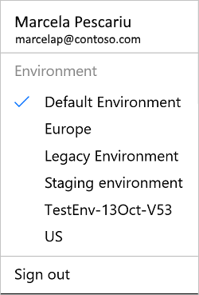

# Ortam seçme
[!INCLUDE [view-pending-approvals](includes/cc-rebrand.md)]

Bu makalede, akışları, ağ geçitlerini, bağlantılarınızı ve diğer kaynaklarınızı oluşturabileceğiniz ve güvenli bir şekilde ayırabilmeniz için kullanabileceğiniz **ortamlar** Microsoft Flow açıklanır.

Şunları öğreneceksiniz:

* Ortamların sağladığı özellikler.
* Ortamlar arasında geçiş yapma.
* Doğru ortamda akış oluşturma.

## Ortamlara genel bakış

Bir akış oluşturduğunuzda, akışı barındıracak bir ortam ve akışın kullandığı kaynakları seçersiniz. Farklı senaryolar için ayrı ortamlar kullanabilirsiniz.

## Ortamları kullanmaya yönelik bazı senaryolar aşağıda verilmiştir

Senaryon|Önerilen
-----|-----
Microsoft Common Data Service bağlantısını kullanan bir akış oluşturmak istiyorsunuz.|Akışınızı ve Common Data Service aynı ortama yerleştirin. Bu, tüm verilerin bu ortam içinde yalıtılması (yalıtım sınırı) sağlar.
Insan kaynakları departmanınız için bir akış oluşturuyorsunuz. Yalnızca Insan kaynakları departmanınızdaki kullanıcıların akışa erişimi olduğundan emin olmak istiyorsunuz.|Bir ortam oluşturun ve yalnızca ık kullanıcıları ekleyin. Akışı ve akışın kullandığı diğer kaynakları bu ortama yerleştirin.
Avrupa 'da SharePoint verilerini göstermek için akış kullanan kullanıcılar vardır.|Avrupa 'da bir ortam oluşturun ve ardından akışınızdan SharePoint bağlantısını oluşturun. Bu Avrupa ortamı, tüm kaynaklar Avrupa 'Da (veri konumu) yerel olduğundan Avrupa kullanıcılarına en iyi performansı verir.

Ortamları oluşturmak için bir Microsoft Flow yöneticisi olmanız gerekir. Ortamlara kimin erişimi olduğunu denetleyen yöneticiler. Ortamları oluşturma ve yönetme hakkında ayrıntılı bilgi için [ortamları yönetme](environments-overview-admin.md) konusuna bakın.

## Ortamları değiştirme

Microsoft Flow ortamlar arasında geçiş yapmayı kolaylaştırır. Ortamları değiştirdiğinizde yalnızca ilgili ortamda oluşturulan öğeleri görürsünüz; başka bir ortamdaki öğelere yönelik olarak görmezsiniz veya erişiminiz yok.

İşte bir örnek.

*Insan kaynakları* ortamında *yeniçalışan* adlı bir akış oluşturdunuz. [Microsoft Flow](https://flow.microsoft.com), *Satış* ortamını açarsınız. *Yeniçalışan* akışı listelenmez. *Yeniçalışan* akışını görmek Için *insan kaynakları* ortamını açın. Aynı kuralların bağlantılar, ağ geçitleri, akışlar ve daha fazlası dahil olmak üzere, ortamda oluşturduğunuz diğer tüm öğeler için de uygulandığını unutmayın.

Ortamları değiştirmek için şu adımları izleyin:

1. [Microsoft Flow](https://flow.microsoft.com)oturum açın.
1. Sağ üst köşede, profilinizi temsil eden bir görüntü görürsünüz.

   

1. Görüntüyü seçin. Açılan listede, size sunulan tüm ortamlar görüntülenir. Şu anda oturum açtığınız ortam işaretlendi:

   
1. Başka bir ortama geçiş yapmak için listeden bu ortamı seçin:

   
1. Microsoft Flow yeni ortama geçiş yapar.

## Doğru ortamda akış oluşturma

Bir akış oluşturmadan önce, akışını ve kaynaklarını ekleyeceğiniz ortamı seçin.

> [!NOTE]
> Yanlış ortamda bir akış oluşturursanız, onu silmeniz ve ardından doğru ortamda oluşturmanız gerekir.

Akışlarınızı barındırmak için bir ortam seçerken aşağıdaki faktörleri göz önünde bulundurun:

* Yalnızca varsayılan ortamda ağ geçitleri oluşturabilirsiniz. Bu nedenle, akışınızı şirket içi verilere bağlamak üzere bir ağ geçidi kullanmak istiyorsanız, varsayılan ortamı kullanmanız gerekir.
* Microsoft Common Data Service veritabanları belirli bir ortama bağlıdır. Bu nedenle, Common Data Service kullanan bir akış oluşturmak istiyorsanız, akışı veritabanını barındıran ortamda oluşturmanız gerekir.
* Kaynakları düzenleyebileceğiniz tüm ortamları görürsünüz. Ancak, bir yöneticiden akışları oluşturmak istediğiniz tüm ortamlara bir Oluşturucu olarak eklemesini istemeniz gerekir.

> [!NOTE]
> Her zaman varsayılan ortamda akış oluşturabilirsiniz.

## Sonraki adımlar

* [Şablondan akış oluşturma](get-started-logic-template.md)
* [Akış oluşturma](get-started-logic-flow.md)
* [Yöneticiler için ortama genel bakış](environments-overview-admin.md)
