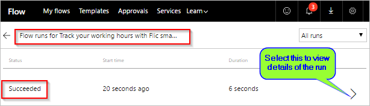

# Flic akıllı düğmesine basarak akışlarınızı çalıştırma (Önizleme)
Shortcut Labs’in Flic olarak bilinen fiziksel düğmesine basarak akışlarınızı tetikleyin. Örneğin, Flic düğmesine basarak çalışma saatlerinizi izleyebilir, takviminizi engelleyebilir, bir olayın ziyaretçilerini sayabilir veya coğrafi konumları kaydedebilirsiniz.

> [!IMPORTANT]
> Akışınızı oluşturmadan önce, Flic’in [Android](https://play.google.com/store/apps/details?id=io.flic.app) veya [iOS](https://itunes.apple.com/us/app/flic-app/id977593793?ls=1&mt=8) için mobil uygulamasını kullanarak tüm Flic özelliklerini yapılandırın.
> 
> 

## Önkoşullar
Flic’leri Microsoft Flow’la kullanmak için:

* [Microsoft Flow](https://flow.microsoft.com)’a erişiminiz olmalıdır.
* Flic'in [Android](https://play.google.com/store/apps/details?id=io.flic.app) veya [iOS](https://itunes.apple.com/us/app/flic-app/id977593793?ls=1&mt=8) mobil uygulamasını indirmiş ve bunu kullanarak bir veya birden çok Flic’i eşleştirmiş olmalısınız.

## Flic özelliklerini yapılandırma
Flic’in olaylarını programlamak için Flic'in mobil uygulamasını kullanın. Olaylar şunlardır:

* tıklama (bir kez hızla basma)
* çift tıklama (iki kez hızla basma)
* tutma (bir kez uzun basma)

Bu ekran görüntüsünde Flic yapılandırma işleminizin nasıl olabileceğine ilişkin bir örnek gösterilir:

Bir Flic olayını Microsoft Flow’a bağladıktan sonra, akışlarınızın tetikleyicisi olarak o Flic’i seçebilirsiniz. Bu yönergelerin ilerleyen bölümünde tetikleyicileri seçeceksiniz.

## Flic tarafından tetiklenen bir akış oluşturma
Bu yönergelerde, bir danışmanın her müşteride ne kadar zaman harcadığını kaydeden bir akış çalıştırmak için Flic kullanıyoruz. Danışman müşteriye geldiğinde Flic’e bir kez basıyor ve müşteriden ayrılmadan hemen önce yeniden basıyor. Flic’e her basıldığında, bağlantılı olduğunu akışın bir çalıştırması başlatılıyor. Akış, geçerli zamanı Google E-Tablolarına kaydediyor ve ardından bir e-posta bildirimi gönderiyor. E-posta, akış çalıştırması hakkındaki ayrıntıları içeriyor.

Not: Flic mobil uygulamasını kullandınız ve en az bir yapılandırma mutlaka **tıklayın** tetikleyici Microsoft Flow için eylem. Bu ekran görüntüsünde, Microsoft Flow’u tetiklemek için **tıklama** eylemini yapılandırdım. Bu yönergenin devamında akışımızı Flic’e bir kez basıldığında (tıklandığında) tetiklenecek şekilde yapılandırıyoruz.

   

Şimdi akışımızı oluşturmaya başlayalım.

### Şablonla başlama
1. [Microsoft Flow](https://flow.microsoft.com)'da oturum açın.
   
    
2. Arama kutusuna **flic** girin ve arama simgesini seçin.
   
    
3. **Flic akıllı düğmesiyle çalışma saatlerinizi izleme** şablonunu seçin.
   
    

### Google E-Tabloları’nda bir elektronik tablo oluşturma
1. Şablonun ayrıntılarını gözden geçirin ve bu şablon için Google E-Tabloları’nda bir elektronik tablo gerektiğine dikkat edin.
   
   
2. Google E-Tabloları’nda, **ClickType** ve **TimeStamp** adlı sütunların bulunduğu bir sayfa içeren bir elektronik tablo oluşturun.
   
      İpucu: Google e-tablolar, sütunlar, sütunun üst sütun adı girerek adlandırın. Bu durumda, sayfanız şu ekran görüntüsündeki gibi görünecektir:
   
   
   
   Not: Bu kılavuzda daha sonra bu sayfayı kullanırsınız.

### Flic tetikleyicisini akışınıza ekleme
1. Şablonun hizmetlerinde oturum açın ve **Devam**’ı seçin.
   
     Siz şablon için gerekli olan hizmetlerde oturum açtıktan sonra **Devam** seçeneği etkinleştirilir.
   
    
2. Arama kutusuna **flic** girin ve **Flic - Flic’e basıldığında** tetikleyicisini seçin.
   
    
3. **Flic - Flic’e basıldığında** kartındaki **Flic düğmesi** listesinde, kullanmak istediğiniz Flic’i seçin.
4. Flic’e bir kez basıldığında akışı tetiklemek istediğinizi belirtmek için **Olaylar** listesinde **tıklama** öğesini seçin.
   
    
   
   İsteğe bağlı olarak, her Flic olayının (tıklama, çift tıklama veya tutma) akışı tetikleyeceğini belirtmek için **herhangi biri** öğesini seçebilirsiniz.
   
   **Çift tıklama**, Flic’e hızla iki kez basıldığında akışın tetikleneceğini belirtir. **Tutma**, Flic’e uzun süre basıldığında akışın tetikleneceğini belirtir.
   
   Başka akışlar oluşturup bunları **Olaylar** listesindeki diğer olayları kullanarak tetikleme özgürlüğüne sahipsiniz. Örneğin, müşteriden ayrıldığınız saati kaydetmek için **çift tıklama** olayını kullanabilirsiniz.

### Sayfayı yapılandırın
   **Satır ekle** kartında:

1. **Dosya** listesinde, daha önce oluşturmuş olduğunuz elektronik tabloyu seçin.
2. **Çalışma Sayfası** listesinde, sayfayı seçin.
   
   Not: İki kutu görünmez **Satır Ekle** siz sayfayı seçtikten sonra kartı. Bu kutular, daha önce oluşturduğunuz sayfadaki iki sütunu temsil eder.
3. **ClickType** kutusunu ve sonra da **Tıklama türü** belirtecini seçin.
4. **Timestamp** kutusunu ve sonra da **Tıklama zamanı** belirtecini seçin.
   
    

### E-posta ayarlarının doğru olduğunu onaylama
1. **Bana e-posta bildirimi gönder** kartının bu ekran görüntüsündeki gibi göründüğünü onaylayın.
   
    

### Akışınızı kaydetme ve test etme
1. Akışınıza bir ad verin ve akışı kaydedin.
   
    

Buradaki adımları izlediyseniz, Flic’e bir kez basıldığında akış tetiklenir. Ardından akış, tıklama türünü ve geçerli zamanı sayfaya kaydeder ve size bir e-posta gönderir.

1. Flic’inize bir kez basın.
2. Google E-Tabloları’nda çalışma sayfanızı açın. **ClickType** ve **Timestamp** sütunlarının sırasıyla “tıklama” ve zaman bilgisiyle doldurulduğunu görüyor olmalısınız.
   
    
3. Çalıştırma sonuçlarını Microsoft Flow web sitesinde veya Microsoft Flow mobil uygulamasında da görebilirsiniz. İşte benim test çalıştırmamın ekran görüntüsü.
   
    
4. Akışın çalıştırılması sonucu aldığım bildirim e-postasının gövdesi de şöyle görünüyor.
   
    

İşi biraz daha ileri götürmek için, Flic’e basıldığındaki konumunuzu (enlem ve boylam) otomatik olarak kaydedecek şekilde akışın kapsamını genişletmeyi düşünebilirsiniz.

## Ek bilgi
* [Düğme akışları paylaşın](share-buttons.md).
* Düğme akışlarınız yürütüldüğünde güncel verilerin gönderilmesi için [düğme tetikleyici belirteçleri](introduction-to-button-trigger-tokens.md) kullanmayı öğrenin.
* [Android](https://aka.ms/flowmobiledocsandroid), [iOS](https://aka.ms/flowmobiledocsios) veya [Windows Phone](https://aka.ms/flowmobilewindows) için Microsoft Flow mobil uygulamasını yükleyin.

