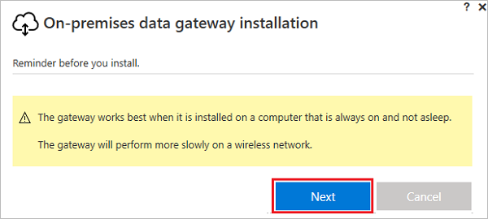

# <a name="understand-on-premises-data-gateways-for-microsoft-flow"></a>Microsoft Flow için şirket içi veri ağ geçitlerini anlama
Şirket içi veri ağ geçidini Microsoft Flow ile kullanarak Microsoft SQL Server gibi şirket içi veri kaynaklarınızla güvenli bağlantılar kurun.

## <a name="installation-and-configuration"></a>Yükleme ve yapılandırma
### <a name="prerequisites"></a>Önkoşullar
Minimum:

* [.NET Framework 4.5](http://www.microsoft.com/download/details.aspx?id=30653)
* Windows 7'nin veya Windows Server 2008 R2'nin 64 bit sürümü (veya sonraki bir sürüm)

Önerilen:

* 8 Çekirdek CPU
* 8 GB Bellek
* Windows Server 2012 R2’nin (veya sonraki bir sürüm) 64 bit sürümü

Dikkat edilmesi gereken noktalar:

* Etki alanı denetleyicisine ağ geçidi yükleyemezsiniz.
* İnternet’e bağlı olmayan, kapalı veya uyku modundaki bir bilgisayara (dizüstü bilgisayar gibi) ağ geçidi yüklememeniz gerekir.
* Kablosuz ağ üzerinde ağ geçidi performansı düşebilir.

## <a name="install-a-gateway"></a>Ağ geçidi yükleme
> [!IMPORTANT]
> Microsoft SharePoint veri ağ geçitleri artık HTTP ve HTTPS trafiğini destekler.
> 
> 

1. [Yükleyiciyi indirin](http://go.microsoft.com/fwlink/?LinkID=820931) ve çalıştırın.
   
    
2. Yükleme sihirbazının ilk ekranında, dizüstü bilgisayara ağ geçidi eklemeyle ilgili anımsatıcıyı kabul etmek için **İleri**’yi seçin.
   
    
3. Yükleme konumunu seçin.
4. Kullanım koşullarını ve gizlilik bildirimini kabul edin.
5. **Yükle**’yi seçin.
   
    
6. **Kullanıcı Hesabı Denetimi** iletişim kutularında, devam etmek için **Evet**’i seçin.
7. **Şirket içi veri ağ geçidi** ekranında, ağ geçidinde oturum açmak için kullanacağınız hesabın e-posta adresini girip **Oturum açın**’ı seçin ve oturum açma işlemini tamamlayın.
   
    

## <a name="register-new-gateway-or-take-over-existing-gateway"></a>Yeni ağ geçidini kaydetme veya mevcut ağ geçidini devralma
1. **Bu bilgisayara yeni bir ağ geçidi kaydedin** ya da **Mevcut bir ağ geçidini aktarın, yeniden yükleyin veya devralın**’ı ve sonra **İleri**’yi seçin.
   
    
2. Yeni bir ağ geçidi yapılandırmak için **Yeni şirket içi veri ağ geçidi adı** kutusuna bir ad girin, **Kurtarma anahtarı** kutusuna bir kurtarma anahtarı girin ve **Kurtarma anahtarını onaylayın** kutusuna aynı kurtarma anahtarını girin. **Yapılandır**’ı ve sonra **Kapat**’ı seçin.
   
    
3. En az sekiz karakter içeren bir kurtarma anahtarı belirtin ve bu kurtarma anahtarını güvenli bir yerde saklayın. Ağ geçidini aktarmak, geri yüklemek veya devralmak istediğinizde bu anahtara ihtiyaç duyarsınız.
4. Mevcut bir ağ geçidini aktarmak, geri yüklemek veya devralmak için ağ geçidinin adını ve kurtarma anahtarını sağlayın, **Yapılandır**’ı seçin ve sonra ek olarak istenen işlemlerin tümünü uygulayın.
   
    

## <a name="restart-the-gateway"></a>Ağ geçidini yeniden başlatma
Ağ geçidi, bir Windows hizmeti olarak çalışır ve diğer tüm Windows hizmetlerinde olduğu gibi, bir ağ geçidini başlatmanın ve durdurmanın birden fazla yolu vardır. Örneğin, ağ geçidinin çalıştırıldığı makinede yükseltilmiş izinlere sahip bir komut istemi açabilir ve şu komutlardan birini çalıştırabilirsiniz:

* Hizmeti durdurmak için şu komutu çalıştırın:
  
    ````net stop PBIEgwService````
* Hizmeti başlatmak için şu komutu çalıştırın:
  
    ````net start PBIEgwService````

## <a name="configure-a-firewall-or-proxy"></a>Güvenlik duvarını veya ara sunucuyu yapılandırma
Ağ geçidiniz için ara sunucu bilgisi sağlama hakkında bilgi edinmek için bkz.[Ara sunucu ayarlarını yapılandırma](https://powerbi.microsoft.com/documentation/powerbi-gateway-proxy/).

Bir PowerShell isteminden aşağıdaki komutu çalıştırarak, güvenlik duvarınız veya ara sunucunuzun bağlantıları engelleyip engellemediğini doğrulayabilirsiniz. Bu komut, Azure Service Bus bağlantısını test eder. Bu komut, yalnızca ağ bağlantısını test eder; bulut sunucu hizmetini veya ağ geçidini etkilemez. Makinenizin İnternet’e bağlı olup olmadığını belirlemenize yardımcı olur.

````Test-NetConnection -ComputerName watchdog.servicebus.windows.net -Port 9350````

Sonuçlar aşağıdaki çıkıştaki gibi görünmelidir. **TcpTestSucceeded** değeri *true* değilse bir güvenlik duvarı tarafından engelleniyor olabilirsiniz.

    ComputerName           : watchdog.servicebus.windows.net
    RemoteAddress          : 70.37.104.240
    RemotePort             : 5672
    InterfaceAlias         : vEthernet (Broadcom NetXtreme Gigabit Ethernet - Virtual Switch)
    SourceAddress          : 10.120.60.105
    PingSucceeded          : False
    PingReplyDetails (RTT) : 0 ms
    TcpTestSucceeded       : True

Daha kapsamlı bir test gerçekleştirmek istiyorsanız **ComputerName** ve **Port** değerlerini, bu konu başlığının ilerleyen kısımlarında ele alınacak olan **Bağlantı noktalarını yapılandırma** bölümünde listelenen değerler ile değiştirin.

Güvenlik duvarı, Azure Service Bus'tan Azure veri merkezlerine giden bağlantıları da engelliyor olabilir. Böyle bir durumda, bölgenizdeki tüm [IP adreslerini](https://www.microsoft.com/download/details.aspx?id=41653) ilgili veri merkezleri için güvenilenler listesine eklemeniz (engellemelerini kaldırmanız) gerekir.

## <a name="configure-ports"></a>Bağlantı noktalarını yapılandırma
Ağ geçidi, Azure Service Bus'a yönelik bir giden bağlantı oluşturur. Ağ geçidi, şu giden bağlantı noktaları üzerinden iletişim kurar: TCP 443 (varsayılan), 5671, 5672, 9350-9354. Ağ geçidi için gelen bağlantı noktaları gerekmez.

[Karma çözümler](https://azure.microsoft.com/documentation/articles/service-bus-fundamentals-hybrid-solutions/) hakkında daha fazla bilgi edinin.

| Etki alanı adları | Giden bağlantı noktaları | Açıklama |
| --- | --- | --- |
| *. analysis.windows.net |443 |HTTPS |
| *.login.windows.net |443 |HTTPS |
| *. servicebus.windows.net |5671-5672 |Gelişmiş İleti Sıraya Alma Protokolü (AMQP) |
| *. servicebus.windows.net |443, 9350-9354 |TCP üzerinden Service Bus Geçişi üstündeki dinleyiciler (Access Control belirteç alımı için 443 gerekir) |
| *.frontend.clouddatahub.net |443 |HTTPS |
| *. core.windows.net |443 |HTTPS |
| login.microsoftonline.com |443 |HTTPS |
| *. msftncsi.com |443 |Ağ geçidine erişilemiyorsa İnternet bağlantısını test etmek için kullanılır. |

Etki alanları yerine IP adreslerini güvenilir listeye eklemeniz gerekirse [Microsoft Azure Veri Merkezi IP aralıkları listesini](https://www.microsoft.com/download/details.aspx?id=41653) indirip kullanabilirsiniz. Bazı durumlarda, Azure Service Bus bağlantıları tam etki alanı adları yerine IP adresi ile oluşturulur.

## <a name="sign-in-account"></a>Oturum açma hesabı
Kullanıcılar bir iş veya okul hesabıyla oturum açar. Bu hesap, kuruluş hesabınızdır. Bir Office 365 teklifine kaydolup iş e-postanızı sağlamazsanız e-postanız nancy@contoso.onmicrosoft.com şeklinde görünebilir. Bulut hizmetindeki hesabınız, Azure Active Directory'deki (AAD) bir kiracı içinde depolanır. Çoğu durumda AAD hesabınızın UPN'si, e-posta adresiyle eşleşir.

## <a name="windows-service-account"></a>Windows Hizmeti hesabı
Şirket içi veri ağ geçidi, Windows hizmeti oturum açma kimlik bilgileri için *NT SERVICE\PBIEgwService*’i kullanacak şekilde yapılandırılır. Varsayılan olarak, bir hizmet gibi oturum açma hakkına sahiptir. Bu, ağ geçidini yüklediğiniz makine bağlamındadır.

Bu, şirket içi veri kaynaklarına bağlanmak için kullandığınız hesap veya bulut hizmetlerinde oturum açmak için kullandığınız iş ya da okul hesabı değildir.

## <a name="frequently-asked-questions"></a>Sık sorulan sorular
### <a name="general-questions"></a>Genel sorular
**Soru:** Ağ geçidi hangi veri kaynaklarını destekler?
**Cevap:**

* SQL Server
* SharePoint
* Oracle
* Informix
* Filesystem
* DB2

**Soru:** Buluttaki veri kaynakları için (ör. SQL Azure) bir ağ geçidi gerekir mi?
**Cevap:** Hayır. Ağ geçidi yalnızca şirket içi veri kaynaklarına bağlanır.

**Soru:** Asıl Windows hizmeti adı nedir?
**Cevap:** Hizmetlerde ağ geçidinin adı, **Power BI Enterprise Gateway Service**'tir.

**Soru:** Buluttan ağ geçidine yönelik herhangi bir gelen bağlantı var mı?
**Cevap:** Hayır. Ağ geçidi, Azure Service Bus'a yönelik giden bağlantıları kullanır.

**Soru:** Giden bağlantıları engellersem ne olur? Neyi açmam gerekir?
**Cevap:** Ağ geçidinin kullandığı [bağlantı noktalarına](gateway-reference.md#ports) ve konaklara göz atın.

**Soru:** Ağ geçidinin, veri kaynağıyla aynı makineye yüklenmesi gerekir mi?
**Cevap:** Hayır. Ağ geçidi, sağlanan bağlantı bilgilerini kullanarak veri kaynağına bağlanır. Bu bağlamda ağ geçitlerini, bir istemci uygulama gibi düşünebilirsiniz. Ağ geçidinin, yalnızca sağlanan sunucu adına bağlanabiliyor olması gerekir.

**Soru:** Ağ geçidinden veri kaynağına yönelik sorgu çalıştırma işlemi için gecikme süresi nedir? En iyi mimari nedir?
**Cevap:** Ağ üzerindeki gecikme süresini azaltmak için ağ geçidini veri kaynağına olabildiğince yakın yükleyin. Ağ geçidini, asıl veri kaynağı üzerine yükleyebilirseniz yaşayacağınız gecikme süresini en aza indirebilirsiniz. Veri merkezlerini de göz önünde bulundurun. Örneğin, hizmetiniz Batı ABD veri merkezini kullanıyorsa ve SQL Server'ınız bir Azure sanal makinesinde barındırılıyorsa, Azure sanal makinenizin de Batı ABD'de bulunmasını istersiniz. Bu sayede gecikme süresini en aza indirir ve Azure sanal makinesine ilişkin çıkış ücretlerinin önüne geçersiniz.

**Soru:** Ağ bant genişliği için herhangi bir gereksinim var mı?
**Cevap:** Ağ bağlantınız için iyi bir veri aktarım hızınızın olması önerilir. Her ortam birbirinden farklıdır ve gönderilen veri miktarı sonuçları etkiler. ExpressRoute, şirket içi ile Azure veri merkezleri arasında belirli düzeyde bir aktarım hızı elde etmenize yardımcı olur.

Aktarım hızınızı belirlemek için üçüncü taraf bir uygulama olan [Azure Speed Test uygulamasını](http://azurespeedtest.azurewebsites.net/) kullanabilirsiniz.

**Soru:** Windows ağ geçidi hizmeti, bir Azure Active Directory hesabı ile çalıştırılabilir mi?
**Cevap:** Hayır. Windows hizmetinin geçerli bir Windows hesabı olmalıdır. Hizmet, varsayılan olarak Hizmet SID'si (*NT SERVICE\PBIEgwService*) ile çalıştırılır.

**Soru:** Sonuçlar buluta nasıl gönderilir?
**Yanıt:** Sonuçlar Azure Service Bus kullanılarak gönderilir. Daha fazla bilgi edinmek için bu işlemin [nasıl gerçekleştiğine](gateway-reference.md#how-the-gateway-works) göz atın.

**Soru:** Kimlik bilgilerim nerede depolanır?
**Yanıt:** Bir veri kaynağı için girdiğiniz kimlik bilgileri, ağ geçidi bulut hizmetinde şifrelenir ve depolanır. Kimlik bilgilerinin şifresi, şirket içi ağ geçidinde çözülür.

### <a name="high-availabilitydisaster-recovery"></a>Yüksek kullanılabilirlik/olağanüstü durum kurtarma
**Soru:** Ağ geçidi ile yüksek kullanılabilirlik senaryolarını etkinleştirmeye yönelik herhangi bir plan var mı?
**Cevap:** Bu plan, yol haritamızda yer alıyor ancak henüz bir zaman çizelgesi hazırlamadık.

**Soru:** Olağanüstü durum kurtarma için hangi seçenekler kullanılabilir?
**Cevap:** Bir ağ geçidini geri yüklemek veya taşımak için kurtarma anahtarını kullanabilirsiniz.

**Soru:** Kurtarma anahtarının avantajı nedir?
**Yanıt:** Ağ geçidinizi aktarmanız veya geri yüklemeniz için bir yol sağlar.

### <a name="troubleshooting-questions"></a>Sorun giderme soruları
**Soru:** Ağ geçidi günlükleri nerede bulunur?
**Cevap:** Bu konu başlığının ilerleyen kısımlarında ele alınan [Araçlar](gateway-reference.md#tools) bölümüne göz atın.

**Soru:** Şirket içi veri kaynağına hangi sorguların gönderildiğini nasıl görebilirim?
**Cevap:** Sorgu izlemeyi etkinleştirip gönderilen sorguları görebilirsiniz. Sorun giderme tamamlandığında sorgu izleme seçeneğini özgün değerine döndürmeyi unutmayın. Sorgu izlemeyi etkin halde bırakmak, günlüklerin daha fazla yer tutmasına neden olur.

Veri kaynağınızda bulunan sorgu izleme araçlarına da bakabilirsiniz. Örneğin, SQL Server ve Analysis Services için Genişletilmiş Olaylar'ı veya SQL Profiler'ı kullanabilirsiniz.

## <a name="how-the-gateway-works"></a>Ağ geçidi nasıl çalışır?


Kullanıcı, şirket içi veri kaynağına bağlı bir öğe ile etkileşim kurduğunda:

1. Bulut hizmeti, veri kaynağı için şifrelenmiş kimlik bilgileri ile beraber bir sorgu oluşturur ve bu sorguyu ağ geçidinin işlemesi için kuyruğa gönderir.
2. Ağ geçidi bulut hizmeti sorguyu çözümler ve isteği [Azure Service Bus](https://azure.microsoft.com/documentation/services/service-bus/)'a gönderir.
3. Şirket içi veri ağ geçidi, Azure Service Bus'ı bekleyen istekler için yoklar.
4. Ağ geçidi sorguyu alır, kimlik bilgilerinin şifresini çözer ve bu kimlik bilgileri ile veri kaynaklarına bağlanır.
5. Ağ geçidi, yürütmesi için sorguyu veri kaynağına gönderir.
6. Sonuçlar, ağ geçidinden veri kaynağına ve ardından bulut hizmetine gönderilir. Daha sonra hizmet, bu sonuçları kullanır.

## <a name="troubleshooting"></a>Sorun giderme
### <a name="update-to-the-latest-version"></a>En son sürüme güncelleştirme
Ağ geçidi sürümü güncel olmadığında birçok sorun ortaya çıkabilir. Son sürümü kullandığınızdan emin olun.  Ağ geçidini yakın bir zamanda güncelleştirmediyseniz en son sürümü yükleyerek sorunun yeniden oluşup oluşmadığını deneyebilirsiniz.

#### <a name="error-failed-to-add-user-to-group---2147463168---pbiegwservice---performance-log-users---"></a>Hata: Kullanıcı gruba eklenemedi.  (-2147463168   PBIEgwService   Performance Log Users   )
Ağ geçidini bir etki alanı denetleyicisine yüklemeyi deniyorsanız bu hata ile karşılaşabilirsiniz. Bu, desteklenmeyen bir işlemdir. Ağ geçidini etki alanı denetleyicisi olmayan bir makineye yüklemeniz gerekir.

## <a name="tools"></a>Araçlar
### <a name="collecting-logs-from-the-gateway-configurator"></a>Ağ geçidi yapılandırıcısından günlük toplama
Ağ geçidi için birçok günlük toplayabilirsiniz. Her zaman günlükler ile başlayın!

1. Yükleyici günlükleri
   
    %localappdata%\Temp\On-premises_data_gateway_*.log
2. Yapılandırma günlükleri
   
    %localappdata%\Microsoft\on-premises data gateway\GatewayConfigurator*.log
3. Kurumsal ağ geçidi hizmeti günlükleri
   
    C:\Users\PBIEgwService\AppData\Local\Microsoft\on-premises data gateway\Gateway*.log
4. Olay günlükleri

**Şirket içi veri ağ geçidi hizmeti** olay günlükleri, **Uygulama ve Hizmet Günlükleri** altında bulunur.


### <a name="fiddler-trace"></a>Fiddler İzleme
[Fiddler](http://www.telerik.com/fiddler), Telerik tarafından geliştirilmiş, HTTP trafiğini izleyen ücretsiz bir araçtır.  İstemci makineden, Power BI hizmetiyle ilgili neler olup bittiğini görebilirsiniz. Burada hataları ve ilgili diğer bilgileri de görebilirsiniz.

