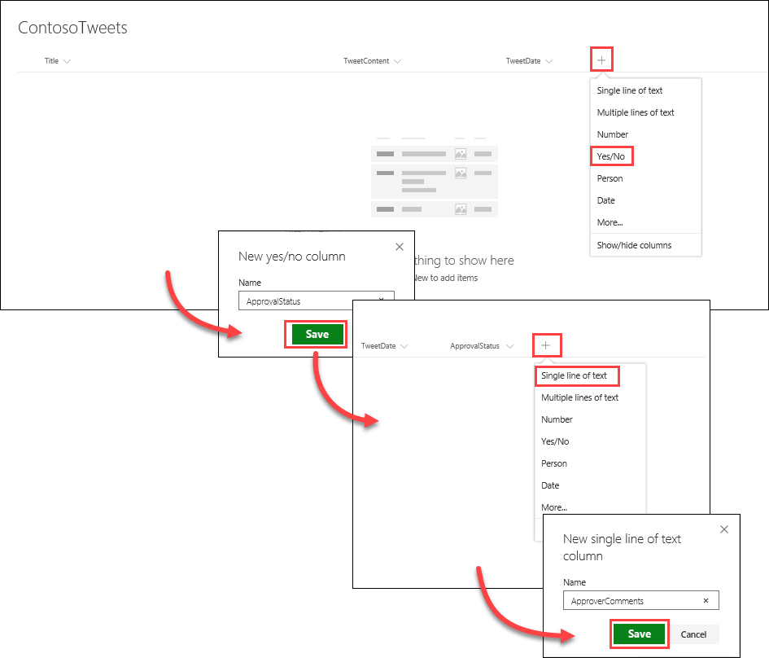
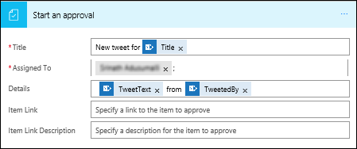
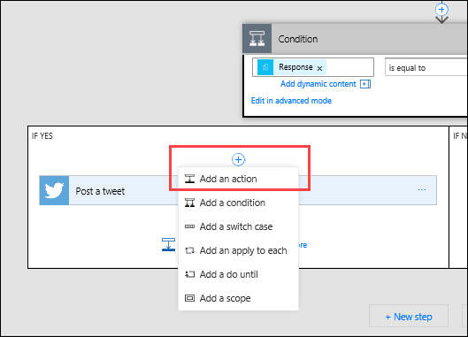
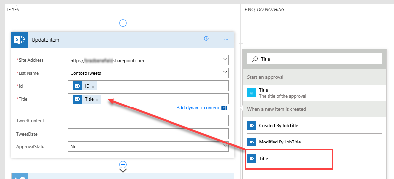

# Bir onay isteği oluşturma
Önceki konu başlıklarından birinde, Twitter akışınızı bir SharePoint listesi ile basit bir şekilde nasıl güçlendirebileceğinizi öğrendiniz. Bu konu başlığında, onayları kullanarak işletme ortamına yönelik senaryolar oluşturmayı öğreneceksiniz. Bu sayede, SharePoint listesine erişimi olan herkes tweetlerle katkıda bulunabilir ve sosyal medya ekibi bu tweetleri onaylayabilir veya reddedebilir. Hesabın ve müşterilere gönderilen tweetlerin denetimi ekip tarafından yapılır. 

## Bir onay isteği akışı oluşturma
1. **Microsoft Flow** giriş sayfasında önce **Onaylar** ve ardından **Onay akışı oluştur** seçeneğini belirleyip ardından aşağı kaydırarak **Onaydan sonra liste öğelerini Twitter’a gönder** şablonunu seçin. 
   
    
2. **SharePoint**, **Onaylar** ve **Twitter** için hesap kimlik bilgilerinizi doğrulayıp **Devam et**’i seçin. 
   
    

Varsayılan olarak, bu şablon belirli bir listede yeni bir öğe oluşturulduğunda bir onay işlemi başlatır ve öğe onaylanırsa Twitter’a bir tweet gönderir. Bu konu başlığında, SharePoint listesini onay yanıtıyla güncelleştiren adımlar ekleyip öğenin onaylanıp onaylanmadığını belirterek ve onaylayanın önerilen tweete eklemiş olabileceği açıklamaları ekleyerek bu işlemi değiştireceksiniz. 

1. Önceden oluşturduğunuz **ContosoTweets** SharePoint listesine iki yeni sütun ekleyin:
   
   1. Artı işaretini “**+**” ve ardından **Evet/Hayır**’ı seçin
   2. **ApprovalStatus** yazıp **Oluştur**’u seçin
   3. Artı işaretini “**+**” ve ardından **Tek satır metin**’i seçin
   4. **ApproverComments** yazıp **Kaydet**’i seçin
      
      
2. **Microsoft Flow**’a dönün ve **Yeni bir öğe oluşturulduğunda** eyleminde aşağıdaki değerleri girin:
   
   * **Site Adresi**: Ekibinizin SharePoint URL’si
   * **Liste Adı**: ContosoTweets
     
     
3. **Bir onay işlemi başlat** eyleminde, tüm alanları görüntülemek için **Düzenle**’yi seçin. 
   
    
4. **Başlık** alanında, **Şunun için yeni tweet** yazın ve dinamik içerik listesinden **Başlık**’ı seçin. 
   
    
5. **Atanan** alanında, adınızı veya bir test kullanıcısı adını girin ve seçin. 
   
    
6. **Ayrıntılar** alanında, varsayılan öğeleri kaldırıp dinamik içerik listesinde **TweetContent**, **TweetDate** ve **Created by DisplayName** öğelerini **tarihinde** ve **tarafından** sözcükleriyle birleştirilmiş olarak ekleyin. 
   
    
7. **Öğe Bağlantısı** alanında, SharePoint listenizin URL’sini kopyalayıp yapıştırın ve **Öğe Bağlantısı Açıklaması** alanında **Contoso Tweet List** değerini girin. 
   
    
8. **Koşul** eyleminde, **EVET İSE** kutusunun üzerinde gelin, artı işaretini “**+**” seçin ve **Eylem ekle**’yi seçin. 
   
    
9. **Güncelleştirilmiş öğe** ifadesini arayın, **SharePoint** bağlayıcısını seçin ve **SharePoint - Öğeyi güncelleştir** eylemini seçin.
   
    
10. **Site Adresi** ve **Liste Adı** alanına sitenizin URL’siyle **ContosoTweets** listesini tekrar girin ve **Kimlik** alanına dinamik içerik listesindeki **Kimlik** değerini girin. 
    
     
11. **Başlık** alanını seçin ve dinamik içerik listesinde **başlık** ifadesini arayın. **Yeni bir öğe oluşturulduğunda** eyleminden **Başlık** öğesini ekleyin. 
    
     
12. **ApprovalStatus** alanını seçin ve değeri **Evet** olarak ayarlayın. Sonra **ApproverComments** alanını seçip dinamik içerik listesinden değeri **Açıklamalar** olarak ayarlayın. 
    
     
13. **HAYIR İSE, *HİÇBİR ŞEY YAPMA*** kutusunun altında **Eylem ekle**’yi seçin.
    
     
14. **EVET İSE** yapılandırması için kullandığınız adımları kullanarak bir **SharePoint - Öğe güncelleştirme** eylemi oluşturun ve **ApprovalStatus** alanı için **Hayır** değerini ayarlayıp bunun dışındaki diğer alanları aynı biçimde yapılandırın. 
    
     
15. **Tweet at** eylemini ve ardından **Düzenle**’yi seçin ve **Tweet metni**’ni dinamik içerik listesinden **TweetContent** olarak ayarlayın.  Çalışmanızı kaydetmek için sayfanın en üstündeki **Akış oluştur**’u seçin. 
    
     

Bu, Microsoft Flow’un ekibinizin üretkenliğini artırmasının yalnızca bir yoludur. Ekibiniz fikirler, ilgili haberler veya ürün rehberliği ile katkıda bulunabilir ve nelerin müşterilere tweetleneceğini siz denetlersiniz.

Sonraki konumuzda, bir onaylayanın önerilen bir tweet için yeni bir istek aldığında neler yapabileceğini öğreneceğiz. 

