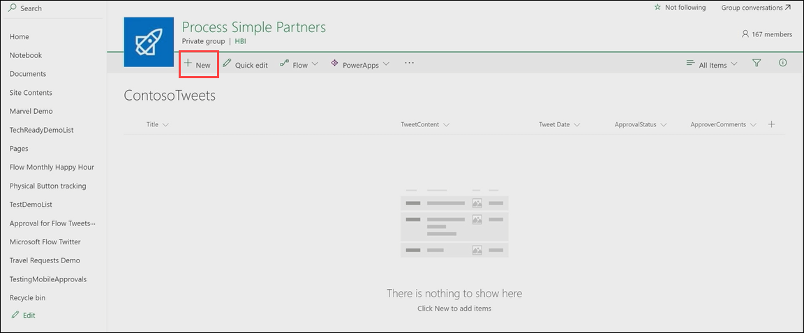
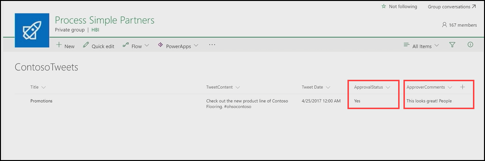

# Bir onay isteğini onaylama
Önceki konulardan birinde, bir SharePoint listesinde depolanan tweetler için bir onay işlemi oluşturmayı öğrendiniz.  Bu konu başlığında, bir onaylayan yeni bir onay isteği aldığında, bu deneyimin nasıl göründüğünü öğreneceksiniz. 

## İstek oluşturma ve işleme
Öncelikle SharePoint listemize bir öğe eklememiz gerekiyor, daha sonra bu öğe için bir onay isteği işleyebiliriz.

1. Önceki konulardan birinde yapılandırılan **ContosoTweets** SharePoint listesini açın.  Yeni bir tweet oluşturmak için **Yeni**’yi seçin. 
   
    
2. Alanlara aşağıdaki değerleri ekleyip **Kaydet**’i seçin.
   
   * **Başlık** - Tanıtımlar
   * **TweetContent** - Yeni Contoso Flooring serisine göz atın #ohsocontoso
   * **TweetDate** - Bugünün tarihi
     
     
3. **Microsoft Flow**’da **Akışlarım**’ı seçin. 
4. Önceki konu başlıklarından birinde yapılandırılan **Liste öğelerini onay sonrasında Twitter’a gönder** akışını seçin ve ardından **ÇALIŞTRMA GEÇMİŞİ** altında çalışan akışı seçin.
   
    
5. **Yeni bir öğe oluşturulduğunda** tetikleyicisini seçin. Yeni oluşturduğunuz liste öğesine ilişkin bilgilerin görüntülendiğini doğrulayın.
   
    
6. **Outlook** posta kutusunda otomatik onay postasını açın ve **Onayla**’yı seçin. 
   
    
7. **Onay Merkezi**’nde istek ayrıntılarını görüntüleyin, açıklama ekleyin ve **Onayla**’yı seçin. 
   
    
8. **SharePoint**’te **ContosoTweets** listesini yenileyin ve **ApprovalStatus** değerinin **Evet** olduğunu ve girdiğiniz açıklamanın görüntülendiğini onaylayın. 
   
    

Bu konu başlığında, bir onay isteği e-postası almadan Onay Merkezi’nde isteği işlemeye kadar geçen süreci bir onaylayanın açısından gördünüz.

