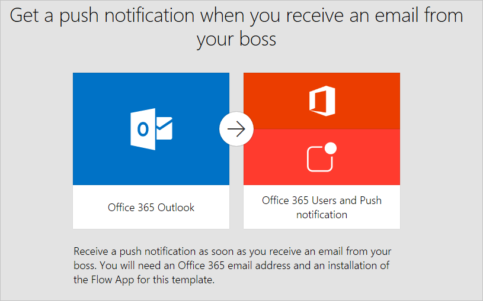

# Bir akıştan bildirim alma
**Microsoft Flow**’un yaygın kullanımlarından biri, bir şey olduğunda **bildirim** almaktır.  Bildirimler **e-posta**, **kısa mesaj** veya **telefonunuzda anında iletme bildirimleri** şeklinde olabilir.

## Gerekli uygulama
**Mobil cihazınıza** anında iletme bildirimleri gönderen bir akış oluşturmak kolaydır.  Akışı **mobil uygulama** veya **flow.microsoft.com**’da oluşturabilirsiniz, ancak anında iletme bildirimleri almak için **mobil uygulamaya** sahip olmanız gerekir. Microsoft Flow mobil uygulaması [Android](https://aka.ms/flowmobiledocsandroid), [iOS](https://aka.ms/flowmobiledocsios) ve [Windows Phone](https://aka.ms/flowmobilewindows)’da kullanılabilir.

Desteklenmeyen bir mobil cihaz kullanıyorsanız, bildirimleri almak için anında iletme bildirimleri yerine **SMS mesajları** (kısa mesaj) kullanmayı göz önünde bulundurabilirsiniz.

## Bildirim gönderen akışlar oluşturma
Yukarıdaki videoda gösterildiği gibi **bir şablon kullanabilir** veya **sıfırdan** akış oluştururken *Anında iletme bildirimi gönder* **eylemini** kullanabilirsiniz.  Diğer eylem veya tetikleyicilerden **dinamik içerikler** ekleyebilirsiniz.

## Sonraki ders
Nasıl **bildirim alacağınızı** öğrendiğinize göre artık Microsoft Flow’u kullanarak **dosya kopyalama** konusuna geçebiliriz.

