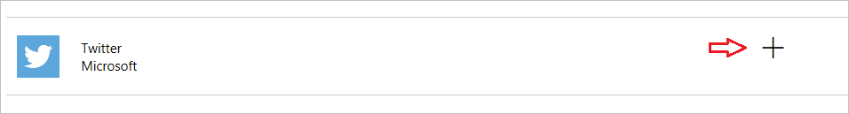
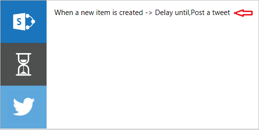

# Bir akıştan tweet gönderme
Bu akış için, **Contoso Flooring** Pazarlama ekibinin **Twitter gönderilerini** ve gönderme tarihlerini depolandığı bir **SharePoint** listesi oluşturacaksınız. Daha sonra, bunlara yönelik içeriği otomatik olarak Tweetleyen bir akış oluşturacaksınız. 

## Microsoft Flow Hizmetlerini Bağlama
Bu konu başlığında, **SharePoint** ve **Twitter** hizmetlerini kullanacaksınız. Daha önce kullanmadığınız bir hizmet söz konusuysa, önce yeni hizmete bağlanmanız gerekir. 

1. Microsoft Flow’da **dişli simgesini** ve ardından **Bağlantılar**’ı seçin,
   
     
2. **+Bağlantı oluştur**’u seçin.
   
     
3. Listede aşağıda kaydırarak Twitter’ı bulun ve **+** öğesini bulun.
   
    
4. Bir Twitter hesabını yetkilendirmek için, kullanıcı adınız veya e-postanızı ve parolanızı girip **Uygulamayı yetkilendir**’i seçin.
   
    
5. Bağlantılarınızı denetlemek için **dişli simgesini** ve **Bağlantılar**’ı seçin.
   
    
   
    Yeni Twitter bağlantınızı ve oluşturduğunuz diğer bağlantıları görmeniz gerekir. 
   
    

## SharePoint listesi oluşturma
Öncelikle Contoso Flooring için yeni bir SharePoint Online listesi oluşturmanız gerekir. 

1. SharePoint Online’da **Yeni**’yi ve ardından **Liste**’yi seçin.
   
    
2. Listeyi **Contoso Tweetleri** olarak adlandırın. 
3. **Site gezintisinde göster** onay kutusunun işaretini temizleyip **Oluştur**’u seçin.
   
    
   
    **Oluştur**’u seçtiğinizde SharePoint sizi yeni listenize götürür.
4. Varsayılan olarak, listede yalnızca **Başlık** sütunu bulunur. Başka bir sütun ekleyip bu sütunu **Tweet İçerikleri** olarak adlandırın. Tweetlerinizde söyleyecekleriniz buraya gelir. 
   
   1. Artı işaretini ve ardından **Daha fazla...**’yı seçin
      
       
   2. **Birden çok satırlı metin**’i ve ardından **Tamam**’ı seçin.
      
       
5. Tweet tarihi ve saati için bir sütun ekleyip **Tweet Tarihi** olarak adlandırın.
   
   1. Yukarıdaki **Tweet İçerikleri** ile aynı şekilde, artı işaretini ve ardından **Daha fazla...**’yı seçin
      
       
   2. Aşağı kaydırarak **Tarih ve Saat Biçimi**’ne ilerleyin. Her ikisini de dahil etmek için **Tarih ve Saat**’i seçin.
      
       
   3. **Tamam**’ı seçin. **Contoso Tweetleri** listesi SharePoint sitenizde görünür ve listeye yeni öğeler ekleyebilirsiniz.

## Akışı oluşturma
Listeniz oluşturulduğuna göre, artık akışı oluşturabilirsiniz.

### Tetikleyici seçme
1. Microsoft Flow’da **Akışlarım**’a gidip **Boş akış oluştur**’u seçin.
   
    
2. **Bir öğe oluşturulduğunda** seçeneğini belirleyin.
   
    
   
    Tetikleyicilerimizin tweet içeriği olan yeni bir satır eklendiğinde tetiklenmesini istiyoruz.
3. SharePoint sitenizi seçip ardından önceden ayarladığınız **Contoso Tweetleri** listesini seçin.
   
    

Tetikleyici için gerçekleştirmeniz gereken işlemler bu kadar.

### Gönderme geciktirmeye eylem ekleme
1. **+Yeni adım**’ı ve ardından **Eylem ekle**’yi seçin. 
   
    
2. **Zamanlama** hizmeti bölümünde **Geciktir:**’i seçin. 
   
      
3. Gecikme değerini ayarlayın.
   
   1. **Zaman damgası** alanına tıklayın veya dokunun. 
   2. Dinamik içerik kutusu açıldığında, aşağıya kaydırarak SharePoint listesindeki üç sütunu görebilirsiniz: **Başlık**, **Tweet Tarihi** ve **Tweet İçeriği**.
   3. **Tweet Tarihi**’ni seçin. 
      
       
      
       Artık bir kullanıcı SharePoint listenize bir öğe eklediğinde, eylemler **Tweet Tarihi** sütununda ayarladığınız tarih ve saate kadar geciktirilir.
      
       

### Tweet göndermek için eylem ekleme
Şimdi akışın **Tweet Tarihi** sütununda belirtilen tarih ve saatte gerçekleştirmesi için başka bir eylem ekleyeceksiniz.

1. **+ Yeni adım**’ı ve **Eylem ekle**’yi seçip **Twitter**’ı arayın.
   
     
2. **Twitter - Tweet gönder** eylemini seçin.
   
     
3. **Tweet metni** alanına tıklayın veya dokunun ve dinamik içerik kutusunda **Tweet İçerikleri**’ni seçin. Oluşturduğunuz dizi şöyledir: 
   
    
4. **Akış oluştur...**’u seçin
   
     
5. **Bitti**’yi seçin.
   
    
   
    Akış tamamlanmıştır.
   
    
   
    SharePoint listenizde yeni bir öğe oluşturulduğunda, akış önceden ayarlanan tarihe kadar göndermeyi geciktirir. Bu tarih geldiğinde, akış listenizdeki **Tweet İçeriği** sütunundaki metinle birlikte Twitter’a gönderir.

## Sonraki ders
Sonraki derste, **Yineleme** adlı bir tetikleyiciyi kullanarak **akışları bir zamanlamaya göre çalıştırmayı** öğreneceksiniz.

