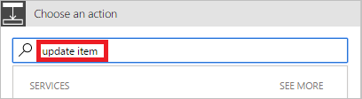

1. **Eylem ekle**'yi seçin.
   
    
2. **Eylem seçin** kartındaki arama kutusuna **öğeyi güncelleştir** yazın.
   
    
3. **SharePoint - Öğeyi güncelleştir** eylemini seçin.
   
    
4. Kartı ihtiyaçlarınıza uyacak şekilde yapılandırın.

