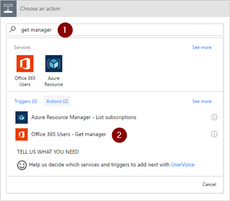
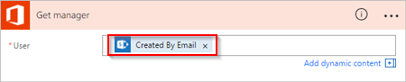

1. **Yeni adım**'ı ve ardından **Eylem ekle**'yi seçin.
   
    
2. **Eylem seçin** arama kutusuna **yöneticiyi al** yazın.
3. **Office 365 Kullanıcıları - Yöneticiyi al (V2)** eylemini bulun ve seçin.

    
4. **Yöneticiyi al** kartındaki **Kullanıcı (UPN)** kutusuna **Oluşturan E-posta** belirtecini ekleyin.

    Bu eylem, SharePoint'te tatil isteğini oluşturan kişi için yöneticiyi getirir.

    

