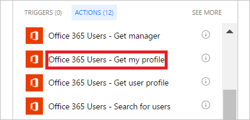

1. **Yeni adım**'ı ve ardından **Eylem ekle**'yi seçin.
   
    
2. **Eylem seçin** arama kutusuna **yöneticiyi al** yazın.
   
    
3. **Office 365 Kullanıcıları - Yöneticiyi al** eylemini bulun ve seçin.
   
    
4. Akışınıza bir ad verin ve **Akış oluştur**'a tıklayarak yaptığınız işlemleri kaydedin.

