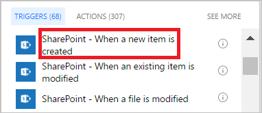

1. Arama kutusuna **SharePoint** yazın.
   
    
2. **SharePoint - Bir öğe oluşturulduğunda** tetikleyicisini bulun ve seçin.
   
    
3. Akışınızın yeni öğeleri izlediği SharePoint listesine ait **Site Adresi** ve **Liste Adı** bilgilerini girin.

