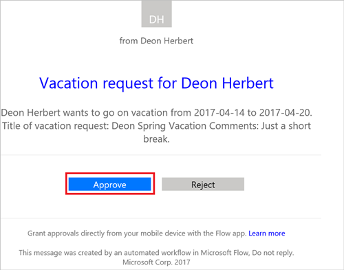

Bir onay akışında onaylayan rolündeyseniz her istek oluşturma işleminde bir e-posta alırsınız. Onay istekleri onay merkezine de gönderilir. İstekleri e-postadan, onay merkezinden veya Microsoft Flow uygulamasından onaylayabilir ya da reddedebilirsiniz.

Bir isteği onaylamak için:

### E-postadan
1. SharePoint Online listesine bir öğe eklendiğinde gönderilen e-postada **Onayla** seçeneğini belirleyin.
   
     Not: Microsoft Flow uygulamasının yüklü olduğu bir mobil cihaz kullanıyorsanız Microsoft Flow uygulaması açılır, aksi durumda onay merkezi tarayıcınızda açılır.
   
    
2. Bir açıklama girin ve **Onayla** düğmesini seçin.
   
    

### Onay merkezinden
1. [Microsoft Flow](https://flow.microsoft.com)'da oturum açın.
   
    
2. **Onaylar** sekmesini seçin.
   
    
3. Onaylamak istediğiniz istekte **Onayla**'yı seçin.
   
    
4. Bir not ekleyin ve **Onayla** düğmesini seçin.
   
    

### Microsoft Flow uygulamasından
1. Microsoft Flow uygulaması yüklü cep telefonunuzdan istek onay e-postasında **Onayla**'yı seçin.
2. Ekranın sağ üst köşesinden **Onayla**'yı seçin.
   
    
3. İşlem başarılı sayfası, onayınızın kaydedildiğini belirtir.
   
    

Not: Android, iOS ve Windows Phone’daki ekranlar birbirinden biraz farklı olabilir, ancak işlevler tüm cihazlarda aynıdır.

