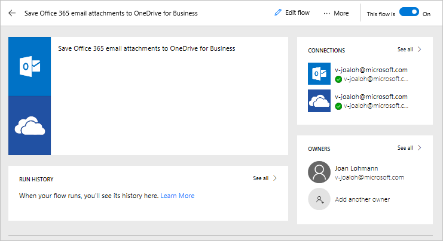
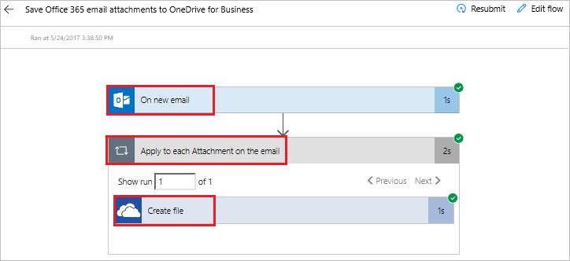

Microsoft Flow için Kılavuzlu Öğrenme’ye tekrar hoş geldiniz. Bu derste, Microsoft Flow ortamını daha yakından görecek ve **ilk akışınızı oluşturacaksınız**.

Microsoft Flow’u kullanmaya başlamak kolaydır. Zaten kullandığınız hizmetlere daha anlamlı şekillerde bağlanmanıza yardımcı olmak için **seçebileceğiniz çok sayıda şablon** bulunur.  

## Microsoft Flow şablonları
[Microsoft Flow web sitesine](https://ms.flow.microsoft.com) göz atın ve **Şablonlar** menüsünü açın. Listede gezinirken, Microsoft Flow’un birçok hizmete bağlanmanıza olanak sağladığını görebilirsiniz.

## Şablon seçme
E-postalarda **ekleri aramak** zaman alabilir. Bu akış, **tüm e-posta eklerinizi** OneDrive’ınızda bir klasöre depolayarak size zaman kazandırır.

**Office 365 e-posta eklerini OneDrive İş’e kaydetme** şablonunu seçin.

## Akış oluşturma ve yönetme
Bu, yalnızca **akışı oluşturmak için gereken** soruları yanıtladığınız **tek tıklamalı** şablonlarımızdan biridir.

Şablon grafiğinde, şablonun **hangi amaçla kullanıldığı ve başarılı olması için neler gerektiğini** belirten bir **açıklama** bulunur.

**Office 365 Outlook** ve **SharePoint** hizmetleri için **kimlik bilgilerinizi sağlamanız** istenir. İki hizmeti de düzenli olarak kullanıyorsanız, oturumunuz önceden açılmıştır.

1. **Akış Oluştur**’u seçin.
   
    
   
    Ardından sonuçları görürsünüz. 
   
    
   
    Flow, OneDrive’ınızda iş e-postanıza gelen **tüm ekleri** otomatik olarak yerleştireceği **bir klasör oluşturdu**.
2. **Akışlarım**’ı açın.
   
    
3. Nasıl çalıştığını görmek için **az önce oluşturduğunuz akışı** seçin.
   
    
4. **Akışın başarılı olduğunu** gösteren bir **yeşil onay işareti** görürsünüz. Çalıştırma geçmişini ve sonuçları görmek için **Başarılı**’yı seçin.
   
    
   
    **Akışın tüm bölümleri** başarılı oldu. 
   
    

## Microsoft Flow’daki önemli kavramlar
Akış oluştururken bilmeniz gereken bazı noktalar. Her akış iki bölümden oluşur: Bir **tetikleyici** ve **bir veya daha fazla eylem**. 

**Tetikleyiciyi** akışın başlangıç eylemi olarak düşünebilirsiniz. Bunlar, buraya **Yeni e-posta geldiğinde** veya SharePoint kullanıyorsanız **yeni bir öğe eklendiğinde** tetiklenebilir. Daha sonra öğreneceğiniz **Yineleme** adlı bir tetikleyici kullanıyorsanız, sabit bir zamanlama ile de tetiklenebilir.

**Eylemler**, **bir tetikleyici çağrıldığında** gerçekleşmesini istediğiniz etkinliklerdir. Örneğin, **Dosya oluştur** eylemi OneDrive’da dosya oluşturur.

Diğer eylemler arasında **e-posta** gönderme, **Tweet** gönderme, **onay işlemi** başlatma ve diğer birçok eylem olabilir.
Bunların tümü kendi akışlarınızı sıfırdan oluşturmaya başladığınızda kullanılacaktır. 

## Sonraki Ders
Önümüzdeki derste Microsoft Flow Mobil uygulaması ve özelliklerine göz atacağız. 

