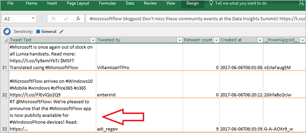
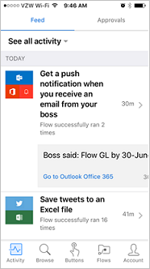

Microsoft Flow için Kılavuzlu Öğrenme’ye hoş geldiniz. **Dilediğiniz hızda ilerleyebileceğiniz bu çevrimiçi kursta**, baştan sonra bilgi edinebilmeniz için Microsoft Flow sıralı bir şekilde anlatılmaktadır. Bu kurs, çok sayıda **görsel ve örnekler** ile ilke ve ayrıntıları anlamanıza yardımcı olan mantıksal bir ilerleyişe uygun olarak **anlaşılır öbekler halinde rehberlik** sunmak üzere tasarlanmıştır.

Bu kursta, Microsoft Flow ve kavramları hakkında bilgi edinip **akış oluşturmayı**, **akışları yönetmeyi** ve bunları ortamınızda **yönetmeyi** öğreneceksiniz. Contoso Flooring adlı kurgusal bir şirkete ilişkin bilgilerle senaryolar sunulacak ve bu senaryoları kendi işletmenizde veya müşterilerinizi işletmelerinde kullanmayı öğreneceksiniz.

Microsoft Flow’u kullanmaya yeni başladıysanız, bu kurs başlamanıza yardımcı olur. Zaten biraz deneyim sahibiyseniz, bu kurs kavramları daha iyi anlamına ve eksik bilgileri tamamlamanıza yardımcı olur. Bu kurs devam eden bir çalışmadır. Bu nedenle lütfen hizmeti nasıl bulduğunuzu ve bu kursa eklenmesini istediğiniz diğer konuları **bize bildirin**.

## Microsoft Flow nedir?
Microsoft Flow, en yaygın kullanılan uygulama ve hizmetler arasında **iş akışlarını otomatikleştirerek** daha akıllı ve daha verimli bir şekilde çalışmanızı sağlayan bir **iş akışı hizmetidir**. Örneğin, bir müşteri adayını **Dynamics 365**’e ekleyebilir ve 100’den fazla takipçisi olan biri şirketinizle ilgili bir tweet gönderdiğinde **MailChimp**’e bir kayıt ekleyebilirsiniz.

Kaydolduğunuzda **100’den fazla hizmete bağlanabilir** ve **verileri bulutta veya şirket içi kaynaklarda yönetebilirsiniz** (örneğin SharePoint ve SQL Server). Microsoft Flow ile kullanabileceğiniz uygulama ve hizmetlerin listesi sürekli olarak genişlemektedir.

## Microsoft Flow ile neler yapabilirsiniz?
Microsoft Flow’u sık kullandığınız **uygulamalar ve hizmetler** arasında **iş akışlarını otomatikleştirmek**, dosyaları eşitlemek, bildirimler almak, veri toplamak ve daha fazlası için kullanabilirsiniz. 

Örneğin, şu görevleri **otomatikleştirebilirsiniz**:

* Yüksek öncelikli bildirim veya e-postaları anında yanıtlama.
* Yeni müşteri adaylarını yakalama, izleme ve takip etme.
* Dosyaları bir hizmetten diğerine kopyalama.
* İşletmeniz hakkında veriler toplama ve bu bilgileri ekibinizle paylaşma.
* Onay iş akışlarını otomatikleştirin.

Microsoft Flow’un yaygın olarak kullanım amaçlarından biri **bildirim almaktır**. Örneğin, Dynamics 365 ya da Salesforce’a bir müşteri adayı eklendiğinde anında bir e-posta veya telefonunuza bir anında iletme bildirimi alabilirsiniz.

Ayrıca **dosyaları kopyalamak için Microsoft Flow kullanabilirsiniz**. Örneğin, ekibinizin Dropbox’a eklenen dosyaların bulabilmesi için bunların SharePoint’e **otomatik olarak kopyalanmasını** sağlayabilirsiniz.

 

 

Belirli bir diyez etiketi ile **bir tweet gönderildiğinde** çalıştırılan bir akış oluşturarak **işletmeniz hakkında söylenenleri izleyebilirsiniz** . Akış bu tweet ile ilgili ayrıntıları bir SQL Server veritabanına, bir SharePoint listesine ve hatta OneDrive’da barındırılan bir Excel dosyasına yerleştirebilir. Topladığınız verilerle, bunları Power BI’a bağlamak, eğilimleri belirlemek ve veriler hakkında sorular sormak için eylemler oluşturabilirsiniz.

Son olarak, örneğin bir SharePoint listesindeki izin istekleri gibi **onay döngülerini otomatikleştirebilirsiniz**.

Daha fazla fikir almak için, yalnızca birkaç adımda akış oluşturmanıza yardımcı olan **şablon listemize göz atın**. Örneğin, **kendinize hava durumu tahminleri göndermek**, düzenli aralıklarla anımsatıcılar almak veya yöneticiniz e-posta gönderdiğinde telefon bildirimleri almak için kolayca akış oluşturabilirsiniz.

Listede görmediğiniz bir akış fikriniz mi var? Kendi akışınızı sıfırdan oluşturabilir ve isterseniz toplulukla paylaşabilirsiniz!

## Nereden akış oluşturabilir ve yönetebilirim?
Bir **tarayıcıda** veya Microsoft Flow mobil uygulamasını indirirseniz **telefonunuzda** akış oluşturabilir ve yönetim görevlerini gerçekleştirebilirsiniz.

  

Aşağıdaki görevleri ve daha fazlasını gerçekleştirebilirsiniz:

* Akışları istediğiniz yerden açma veya kapatma.
* Bir akış başarısız olduğunda görme.
* Ayrıntılı çalıştırma geçmişi raporlarını gözden geçirme.
* Çalıştırmaları bildirim türüne göre görüntüleme ve filtreleme.

## Kısa bir Microsoft Flow turu
Şimdi araca bir göz atalım. Microsoft Flow’u kullanmayı öğrenmenizi sağlayacak birçok bilgi sunuyoruz.

Giriş sayfasında şu menüler bulunur:

* Akışlarınızın bulunduğu **Akışlarım**.
* Kullanmaya başlamak için harika bir seçenek olan **Şablonlar**.
* Onay işleminizi otomatikleştirip kolaylaştırabileceğiniz **Onaylar**.
* Bir hizmetten diğerine bağlanabileceğiniz **Bağlayıcılar** (eski adıyla **Hizmetler**).
* Microsoft Flow’u hızla kullanmaya başlamanıza yardımcı olan bilgiler sağlayan **Öğrenme**.

Şimdilik aşağıdakileri içeren **Öğrenme** menüsüne odaklanalım:

* **Kılavuzlu Öğrenme**, Microsoft Flow’u kullanma konusunda başlangıç tekniklerinden gelişmiş senaryolara kadar size yol gösterebilir.
* Gelişmiş konularımız **Belgeler**’de bulunur. Bir özellik veya işlevi gerçekten anlamak istiyorsanız, buradaki kapsamlı bilgiler sayesinde öğrenebilirsiniz.
* **Destek**, yardım bulmak için harika bir yerdir.
* **Topluluk**’ta diğer kullanıcıların Microsoft Flow’u nasıl kullandığını görebilirsiniz.
* **Görüş bildirin**, sizi geliştiricilere ve diğer kullanıcılara **açıklamalar ve sorular gönderebileceğiniz** bir kullanıcı topluluğuyla bir araya getirir.
* **Blog**, Microsoft Flow ekosistemindeki en yeni gelişmeler ve yayınlar hakkında güncel bilgiler sunar.
* **Fiyatlandırma**, kendiniz veya işletmeniz için doğru planı seçmenize yardımcı olabilir.

**Şablonlar** sayfasında, en popüler şablonlardan bazılarına bakarak denemek istediğiniz akışlara yönelik harika fikirler edinebilirsiniz.

## Sonraki ders
Microsoft Flow’un ne olduğu ve neler yapabildiği hakkında biraz bilgi aldığınıza göre akışı oluşturan unsurlara göz atabilirsiniz.

