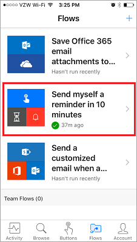
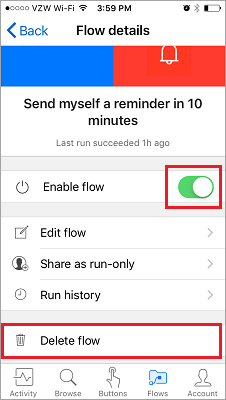

Bu ders, Microsoft Flow mobil uygulamasını ve özelliklerini kapsar. Mobil uygulamadan şu özelliklere erişebilirsiniz: **Etkinlik Akışı**, **Gözatma**, **Düğmeler** ve **Akışları Yönetme**.

Öncelikle uygulama mağazanızdan Microsoft Flow uygulamasını **indirmeniz** ve **yüklemeniz** gerekir.

Yüklendiğinde uygulamayı **açın** ve **oturum açın**. Uygulamayı açtığınızda **Etkinlik Akışı**’nı görürsünüz.

Etkinlik Akışı, **hareket halindeyken** ve tam deneyim için **bilgisayarınıza erişim** sahibi olmadığınız zamanlarda akışlarınızı görebileceğiniz yerdir.

Örneğin, bu akışlardan birini seçerseniz, akışın **son etkinliğinin** çalıştırılıp çalıştırılamadığına ve çalıştırılamadıysa hangi adımda başarısız olduğuna **daha yakından bakabilirsiniz**.

Gördüğünüz gibi bu akış, her iki adımda da başarılı oldu. Buradan **Düğmeler** simgesini seçin.

## Akışlar nasıl başlatılır?
   Düğmeler el ile gerçekleştirilen bir eylemle başlatılan akışlardır. Örneğin, **Yöneticinize "Bugün evden çalışıyorum" e-postası gönderin** gibi bir düğme oluşturabilirsiniz.
Uzakta oturuyorsanız veya trafik yoğunsa bunu kullanabilirsiniz.

Koleksiyonunuza eklemek üzere **daha fazla düğme akışına** göz atmak için **Gözat** düğmesini kullanın.

Bunun nasıl çalıştığını görmek için, **10 dakika içinde kendime anımsatıcı gönder** düğme akışını kullanacağız.

1. **Düğmeler**’i ve ardından **Şablonlara gözat**’ı seçin.
2. Anımsatıcı düğme akışını seçin.
3. **Bu şablonu kullan**’a dokunun.
   
    
4. **Oluştur**’a dokunun.
   
    
   
    Akış **kaydedilir**.
   
    
5. Yeni akışı görmek için **Düğmeler**’e dokunun. 
   
    
6. Düğmeye dokunduğunuzda, 10 dakika içinde **bir anımsatıcı alırsınız**.
   
    

Koleksiyonunuza başka düğmeler eklemek kolaydır.

## Akışı değiştirme veya silme
Akışlarınızdan birini değiştirmeye veya silmeye karar verirseniz, bunu kolayca yapabilirsiniz.

1. Akışlarınıza yönelik mobil yönetim alanı olan **Akışlar** düğmesine dokunun.
   
    
2. Şimdi akışlarınızdan birine dokunun.
   
    
   
    Birkaç seçeneğiniz olduğunu görürsünüz:
   
   * Akışı etkinleştirmek veya devre dışı bırakmak için iki durumlu **Akışı etkinleştir** düğmesine dokunun.
   * Akışı yeniden kullanmak isterseniz, istediğiniz zaman düzenleyebilirsiniz. 
   * Akışın başarılı ve başarısız çalıştırmaları hakkında bilgi edinmek için akışın çalıştırma geçmişini görebilirsiniz.
   * Ayrıca **Akışı sil** düğmesine dokunarak akışı silebilirsiniz.
     
     
     
     Burada **akışın silindiğini** görebilirsiniz.
     
     

## Sonraki Ders
Sonraki ders, bir ekip için **düğme akışı oluşturmayı** anlatır. 

