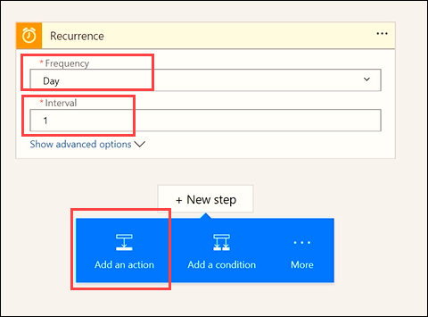
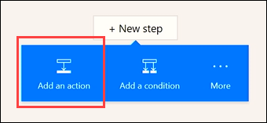
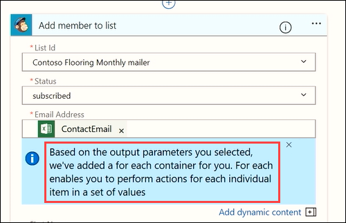

Bu konu başlığında, **Yinelenme** olarak adlandırılan bir tetikleyici kullanarak önceden zamanlanmış akışlar çalıştırmayı öğreneceksiniz.  Contoso pazarlama ekibi için bir Excel tablosundan müşteri e-posta adreslerini otomatik olarak OneDrive’a alan bir akış oluşturacaksınız. Akışı günde bir kez elektronik tabloya eklenen yeni e-posta adreslerini bir MailChimp müşteri listesine ekleyecek şekilde yapılandıracaksınız. 

## Zamanlanan akış oluşturma
1. **Microsoft Flow**’u açın, **Akışlarım**’ı seçin ve **Boş akış oluştur**’u seçin. 
   
    
2. **Yüzlerce bağlantı ve tetikleyiciyi arayın** seçeneğini belirleyin.
3. **Zamanlama** hizmetini arayıp seçin ve sonra **Zamanlama - Yinelenme** tetikleyicisini seçin.
   
    
4. **Sıklık** değerini **Gün** ve **Aralık** değerini **1** olarak ayarlayın. **Yeni adım**’ı ve **Eylem ekle**’yi seçin. 
   
    
5. **Excel** sözcüğünü arayıp **Excel** hizmetini seçin ve daha sora **Excel - Satırları Al** eylemini seçin. 
   
    
   
    **Not**: Seçtiğinizden emin olun **satırları Al**değil **Get satır**. 
6. **Dosya adı**’nı seçin ve dosyanızın olduğu konuma gidin. **Tablo adı**’nı seçin ve elektronik tabloda istediğiniz tabloyu seçin. 
   
    
7. Yeni bir eylem ekleyin. 
   
    
8. **MailChimp** hizmetini arayın, daha sonra **MailChimp - Üyeyi listeye ekle** eylemini seçin.
   
    
   
    **Not:** Mailchimp bir *premium* bağlayıcı. Microsoft Flow lisansınıza bağlı olarak, bu bağlayıcıyı kullanmak için bir denemeye kaydolmanız gerekebilir.
9. Açılır menülerden **Liste Kimliği** ve **Durum** alanlarını ekleyin:
   
   * **Liste Kimliği** - İstediğiniz MailChimp posta listesini seçin
   * **Durum** - **Abone**’yi seçin 
     
     
10. **E-posta Adresi**’nde, **ContactEmail** alanını eklemek için dinamik içerik özelliğini kullanın. 
    
     
    
     Akışın otomatik olarak ek bir adım oluşturduğunu görürsünüz. Akış ek bir eylem gerektiren bir eylem ayarlayacağınızı algılar. Akış yeni bir e-posta adresi okuduğunda, her satır için yeni bir eylem de oluşturur. 
    
     
11. **Ad** ve **Soyadı** alanlarını doldurmak için dinamik içeriği kullanın:
    
    * **Ad** – FirstName
    * **Soyadı** – LastName
      
      

Artık bu akış günde bir kez çalışarak bu Excel tablosundan yeni satırları ve e-posta adresi ile adı alır ve bunları MailChimp Contoso posta listesini doldurmak için kullanarak zaman ve paradan tasarruf etmenize yardımcı olur. 

