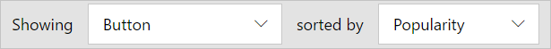
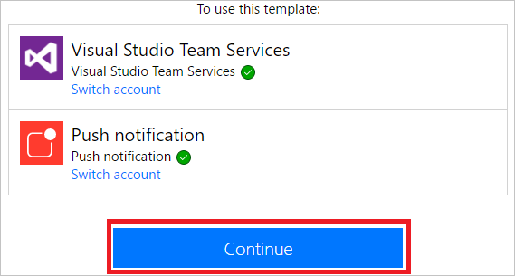
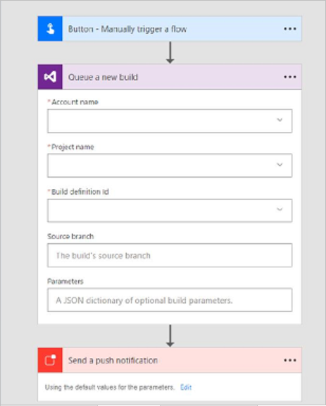
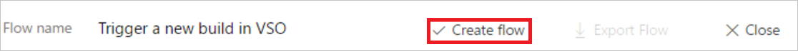
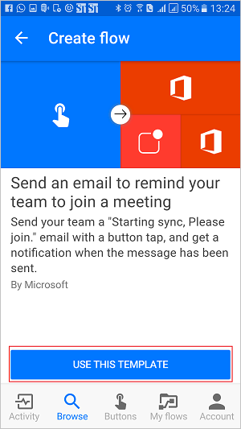
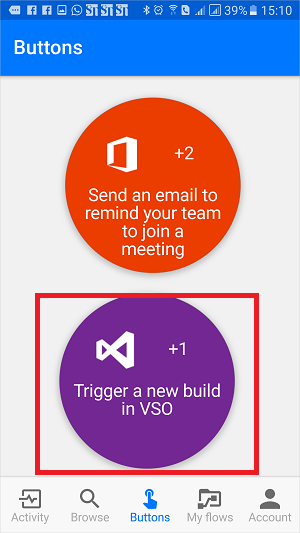

# Düğmesi akışları tanıtımı
## Düğme akışları nedir?
Tek bir düğmeye dokunarak çalıştırabilmek istediğimiz çok sayıda yinelenen görev vardır. Örneğin, günlük ekip eşitlemesine katılmalarını hatırlatmak üzere ekibinize hızlıca e-posta göndermeniz veya gün boyunca planlanan başka giriş olmayacağını öğrendikten sonra kod tabanınızın yeni bir Visual Studio Online derlemesini başlatmanız gerekebilir. Düğme akışları bunları ve diğer birçok görevi mobil cihazınızda tek bir düğmeye dokunarak gerçekleştirmenize olanak tanır.

**Not** Mobil cihazınızdan veya Flow portalından düğme akışları oluşturabilirsiniz.  
    

## Neden düğme oluşturmalıyım?
Yinelenen görevleri mobil cihazlarınızla dilediğiniz yerden ve dilediğiniz zaman kolayca çalıştırabilmenizi sağlayacak düğmeler oluşturun. Yürütme düğmeleri size zaman kazandırır ve gerçekleştirdikleri görevler otomatik hale getirildiğinden, elle yaptığınız işlemlere göre daha az hata oluşur.  

## Düğme oluşturma
### Önkoşullar
* Flow’a erişim. Erişiminizi yöneticiniz sağlayabilir.
* Düğmenizi oluşturmak üzere bağlayıcıları kullanma izinlerine sahip bir hesap. Örneğin, Dropbox’a erişen bir düğme oluşturmak için Dropbox hesabı gerekir.

### Portaldan
Bu kılavuzda Visual Studio Online (VSO) derlemesi başlatan ve derleme başladığında size bildirim gönderen bir düğme oluşturalım:  

1. **Gösteriliyor** açılır listesini seçin ve **Düğme** kategorisini belirleyin. Bunun yapılması, şablon listesini yalnızca düğme akışlarında kullanılabilecek düğmeleri gösterecek şekilde filtreler.  
      
2. Şablon listesinden **VSO’da yeni derleme tetikleme** şablonunu seçin.  
     
3. **VSO’da yeni derleme tetikleme** sayfasındaki **Bu şablonu kullan** düğmesini seçin.   
     
4. Oturum açmadıysanız bu noktada oturum açmanız istenir:  
     
5. Flow’da oturum açtıktan sonra, seçtiğiniz şablonlarda kullanılan bağlayıcılarda oturum açmanız istenir. Bu örnekte, yukarıdaki 2. adımda **VSO’da yeni derleme tetikleme** şablonunu seçtiğimiz için, henüz oturum açmadıysanız VSO’da (ve birlikte çalıştığınız diğer bağlayıcılarda) oturum açmanız gerekir:  
       
6. Flow’un VSO hesabınıza erişmesine yetki vermeyi kabul ediyorsanız **Kabul Et** düğmesini seçin.  
      
   **Not** Her bağlayıcıyı benzer şekilde yetkilendirmeniz gerekir. Sonraki adıma geçmeye hazır olduğunuzda tasarımcı aşağıdaki gibi görünmelidir. Devam etmek için **Devam** düğmesini seçin:  
      
7. Başlatmak istediğiniz derlemenin özelliklerini yapılandırmak için artık hazırsınız:    
     
8. **Yeni bir derlemeyi kuyruğa al** kartındaki **Hesap adı**, **Proje adı**, **Derleme tanım kimliği**, **Kaynak dalı** ve isteğe bağlı olarak **Parametreler** öğesini seçin veya girin:    
     
9. Ardından, **Anında iletme bildirimi gönder** kartında anında iletme bildiriminin özelliklerini yapılandırın. Varsayılan olarak, bu anında iletme bildirimi derlemenin durumunu gösteren bir Web sayfasına HTML bağlantısı gönderecek şekilde yapılandırılır:  
     
10. Düğme akışınızı kaydetmek için **Akış oluştur** düğmesini seçin:   
11. Birkaç dakika içinde şu başarı iletisini görmeniz gerekir:  
      

Tebrikler, bir düğme akışı oluşturdunuz! Artık bu düğmeyi, dilediğiniz zaman ve dilediğiniz yerde Flow uygulamasındaki **Düğmeler** sekmesinden çalıştırabilirsiniz. Çalışması için "düğmeye" basmanız yeterli! Microsoft Flow mobil uygulaması [Android](https://aka.ms/flowmobiledocsandroid), [iOS](https://aka.ms/flowmobiledocsios) veya [Windows Phone](https://aka.ms/flowmobilewindows)’da kullanılabilir.

### Mobil cihazınızdan
**Not**: Bu kılavuzda bir Android cihazındaki ekranlar gösterilmektedir; bir iOS cihazındaki ekranlar ve deneyim aynıdır.

Flow uygulamasında:

1. **Gözat** sekmesini seçin ve **Düğme** kategorisine doğru kaydırın.  
     
2. **Tümünü gör** bağlantısını seçin. Bu bağlantı çalışmaya hazır tüm düğme şablonlarını gösterir.     
     
3. **Ekibinize toplantıya katılmayı hatırlatan bir e-posta gönderin** şablonunu seçin    
     
4. Sayfanın altındaki **BU ŞABLONU KULLAN** bağlantısını seçin.    
     
5. Bu şablonun kullandığı tüm hizmetlerde oturum açmanız gerekir:    
     
6. Tüm hizmetlerde oturum açtıktan sonra **İleri** bağlantısını seçin.      
     
7. **Oluştur** bağlantısını seçin. Burada ayrıca akışı gözden geçirebilir ve örneğin e-postanızı kişiselleştirmek için gereken değişiklikleri yapabilirsiniz.        
     
8. Birkaç dakika sonra düğme akışı oluşturulur. **AKIŞIMI GÖR**'ü seçin:   
     
9. **Akışlarım** sekmesinde tüm akışlarınızı görüntüleyin  
     

Tebrikler, bir düğme akışı oluşturdunuz! Artık bu düğmeyi, dilediğiniz zaman ve dilediğiniz yerde Flow uygulamasındaki **Düğmeler** sekmesinden çalıştırabilirsiniz. Çalışması için "düğmeye" basmanız yeterli! Flow uygulaması şu anda Android ve iOS mobil cihazlarında kullanılabilir.  

  

## Düğme akışını tetikleme
Bir düğme akışı oluşturduktan sonra çalıştırmanız gerekir. Düğme akışlarını yalnızca Flow uygulamasından çalıştırabileceğiniz için Android veya iOS mobil cihazınıza Flow’un yüklü olduğundan emin olun.  

1. Şimdi Flow uygulamasını başlatın, sayfanın altındaki **Düğmeler** sekmesine dokunun ve tetiklemek istediğiniz düğme akışını temsil eden *düğmeye* dokunun:  
      
2. Akış çalışırken ilerleme durumuna bakın:  
      
3. Son olarak, sayfa güncelleştirilir ve düğme akışının tamamlandığı gösterilir:  
      

Bir akışı çalıştırmak için tüm yapmanız gereken budur. 

Bu noktada e-postanın gönderildiğini belirten anında iletme bildirimini almanız gerekir.  

## Düğme akışınızın çalışmasını izleyin
Flow uygulamanızın **Etkinlik** sekmesinden düğme akışlarını izleyebilirsiniz:   
  

**Not**: Çalıştırma hakkında bilgi edinmek üzere çalışma sonuçlarının ayrıntılarına inmek için herhangi bir etkinliğe dokunun.  

  

## Düğme akışlarını yönetme
Bir düğmeyi dilediğiniz zaman ve dilediğiniz yerde etkinleştirmeniz/devre dışı bırakmanız, düzenlemeniz veya silmeniz için düğme akışlarının tam denetimi sizdedir. Mobil uygulamadan veya akış portalından **Akışlarım**’ı seçerek akışlarınızı yönetmeye başlayın.    

Flow uygulamasının **Akışlarım** sekmesinde:

1. Yönetmek istediğiniz akışı seçin:    
      
2. Gerçekleştirmek istediğiniz işleme göre bu seçeneklerin herhangi birine dokunabilirsiniz:    
     
3. Bir akışı silmek için **Akışı sil**’e dokunun.  

**Not** Bir akışı sildiğinizde tüm çalışma geçmişi silinir:   
   

1. Bir düğme akışını düzenlemeyi bitirdikten sonra değişikliklerinizi kaydetmek için **Güncelleştir**’e dokunun:   
      
2. Belirli bir düğme akışına ait tüm çalışmaların sonuçlarını görmek için **Çalıştırma geçmişi**’ne dokunun:    
     
3. Bir akışı devre dışı bırakırsanız **Düğmeler** sekmesinde artık kullanılamaz:    
     

## Sonraki adımlar
* [Düğme akışları paylaşın](share-buttons.md).
* Düğme akışlarınız çalıştırıldığında gerçek zamanlı veriler gönderilmesini sağlayan [düğme tetikleyicisi belirteçlerini](introduction-to-button-trigger-tokens.md) kullanmayı öğrenin.
* [Android](https://aka.ms/flowmobiledocsandroid), [iOS](https://aka.ms/flowmobiledocsios) veya [Windows Phone](https://aka.ms/flowmobilewindows) için Microsoft Flow mobil uygulamasını yükleyin.

