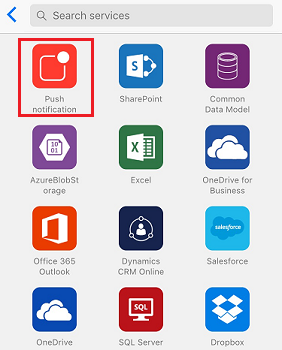

# Microsoft Flow kullanarak telefonunuzdan akış oluşturma
Hizmetler listesinde arayarak, kategorilere göz atarak veya anahtar sözcükler belirterek bulabileceğiniz bir şablon kullanarak telefonunuzdan akış oluşturun. Bu konu başlığındaki adımları uygulayarak, yöneticinizden e-posta aldığınızda telefonunuza anında iletme bildirimi gönderen bir akış oluşturun.

Daha önce Microsoft Flow kullanmadıysanız [genel bakış edinin](getting-started.md).

## Önkoşullar
* Bir [Microsoft Flow hesabı](sign-up-sign-in.md).
* [Desteklenen bir cihazda](getting-started.md#use-the-mobile-app) [Android](https://aka.ms/flowmobiledocsandroid), [iOS](https://aka.ms/flowmobiledocsios) veya [Windows Phone](https://aka.ms/flowmobilewindows) için Microsoft Flow mobil uygulaması. Bu konu başlığında kullanılan grafikler, uygulamanın iPhone sürümünden alınmıştır ancak Android cihazları ve Windows Phone için de benzer bir arabirim sunulur.
* Bu konu başlığında gösterilen şablonu kullanmak için ayrıca şunlar gerekir:
  
  * Office 365 kimlik bilgileri.
  * Telefonunuzda etkinleştirilmiş anında iletme bildirimleri.

## Şablon bulma
1. Mobil uygulamayı açın ve ekranın altındaki **Gözat** düğmesine dokunun.
   
    
   
    Şu adımlardan herhangi birini uygulayarak şablon bulabilirsiniz:
   
   * Ekranın üstündeki arama kutusunda bir anahtar sözcük belirtin.
   * Hizmetler listesindeki bir seçeneğe dokunun.
   * Çeşitli kategorileri göstermek için aşağı kaydırın ve herhangi bir kategorideki bir şablona dokunun.
     
       
     
     Bu öğreticide, yöneticinizden e-posta aldığınızda anında iletme bildirimi gönderen şablonu açacaksınız.
2. Hizmetler listesinde, **Tümünü göster**'e dokunun.
   
    
3. **Anında iletme bildirimi** simgesine dokunun.
   
    
4. Arama çubuğuna **e-posta** yazın ve ardından yöneticinizden bir ileti aldığınızda anında iletme bildirimi gönderecek şablona dokunun.
   
    
5. Seçtiğiniz şablonla ilgili ayrıntıların bulunduğu ekranda, **Bu şablonu kullan**'a dokunun.
   
    

## Akışı sonlandırma
1. İstenirse **Oturum aç**'a dokunup Office 365 Outlook, Office 365 Kullanıcıları veya her ikisi için kullandığınız kimlik bilgilerinizi sağlayın.
   
    
   
    Aynı bağlantıları, başka akışlar oluşturduğunuzda da kullanabilirsiniz.
2. Sağ üst köşede bulunan **İleri**'ye dokunun.
   
    
   
    Sonraki ekranda, tetikleyici olayı ve sonucunda oluşan tüm eylemler gösterilir.
   
    
   
    Bu şablonda, yeni e-posta akışı tetiklenerek (yöneticinizin adresini de içeren) bilgileriniz alınır ve bu adresten e-posta aldığınızda size bir anında iletme bildirimi gönderilir. Bazı şablonların düzgün şekilde çalışması için bir takım özelleştirmeler gerekir ancak bu şablonda bunlara gerek yoktur.
3. (isteğe bağlı) Ekranın üst kısmına akış için farklı bir ad yazın.
   
    
4. Sağ üst köşedeki **Oluştur** düğmesine dokunun.
   
    
   
    Akışınız oluşturuldu ve siz akışı durdurana veya silene kadar yöneticinizden gelen e-postaları denetleyecek.

## Sonraki adımlar
* [Akış etkinliğinizi izleme](mobile-monitor-activity.md).
* [Akışlarınızı yönetme](mobile-manage-flows.md).

