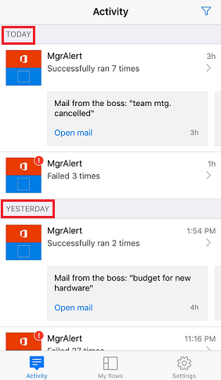

# Microsoft Flow'daki etkinlikleri telefonunuzdan izleme
Her bir akışın bugün, dün ve önceki günlerde kaç kez başarılı veya başarısız olduğunun bir özetini görüntüleyin. Her bir çalıştırmayla ilgili ayrıntıları (örneğin, çalıştırılma zamanı; her bir adımın ne kadar sürdüğü ve başarısız olduysa başarısız olma nedeni) keşfedin.

**Önkoşullar**

<iframe width="560" height="315" src="https://www.youtube.com/embed/vZuYZ64K3tI?list=PL8nfc9haGeb55I9wL9QnWyHp3ctU2_ThF" frameborder="0" allowfullscreen></iframe>

* [Desteklenen bir cihazda](getting-started.md#use-the-mobile-app) [Android](https://aka.ms/flowmobiledocsandroid), [iOS](https://aka.ms/flowmobiledocsios) veya [Windows Phone](https://aka.ms/flowmobilewindows) için Microsoft Flow mobil uygulamasını yükleyin. Bu konu başlığında kullanılan grafikler, uygulamanın iPhone sürümünden alınmıştır ancak Android ve Windows Phone için de benzer grafikler sunulur.
* Akışınız yoksa [Microsoft Flow'un web sitesinde](https://flow.microsoft.com/) bir akış oluşturun. Daha kolay test edebilmek için, bir dış olay beklemek yerine kendi kendinize tetikleyebileceğiniz bir akış kullanın.

Bu öğreticideki akış, belirli bir adresten e-posta aldığınızda çalıştırılır:

Bu tür bir akışı; test etme amaçlı olarak kişisel e-posta adresinizle ve akış hazır olduğunda gerçek kullanım için farklı bir adresle (örneğin, yöneticinizin adresi) yapılandırabilirsiniz.

Akış çalıştırıldığında telefonunuza şu söz diziminin bulunduğu özel bir anında iletme bildirimi gönderilir:

**Not:** Mobil uygulamanızdan da [akışlarınızı yönetebilirsiniz](mobile-manage-flows.md).

## Etkinlik özetini görüntüleme
<iframe width="560" height="315" src="https://www.youtube.com/embed/nVCGJamOw6s?list=PL8nfc9haGeb55I9wL9QnWyHp3ctU2_ThF" frameborder="0" allowfullscreen></iframe>

1. Akışınız daha önce çalıştırılmadıysa veri oluşturmak için bir çalıştırma tetikleyin.
   
    Verilerin uygulamada görünmesi biraz zaman alabilir.
2. Mobil uygulamayı açtığınızda, **Etkinlik** sekmesi varsayılan olarak gösterilir.
   
    Bu sekme, bugünün verileri en üstte olacak şekilde verileri güne göre düzenler.
   
    
   
    Her bir giriş, tetikleyici olaylarına ve eylemlerine karşılık gelen simgelerle birlikte bir akışın adını gösterir.
   
    
   
    Bir gün içinde en az bir akış çalıştırması başarılı olduysa bir giriş, akışın başarılı olma sayısını ve en son ne zaman başarılı olduğunu gösterir. Akış başarısız olduysa farklı bir giriş, buna ilişkin benzer bilgiler gösterir.
   
    
   
    Akış bir anında iletme bildirimi gönderirse girişin altında, başarılı çalıştırmalar için gönderilen en son bildirimin metni görünür.
   
    
3. Bir gün içinde birden fazla anında iletme bildirimi gönderilmişse son üç çalıştırmaya ilişkin bildirimleri görüntülemek için bildirim üzerinde sola kaydırın. Bir gün içinde dörtten fazla bildirim gönderilmişse **Daha fazla** seçeneği görünene kadar sola kaydırın ve tüm bildirimlerin listesini görüntülemek için bu seçeneğe dokunun.
   
    
4. Etkinlik özetine dönmek için **Geri**'ye dokunun.
5. Etkinlik özetini filtrelemek için sağ üst köşedeki simgeye dokunun.
   
    Tüm girişleri, yalnızca başarısız olunan girişleri veya yalnızca anında iletme bildirimi içeren girişleri görüntüleyebilirsiniz.
   
    

## Çalıştırma ayrıntılarını gösterme
1. Etkinlik özetinde, en son çalıştırmaya ilişkin ayrıntıları göstermek için bir girişe dokunun.
   
     Her bir olay ve eylemle birlikte bunların başarılı veya başarısız olduğunu belirten bir simge görünür. Başarılı olduysa işlemin süresi de (saniye cinsinden) görünür.
   
    
2. Ekranın alt kısmında, akışın tüm çalıştırmalarını listelemek için **See previous runs**'a (Önceki çalıştırmaları göster) ve ardından ayrıntılarını görüntülemek için bir çalıştırmaya dokunun.
   
    

