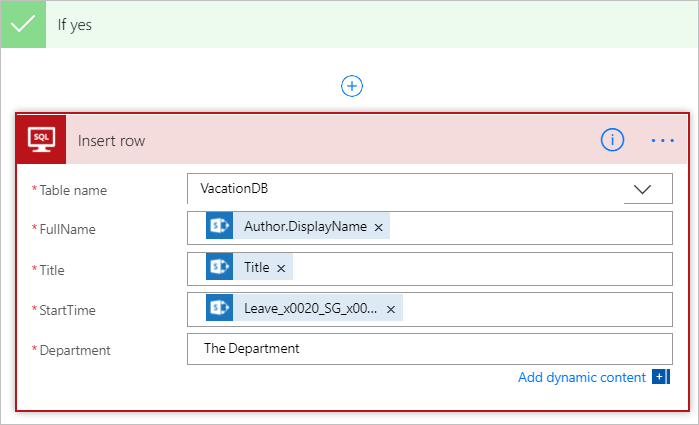
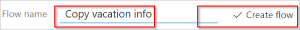

# Microsoft Flow ile verileri filtreleme ve kopyalama
Bu kılavuzda, bir kaynağı yeni veya değiştirilen öğeler için izleyen ve bu değişiklikleri bir hedefe kopyalayan bir akış oluşturmayı öğreneceksiniz. Kullanıcılarınız verileri bir konuma giriyorsa ancak takımınızın bu verilere farklı bir konumda veya biçimde ihtiyacı varsa, buna benzer bir akış oluşturabilirsiniz.

Bu kılavuz verileri bir Microsoft SharePoint [listesinden](https://support.office.com/article/SharePoint-lists-I-An-introduction-f11cd5fe-bc87-4f9e-9bfe-bbd87a22a194) (kaynak) bir [Azure SQL Veritabanı](https://docs.microsoft.com/azure/sql-database/sql-database-technical-overview) tablosuna (hedef) kopyalar ancak verileri Microsoft Flow tarafından desteklenen [150’nin üzerinde hizmet](https://flow.microsoft.com/connectors/) arasında kopyalayabilirsiniz.

> [!IMPORTANT]
> İki yönlü eşitleme desteklenmediğinden, hedefte yaptığınız değişiklikler kaynağa kopyalanmaz. İki yönlü eşitleme ayarlamayı denerseniz, değişikliklerin kaynak ve hedef arasında gönderildiği sonsuz bir döngü oluşturursunuz.
> 
> 

## Önkoşullar
* Bir veri kaynağına ve hedefe erişiminiz olmalıdır. Bu kılavuz, kaynak ve hedef oluşturma adımlarını içermez.
* [Microsoft Flow](https://flow.microsoft.com)’a erişiminiz olmalıdır.
* Verilerinizin depolanma şekli hakkında temel bilgilere sahip olma.
* Akış oluşturma hakkındaki temel bilgileri edinme. [Eylemler, tetikleyiciler](multi-step-logic-flow.md#add-another-action) ve [koşulları](add-condition.md) nasıl ekleyeceğinizi gözden geçirebilirsiniz. Aşağıdaki adımlarda bu eylemleri nasıl gerçekleştireceğinizi bildiğiniz varsayılmaktadır.

> [!TIP]
> Kaynak ve hedefteki tüm sütun adlarının eşleşmesi gerekmez ancak bir öğe eklediğinizde veya güncelleştirdiğinizde tüm *gerekli* sütunlar için veri sağlamanız gerekir. Microsoft Flow gerekli alanları sizin için belirler.
> 
> 

## Adımlara hızlı genel bakış
Microsoft Flow’u rahatça kullanabiliyorsanız, verileri bir veri kaynağında diğerine kopyalamak için bu hızlı adımları kullanın:

1. İzleyeceğiniz kaynağı ve değiştirilen verileri kopyalayacağınız hedefi belirleyin. Her ikisine de erişiminiz olduğunu onaylayın.
2. Kaynak ve hedefte öğeleri benzersiz olarak tanımlayan en az bir sütun tanımlayın. Aşağıdaki örnekte **Başlık** sütunu kullanılmaktadır, ancak siz istediğiniz sütunları kullanabilirsiniz.
3. Kaynağı değişiklikler için izleyen bir tetikleyici ayarlayın.
4. Değiştirilen öğenin var olup olmadığını belirlemek için hedefi arayın.
5. Aşağıdaki gibi bir **Koşul** kullanın:
   * Yeni veya değiştirilmiş öğe hedefte yoksa öğeyi oluşturun.
   * Yeni veya değiştirilmiş öğe hedefte varsa öğeyi güncelleştirin.
6. Akışınızı tetikleyin ve yeni veya değiştirilen öğelerin kaynaktan hedefe kopyalandığını doğrulayın.

> [!NOTE]
> Önceden SharePoint veya Azure SQL Veritabanı’na bir bağlantı oluşturmadıysanız, oturum açmanız istendiğinde yönergeleri izleyin.
> 
> 

Akışı oluşturmak için ayrıntılı adımları aşağıda bulabilirsiniz.

## Kaynağı değişiklikler için izleme
1. [Microsoft Flow](https://flow.microsoft.com)’da oturum açın ve **Akışlarım** > **Boş akış oluştur**’u seçin.
2. **SharePoint** sözcüğünü arayın ve tetikleyici listesinden **SharePoint - Bir öğe oluşturulduğunda veya değiştirildiğinde** tetikleyicisini seçin.
3. **Site Adresi**’ni girip **Bir öğe oluşturulduğunda veya değiştirildiğinde** kartında **Liste Adı**’nı seçin.
   
    Akışınızın yeni veya güncelleştirilmiş öğeleri izlediği SharePoint listesine ait **Site Adresi** ve **Liste Adı** bilgilerini girin.
   
    

## Yeni veya değiştirilmiş öğeler için hedefi arama
Yeni veya değiştirilmiş öğelere ilişkin hedefi aramak için **SQL Server - Satırları al** eylemini kullanırız.

1. **Yeni adım** > **Eylem ekle** seçeneğini belirleyin.
2. **Satırları al** ifadesiyle arama yapın, **SQL Server - Satırları al**’ı seçin ve ardından **Tablo adı** listesinden izlemek istediğiniz tabloyu seçin.
3. **Gelişmiş seçenekleri göster**’i seçin.
4. **Filtre Sorgusu** kutusunda, **Title eq '** yazın, dinamik içerik listesinden **Başlık** belirtecini seçin ve ardından **'** yazın.
   
    Önceki adımda kaynak ve hedefteki satırların Başlık değerlerinin eşleştiği varsayılmaktadır.
   
    **Satırları al** kartı şimdi resimdeki gibi görünmelidir:
   
    

## Yeni veya değiştirilen öğenin bulunup bulunmadığını denetleme
**Koşul** kartını açmak için **Yeni adım** > **Koşul ekle**’yi seçin.

Koşul kartında:

1. Sol taraftaki kutuyu seçin.
   
    **Bu akışta kullanılan uygulama ve bağlayıcılardan dinamik içerik ekleyin** listesi açılır.
2. **Satırları al** kategorisinden **değer**’i seçin.
   
   > [!TIP]
   > **Satırları al** kategorisinden **değer**’i seçtiğinizi onaylayın. **Bir öğe oluşturulduğunda veya değiştirildiğinde** kategorisinden **değer**’i seçmeyin.
   > 
   > 
3. Ortadaki kutudaki listeden **eşittir**’i seçin.
4. Sağ taraftaki kutuya **0** (sıfır) girin.
   
    **Koşul** kartı şimdi şu resme benzer şekilde görünür:
   
    
5. **Gelişmiş modda düzenleme**’yi seçin.
   
    Gelişmiş mod açıldığında, kutuda **\@equals(body('Get_rows')?['value'], 0)** ifadesini görürsünüz. **body('Get_items')?['value']** işlevinin etrafına **length()** öğesini ekleyerek bu ifadeyi düzenleyin. Tüm ifade şimdi aşağıdaki şekilde görünür: **@equals(length(body('Get_rows')?['value']), 0)**
   
    **Koşul** kartı şimdi şu resme benzer şekilde görünür:
   
    
   
   > [!TIP]
   > **length()** işlevini eklemek, akışın **değer** listesini denetlemesine ve öğe içerip içermediğini belirlemesine olanak sağlar.
   > 
   > 

Akışınız hedeften öğeleri “aldığında”, iki olası sonuç bulunur.

| Sonuç | Sonraki adım |
| --- | --- |
| Öğe var |[Öğeyi güncelleştirin](odata-filters.md#update-the-item-in-the-destination) |
| Öğe yok |[Yeni bir öğe oluşturun](odata-filters.md#create-the-item-in-the-destination) |

> [!NOTE]
> **Satır ekle** ve **Satırı güncelleştir** kartları akışta kullanılan Azure SQL Veritabanı tablosundaki sütun adlarını gösterdiğinden, sonraki adımda gösterilen kartlar sizinkilerden farklı olabilir.
> 
> 

## Hedefte öğe oluşturma
Öğe hedefte yoksa, **SQL Server - Satır ekle** eylemini kullanarak öğeyi oluşturun.

**Koşul**’un **Evet ise** dalında:

1. **Eylem ekle**’yi seçin, **satır ekle** öğesini arayın ve ardından **SQL Server - Satır ekle**’yi seçin.
   
    **Satır ekle** kartı açılır.
2. **Tablo adı** listesinden yeni öğenin ekleneceği tabloyu seçin.
   
    **Satır ekle** kartı genişletilir ve seçili tablodaki tüm alanları görüntüler. Yıldız işareti (*) olan alanlar gereklidir ve satırın geçerli olması için bu alanların doldurulması gerekir.
3. Doldurmak istediğiniz her bir alanı seçin ve verileri girin.
   
    Verileri el ile girebilir, **Dinamik içerikten** bir veya daha fazla belirteç seçebilir ya da alanlara metin ve belirteçlerin herhangi bir birleşimini girebilirsiniz.
   
    **Satır ekle** kartı şimdi şu resme benzer şekilde görünür:
   
    

## Hedefteki öğeyi güncelleştirme
Öğe hedefte varsa öğeyi değişikliklerle güncelleştirin.

1. **SQL Server - Satırı güncelleştir** eylemini **Koşul**’un **Hayır ise** dalına ekleyin.
2. Tablonun alanlarını doldurmak için bu belgenin [öğeyi oluşturma](odata-filters.md#create-the-item-in-the-destination) bölümündeki adımları izleyin.
   
    
3. Sayfanın en üstünde, **Akış adı** kutusunda akışınız için bir ad girin ve kaydetmek için **Akış oluştur**’u seçin.
   
    

Şimdi, SharePoint listenizdeki (kaynak) bir öğe değiştirildiğinde, akışınız tetiklenir ve yeni bir öğe ekler veya Azure SQL Veritabanınızda (hedef) varolan bir öğeyi güncelleştirir.

> [!NOTE]
> Akışınız kaynaktan bir öğe silindiğinde tetiklenmez. Bu önemli bir senaryoysa, bir öğenin artık gerekli olmadığını gösteren ayrı bir sütun eklemeniz yararlı olabilir.
> 
> 

## Daha fazla bilgi
Akışlarınızda [veri işlemlerini](data-operations.md) kullanın.

