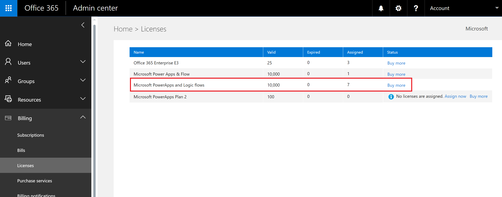

# Kuruluşunuzda Flow ile ilgili soru-cevap
Bu konu başlığında, kuruluşunuzdaki kullanıcıların Flow’u nasıl kullanacağı ve Flow hizmetini nasıl denetleyeceğiniz açıklanmıştır.

## Flow’a kaydolma
### Microsoft Flow nedir?
Microsoft Flow, kişilerin ve ekiplerin eşitleme yapmak, bildirimler almak, veri toplamak ve daha fazlası için sık kullandığı uygulama ve hizmetler arasında otomatik iş akışları oluşturmasına yardımcı olan bir genel bulut hizmetidir. 

### Kullanıcılar Flow’a nasıl kaydolabilir?
Kullanıcılar Web portalı üzerinden Flow’a iki şekilde kaydolabilir:

#### Seçenek 1
Kullanıcılar [flow.microsoft.com](https://flow.microsoft.com) sayfasına gidip **Ücretsiz kaydolun**’u seçerek ve ardından [portal.office.com](https://portal.office.com/Start?sku=flow_free) veya [signup.live.com](https://signup.live.com) üzerinden Flow’a kaydolma işlemini tamamlayarak kayıt yapabilir.

#### Seçenek 2
Kullanıcılar [flow.microsoft.com](https://flow.microsoft.com) sayfasına gidip **Oturum Aç**’ı seçtikten sonra iş, okul veya kişisel e-posta adresleri ile oturum açıp Flow kullanım koşullarını kabul ederek kaydolabilir.    

Kuruluşunuzdaki bir kullanıcı Seçenek 2 ile Flow’a kaydolduğunda bu kullanıcıya otomatik olarak bir Microsoft Flow Ücretsiz lisansı atanır.

[Flow’a kaydolma](sign-up-sign-in.md) bölümünde daha ayrıntılı bilgi verilmektedir.

### Bir kullanıcının Flow’a kaydolmasını engelleyebilir miyim?
Microsoft Flow tamamen genel bir bulut hizmetidir. Dünyadaki herkes kaydolup günlük görevlerini otomatik hale getirmek için bu programı kullanabilir. Microsoft Flow’u kullanmak için kullanıcıların bir Office 365 hesabına sahip olması veya bu hesabı kullanması şart değildir. Bu nedenle, şu anda başka bir kişinin Flow kullanmasını (e-posta adresine bakılmaksızın dünyadaki herkes kullanabilir) engellemenize yönelik bir mekanizma bulunmamaktadır.

Ancak, bir kullanıcı Microsoft Flow’a kaydolursa ve bu kullanıcıyı kuruluşunuzda desteklememeyi seçerseniz kullanıcının bu programı kullanımından doğan maliyetler şirketinize yansıtılamaz. Bir kişi Microsoft Flow’a kaydolduğunda, Microsoft tarafından sunulan diğer birçok bulut hizmetinde olduğu gibi (ör. Bing, Wunderlist, OneDrive veya Outlook.com ) kişi ile Microsoft arasındaki bir ilişki oluşturulur. Bir kişinin Microsoft Flow kullanımı, hiçbir şekilde bu hizmetin kuruluşunuz tarafından sağlandığı anlamına gelmez.

Son olarak, şirketiniz Microsoft Flow içindeki yalnızca kurumsal verilerin kullanımını kısıtlamak istiyorsa bunun Veri kaybı önleme (DLP) ilkeleri aracılığıyla yapılmanız mümkündür.

### Kullanıcılar ücretli Microsoft Flow özelliklerine nasıl erişebilir?
Kişiler ücretli Microsoft Flow özelliklerine üç farklı şekilde erişebilir:

1. Bireysel olarak 90 günlük ücretsiz Flow Planı 1 veya Flow Planı 2 denemesi için kaydolabilirler
2. Kişilere Office 365 yönetici portalından bir Flow lisansı atayabilirsiniz.
3. Kullanıcıya Flow hizmetine erişim içeren bir Office 365 ve Dynamics 365 planı atanmış olabilir. Flow özelliklerini içeren Office 365 ve Dynamics 365 planlarının listesi için [Flow fiyatlandırma sayfasına](https://flow.microsoft.com/pricing/) bakın.

### Bir kullanıcının ücretli Flow özelliklerini kullanmasını engelleyebilir miyim?
Herhangi bir kullanıcı ücretli Microsoft Flow özelliklerini 90 gün boyunca herhangi bir maliyet oluşmadan kullanabilir. Ancak, kuruluşunuz içinde kalıcı ücretli lisansların atamasını Office 365 yönetici portalından tam olarak yönetebilirsiniz.

Ücretsiz tekliflerde olduğu gibi, bir kişi deneme için kaydolmayı seçerse bu, ilgili kişi ile Microsoft arasındaki bir ilişkidir ve şirketiniz tarafından onaylanmış olması gerekmez.

## Flow yönetimi
### Flow simgesi neden Office 365 uygulama başlatıcıda görüntüleniyor?
Ağustos ayında duyurulduğu gibi Microsoft Flow, artık Office 365 paketinin temel bir parçasıdır. Bu duyurudan üç ay sonra Microsoft Flow, tüm mevcut Office 365 SKU'ları kapsamındaki bir hizmet olarak etkinleştirilmiştir. Dünyanın her yerinden kullanıcılar artık Microsoft Flow’u kullanabildiği için Flow bu kişiler için uygulama başlatıcıda görüntülenmektedir.

Flow kutucuğunu uygulama başlatıcıdan varsayılan olarak kaldırmak istiyorsanız aşağıdaki bölüme bakın.

### Microsoft Flow’u kuruluşum için uygulama başlatıcıdan nasıl kaldırabilirim?
Bir kullanıcıya bir Flow Planı 1 veya Flow Planı 2 lisansı atandıysa bu kullanıcı için Flow lisansını kaldırarak Flow simgesini uygulama başlatıcıdan kaldırmak için aşağıdaki adımları izleyebilirsiniz:

1. [Office 365 Yönetici Portalı](https://portal.microsoftonline.com/)’na gidin.
2. Sol gezinti çubuğunda, **Kullanıcılar**’ı ve ardından **Etkin Kullanıcılar**’ı seçin.
3. Lisansını kaldırmak istediğiniz kullanıcıyı bulun ve kullanıcının adını seçin.
4. Kullanıcı ayrıntıları bölmesinde, **Ürün lisansları** bölümünde **Düzenle**’yi seçin.
5. **Microsoft Flow Planı 1** veya **Microsoft Flow Planı 2** adlı lisansı bulun, iki durumlu düğmeyi **Kapalı** olarak ayarlayın ve ardından **Kaydet**’i seçin.
   
   

Kullanıcı Flow’a Office 365 ve Dynamics 365 plan lisansı üzerinden erişiyorsa, aşağıdaki adımları izleyerek kullanıcının bu plana dahil olan ek özelliklere erişimini devre dışı bırakabilirsiniz:

1. [Office 365 Yönetici Portalı](https://portal.microsoftonline.com/)’na gidin.
2. Sol gezinti çubuğunda, **Kullanıcılar**’ı ve ardından **Etkin Kullanıcılar**’ı seçin.
3. Erişimi kaldırmak istediğiniz kullanıcıyı bulun ve kullanıcının adını seçin.
4. Kullanıcı ayrıntıları bölmesinde, **Ürün lisansları** bölümünde **Düzenle**’yi seçin.
5. Kullanıcının Office 365 veya Dynamics 365 lisansını genişletin, **Office 365 için Flow** veya **Dynamics 365 için Flow** adlı hizmete erişimi devre dışı bırakın ve ardından **Kaydet**’i seçin.
   
   

PowerShell aracılığıyla lisansları toplu olarak kaldırmak da mümkündür. Ayrıntılı bir örnek için [Office 365 PowerShell ile kullanıcı hesaplarından lisansları kaldırma](https://technet.microsoft.com/library/dn771774.aspx) konusuna bakın.   Son olarak, bir lisans içindeki hizmetlerin toplu olarak kaldırılması hakkında daha ayrıntılı yönergeleri [Office 365 PowerShell ile hizmetlere erişimi devre dışı bırakma](https://technet.microsoft.com/library/dn771769.aspx) konusunda bulabilirsiniz.

Kuruluşunuzdaki bir kullanıcı için Flow lisansının kaldırılması, bu kullanıcı için Flow simgesinin aşağıdaki konumlardan kaldırılmasına neden olur:

1. [Office.com](https://office.com)
   
   
2. Office 365 Uygulama Başlatıcı
   
   

Bunun varsayılan olarak yalnızca Flow kutucuğunu kaldıracağını unutmayın. Kullanıcı bireysel olarak Microsoft Flow kullanmayı seçebilir.

### Neden Office 365 kiracımda Microsoft Flow için 10.000 lisans görüntülendi?
Dünyadaki herhangi biri, Microsoft Flow Planı 1 veya 2’yi 90 gün boyunca deneyebilir ve bu deneme lisansları kiracınızdaki yeni Flow kullanıcıları için mevcut kapasiteyi gösterir. Bu lisanslar için herhangi bir ücret alınmaz. Özellikle, Office 365 yönetici portalında Flow için 10.000 (deneme) lisansı kapasitesi görmenizin iki olası nedeni vardır:

1. Kiracınızdaki en az bir kullanıcı Nisan 2016 ile Ekim 2016 arasında gerçekleşen Flow genel önizlemesine katıldıysa "Microsoft PowerApps ve Mantık akışları" olarak etiketlenen 10.000 lisans görürsünüz
   
    
2. Kiracınızdaki en az bir kullanıcı [Kullanıcılar PowerApps için nasıl kaydolabilir?](#how-do-users-sign-up-for-powerapps) bölümünde özetlenen deneme kaydı **Seçenek 1**’i kullanarak bir Flow Planı 2 için kaydolduysa "Microsoft Power Apps & Flow" olarak etiketlenen 10.000 lisans görürsünüz
   
    

Kullanıcılara Office 365 yönetici portalını kullanarak kendiniz ek lisanslar atamayı seçebilirsiniz, ancak bunların Microsoft Flow Planı 2 için deneme lisansı olduğunu ve sürelerinin bir kullanıcıya atandıktan 90 gün sonra dolacağını unutmayın.

### Ücretsiz mi? Bu lisanslar için benden ücret alınacak mı?
Kullanıcılar açık izniniz olmadıkça kuruluşunuza maliyet yansımasına neden olamaz, yani ücretsiz lisanslar veya deneme lisansları kuruluşunuzun ücretlendirilmesine yol açmaz. Ayrıca, bu lisanslarda çalıştırma kotası gibi kotaları kullanılmaz.

### Microsoft Flow Ücretsiz lisansını kaldırdım, ancak kullanıcılar hala Flow’a erişebiliyor.
Microsoft Flow Ücretsiz lisansı yalnızca izleme amaçlı eklenir. İlk bölümde bahsedildiği gibi, başka bir kullanıcının Microsoft Flow’u bireysel amaçlarla kullanmasını önlemek mümkün değildir. Bu nedenle, Microsoft Flow Ücretsiz lisansının var olması gerçekte herhangi bir özellik eklemez veya kaldırmaz.

### Office 365 Yönetim portalında tüm Flow lisanslarını neden göremiyorum?
Kullanıcılar, Microsoft Flow’u bireysel olarak veya kuruluşlarının bir parçası olarak kullanabilir. Kuruluş düzeyindeki lisanslar, Office 365 portalında her zaman görünür. Ancak, bir kullanıcı deneme sürümüne bireysel kullanıcı olarak kaydolursa, bu lisans kullanıcının Office 365 yöneticisi tarafından yönetilmez ve portalda görünmez.

### Bir kişi hangi planı kullandığını nasıl öğrenebilir?
Kişiler, sahip oldukları planı Flow fiyatlandırma sayfasını ([https://flow.microsoft.com/pricing](https://flow.microsoft.com/pricing)) ziyaret ederek görebilir. Kullandıkları plan veya deneme sürümü bu sayfada gösterilir.

### Microsoft Flow’a kaydolmak kuruluşumdaki kimlikleri etkileyecek mi?
Kuruluşunuzda bir Office 365 ortamı zaten varsa ve kuruluşunuzdaki tüm kullanıcılar Office 365 hesabına sahipse kimlik yönetimi etkilenmez.

Kuruluşunuzda bir Office 365 olmasına rağmen kuruluşunuzdaki tüm kullanıcılar Office 365 hesabına sahip değilse, bu durumda kiracıda bir kullanıcı oluşturulur ve kullanıcının iş ya da okul e-posta adresine göre lisans atanır. Bu durum, kuruluşunuzdaki kullanıcılar hizmete kaydoldukça herhangi bir zamanda yönetmekte olduğunuz kullanıcı sayısının artacağı anlamına gelir.

Kuruluşunuzda e-posta etki alanınıza bağlı bir Office 365 ortamı yoksa, kimlik yönetme yönteminizde bir değişiklik olmaz. Kullanıcılar yeni bir sadece bulut kullanıcı dizinine eklenir ve kiracı yöneticisi olarak bunları devralıp yönetme seçeneğine sahip olursunuz.

### Microsoft Flow tarafından yeni bir kiracı oluşturuldu, bunu nasıl yönetirim?
Microsoft Flow tarafından yeni bir kiracı oluşturulduysa aşağıdaki adımları kullanarak bu kiracıyı talep edip yönetebilirsiniz:

1. Kiracıya katılmak için, yönetmek istediğiniz kiracı etki alanıyla eşleşen bir e-posta adresi etki alanı kullanarak Flow’a kaydolun. Örneğin, Microsoft contoso.com kiracısını oluşturduysa @contoso.com ile sona eren bir e-posta adresi kullanarak kiracıya katılın.
2. Etki alanı sahipliğini doğrulayarak yönetici denetimini talep edin: kiracıya girdikten sonra etki alanı sahipliğini doğrulayarak kendinizi yönetici rolüne yükseltebilirsiniz. Bunu yapmak için aşağıdaki adımları izleyin:    
   
   1. [https://portal.office.com](https://portal.office.com/Start?sku=flow_free) adresine gidin.
   2. Sol üst köşedeki uygulama başlatıcısı simgesini ve Yönetici öğesini seçin.
   3. **Yönetici olun** sayfasındaki yönergeleri okuyun ve ardından **Evet, yönetici olmak istiyorum**’u seçin.  
      
       **NOT**: Bu seçenek görünmezse zaten bir Office 365 yöneticisi mevcut olabilir.

### Birden fazla etki alanım varsa kullanıcıların ekleneceği Office 365 kiracısını denetleyebilir miyim?
Hiçbir şey yapmazsanız her kullanıcı e-posta etki alanı ve alt etki alanı için bir kiracı oluşturulur.

E-posta adresi uzantılarına bakılmaksızın tüm kullanıcıların aynı kiracıda olmasını istiyorsanız:  

* Önceden bir hedef kiracı oluşturun veya var olan bir kiracıyı kullanın. Kiracıyla birleştirmek istediğiniz tüm mevcut etki alanlarını ve alt etki alanlarını ekleyin. Bundan sonra e-postaları bu etki alanları ve alt etki alanları ile sona eren tüm kullanıcılar kaydolduklarında otomatik olarak hedef kiracıya eklenir.

**ÖNEMLİ**: Kiracılar oluşturulduktan sonra kullanıcıları kiracılara taşımaya yönelik desteklenen otomatik bir mekanizma yoktur. Tek bir Office 365 kiracısına etki alanları ekleme hakkında daha fazla bilgi için bkz. [Office 365’e kullanıcı ve etki alanı ekleme](https://support.office.com/article/Add-your-users-and-domain-to-Office-365-ffdb2216-330d-4d73-832b-3e31bcb5b2a7).

### Kullanıcıların, kuruluşumun iş verilerine erişim olanağını nasıl kısıtlayabilirim?
Microsoft Flow aşağıda gösterildiği gibi iş verileri ve iş dışındaki veriler için veri bölgeleri oluşturmanıza olanak sağlar. Bu veri kaybı önleme ilkeleri uygulandığında kullanıcıların, iş verilerini ve iş dışı verileri birleştiren Akışlar tasarlaması veya çalıştırması engellenir. Daha ayrıntılı bilgi için bkz. [Veri kaybı önleme (DLP) ilkeleri](prevent-data-loss.md).

  

