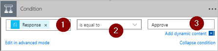

# Microsoft Flow ile paralel onay iş akışları oluşturma
[!INCLUDE [view-pending-approvals](includes/cc-rebrand.md)]

Bir paralel onay iş akışında, faturalar, satın alma siparişleri, tatil istekleri vb. gibi öğelerin onaylanması için birden çok kişi gerekir. Her birinin onayı diğer onaylayanlardan bağımsızdır.

Bu izlenecek yolda, paralel onay iş akışını otomatikleştiren bir akış oluşturmak için Microsoft Flow kullanırız. Bu akış, çalışanın düzenli olarak desteklediği tüm kişilerden (veya ekiplerden) onay gerektiren bir çalışan tatil isteği işlemini otomatikleştirir. Çalışanlar tatil istemek için bir [SharePoint listesi](https://support.office.com/article/Introduction-to-lists-0a1c3ace-def0-44af-b225-cfa8d92c52d7) kullanır. Tatil onayları çalışanın doğrudan Yöneticisi, satış ekibi ve Insan kaynakları ekibi 'nden gereklidir. Her bir tatil isteği bir karar için her onaylayana yönlendirilir. Akış, durum değişiklikleri ile e-posta gönderir ve ardından SharePoint 'i kararlarla güncelleştirir.

## Kaynakları

[!INCLUDE [prerequisites-for-modern-approvals](includes/prerequisites-for-modern-approvals.md)]

Oluşturduğunuz SharePoint Online listesinde şu sütunlar bulunmalıdır:

   

SharePoint Online listesinin adını ve URL 'sini unutmayın. Bu öğeleri daha sonra SharePoint 'i yapılandırmak için kullanıyoruz. **bir öğe oluşturulduğunda** tetikleyici.

## Boş şablondan akışınızı oluşturun

[!INCLUDE [sign-in-and-create-flow-from-blank-template](includes/sign-in-and-create-flow-from-blank-template.md)]

## Tetikleyici ekleme

[!INCLUDE [add-trigger-when-sharepoint-item-created](includes/add-trigger-when-sharepoint-item-created.md)]

   

## Tatil isteğini oluşturan kişi için yöneticiyi al

[!INCLUDE [add-get-manager-action](includes/add-get-manager-action.md)]

## Akışınızı adlandırın ve kaydedin

1. Akışınız için bir ad girin ve ardından, şimdiye kadar yaptığımız işi kaydetmek için **Kaydet** simgesini seçin.

   

> [!NOTE]
> Akışındaki değişiklikleri kaydetmek için düzenli aralıklarla **Kaydet** simgesini seçin.
> 
> 

## Anlık yönetici için onay eylemi ekleme

[!INCLUDE [add-an-approval-action](includes/add-an-approval-action.md)]

> [!IMPORTANT]
> Bu eylem, tatil isteğini **atanan** kutusundaki e-posta adresine gönderir, bu nedenle **yöneticiyi al (v2)** listesinden **e-posta** belirtecini ekleyin.
> 
> 

## Satış ekibi için paralel bir dal onay eylemi ekleyin

1. **Get Manager (v2)** ve **bir onay başlatma** kartları arasında bulunan aşağı oku seçin.
2. Seçtikten sonra aşağı ok üzerinde görüntülenen artı işaretini seçin.
3. **Paralel dal Ekle ' yi**seçin.
4. **Eylem Ekle**' yi seçin.

    
5. ' İ bulun, seçin ve ardından, tatil isteğini satış ekibine gönderen bir **onay başlangıcı** eylemi yapılandırın. **Bir onay başlatma** eyleminin nasıl ekleneceğini bilmiyorsanız, [hemen yöneticiye onay eylemi eklemek için kullanılan adımlara](parallel-modern-approvals.md#add-an-approval-action-for-immediate-manager) bakın.

> [!IMPORTANT]
> **Onay 2 başlangıç** eyleminin **atanan** kutusunda Sales ekibinin e-posta adresini kullanın.
> 
> 

## İnsan kaynakları ekibi için paralel bir dal onay eylemi ekleyin

1. Satış ekibinin eklemek üzere bir [paralel dal](parallel-modern-approvals.md#insert-a-parallel-branch-approval-action-for-the-sales-team) eklemek ve ardından insan kaynaklarına tatil istekleri göndermek için bir **onay Başlat** eylemi yapılandırmak için bu adımları tekrarlayın.

> [!IMPORTANT]
> **Onay 3** ' ün başlama eyleminin **atanan** kutusunda insan kaynakları ekibinin e-posta adresini kullanın.
> 
> 

Bunu takip ediyorsanız, akışınız Şu örneğe benzemelidir:

   

## Paralel dallar eklendikten sonra Seçenekler

Paralel dallara eylem ekledikten sonra, akışınıza daha fazla adım eklemek için iki seçeneğiniz vardır:

1. Küçük **yeni adım Ekle** düğmesini (daldaki herhangi bir boşluğu veya bir dalın hemen altındaki alanı seçtiğinizde görüntülenen dairesel artı düğmesini) kullanın. Bu düğme, **belirli bir dala**bir adım ekler. Bu düğmeyle eklediğiniz adımlar, bu özel dal tamamlandıktan sonra çalışır.
1. Tüm iş akışının alt kısmındaki daha büyük **yeni adım** düğmesini kullanın. Bu düğmeyle eklediğiniz adımlar tüm dallar tamamlandıktan sonra çalışır.

Aşağıdaki bölümlerde, her dalda bu adımları gerçekleştirmek için küçük **yeni adım Ekle** düğmesini kullanıyoruz:

* Tatil isteğinin onaylandığını veya reddedildiğini denetleyen bir koşul ekleyin.
* Kararı çalışana bildiren bir e-posta gönderin.
* SharePoint 'teki tatil isteğini onay kararı ile güncelleştirin.

Daha sonra, tatil isteğinde yapılan tüm kararları özetleyen bir e-posta göndermek için daha büyük **yeni adım** düğmesini kullanıyoruz.

Devam edelim:

## Her dala bir koşul ekleyin

1. **Bir onay dalı başlatma** üzerinde herhangi bir boşluk seçin.
2. Küçük **yeni adım Ekle** düğmesini (önceki adımda yer alan boşluk ' u seçtikten sonra görüntülenen dairesel artı düğmesini) seçin.
3. Görüntülenen menüden **Koşul Ekle** ' yi seçin.
4. **Koşul** kartındaki ilk kutuyu seçin ve ardından dinamik içerik listesindeki **onay Başlat** kategorisinden **Yanıt** belirtecini seçin.

    
5. Listenin ( **koşul kartının**ortasında), **olarak**ayarlandığını onaylayın.
6. Son kutuya **Onayla** (Bu metin büyük/küçük harfe duyarlıdır) yazın.
7. Koşul kartınız şu örneğe benzemelidir:

    

   > [!NOTE]
   > Bu koşul, çalışanın yöneticisine giden **onay başlangıcı** eyleminden gelen yanıtı denetler.
   > 
   > 
8. Önceki adımları **bir onay başlangıcı** (satışlarla ilgili onay isteği) ve **bir onay 3** (insan kaynakları onay isteği) dallarına yeniden başlatın.

## Her dala e-posta eylemleri ekleme

**Koşul** dalının **Evet** tarafında aşağıdaki adımları gerçekleştirin.

   Note: akışınız, istek onaylandığında e-posta göndermek için şu adımları kullanır:

[!INCLUDE [add-action-to-send-email-when-vacation-approved](includes/add-action-to-send-email-when-vacation-approved.md)]

   

Bir istek reddedildiğinde e-posta göndermek için **koşul** dalının **Hayır** ' ı kullanın ve ardından önceki adımları yineleyerek ret e-postası için bir şablon ekleyin.

Önceki adımları **bir onay başlangıcı** (satışlarla ilgili onay isteği) ve **bir onay 3** (insan kaynakları onay isteği) dallarına yeniden başlatın.

## Tatil isteğini kararlarla güncelleştirin

Kararları verirken SharePoint 'i güncelleştirmek için aşağıdaki adımları gerçekleştirin.

   Note: Bu adımları hem **if** hem de dalın **hiç** bir tarafında gerçekleştirdiğinizden emin olun.

[!INCLUDE [add-action-to-update-sharepoint-with-approval](includes/add-action-to-update-sharepoint-with-approval.md)]

   

**Bir onay başlangıcı oluşturma 2** ' de önceki adımları yineleyin ve **bir onay 3 dalı başlatın** .

## Akışı doldurun

1. **Yeni adım** > **Eylem Ekle** ' yi seçin

    
1. Her onay sonucunu özetleyen bir e-posta göndermek için daha önce sunulan adımları kullanın. Bu e-postayı tatil isteğinde bulunan çalışana gönderin. Kartınız şu örneğe benzeyebilir:

   

## Modern onaylar hakkında daha fazla bilgi edinin

[Modern onaylara giriş](modern-approvals.md)

