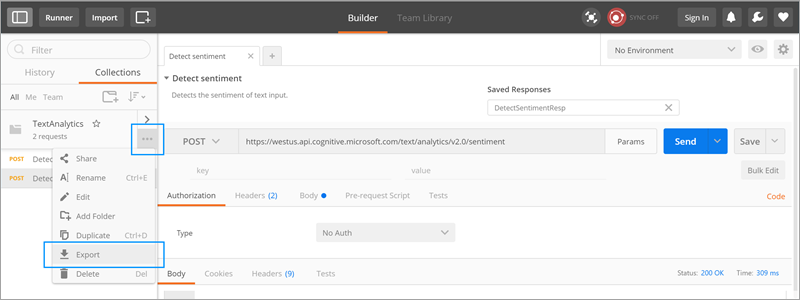

# Özel bağlayıcıyı Postman ile açıklama
[Postman](https://www.getpostman.com/), API geliştirme çalışmanızı hızlandırmaya ve kolaylaştırmaya yönelik bir araçtır. Bu öğreticide Postman Collection dosyasının nasıl oluşturulduğu gösterilir. Daha sonra bunu kullanarak Microsoft Flow’da kolayca [özel bağlayıcılar](register-custom-api.md) oluşturabilirsiniz.

## Önkoşullar
* [Postman uygulamasını](https://www.getpostman.com/apps) yükleyin.

## Postman Collection oluşturma
Şimdi Azure Bilişsel Hizmetler [Metin Analizi API’si](https://www.microsoft.com/cognitive-services/text-analytics-api) için bir Postman Collection oluşturalım. Bu API, kendisine geçirdiğiniz dili, duyguyu ve önemli tümcecikleri tanımlar.

1. Postman Collection oluşturma işleminin ilk adımı bir istek oluşturmaktır. İstek oluştururken, HTTP fiilini, istek URL’sini, sorgu veya yol parametrelerini, üst bilgileri ve gövdeyi ayarlayabilirsiniz. Daha fazla bilgi için Postman belgelerinde [İstekleri Gönderme](https://www.getpostman.com/docs/requests) konusuna bakın. Dil Algılama API’si uç noktası için değerleri aşağıda gösterildiği gibi ayarlayın:
   
    
   
    Kullanılan parametre ve değerlerin ayrıntıları:
   
   | Parametre | Değer |
   | --- | --- |
   | Fiil |POST |
   | İstek URL’si |https://westus.api.cognitive.microsoft.com/text/analytics/v2.0/languages |
   | Params |numberOfLanguagesToDetect |
   | Yetkilendirme |“No Auth” |
   | Üst Bilgiler |Ocp-Apim-Subscription-Key = <your subscription key>  Content-Type = application/json |
   | Gövde |<code>{ &nbsp;&nbsp;&nbsp;"documents": [ &nbsp;&nbsp;&nbsp;&nbsp;&nbsp;{ &nbsp;&nbsp;&nbsp;&nbsp;&nbsp;&nbsp;&nbsp;&nbsp;"id": "1", &nbsp;&nbsp;&nbsp;&nbsp;&nbsp;&nbsp;&nbsp;&nbsp;"text": "Hello World" &nbsp;&nbsp;&nbsp;&nbsp;&nbsp;} &nbsp;&nbsp;] }<code> |
2. İstekte bulunmak ve yanıt almak için **Gönder**’e tıklayın.
3. İsteği Postman Collection’a kaydetmek için **Kaydet**’e tıklayın.
   
    
4. **İsteği Kaydet** iletişim kutusunda **İstek adı** ve **İstek açıklaması** sağlayın. Bu değerleri özel bağlayıcınızda kullanacaksınız.
   
    
   
    İsteğin yanıtını da kaydedebilirsiniz. Özel bağlayıcılar şu anda istek başına yalnızca bir yanıtı desteklemektedir. İstek başına birden çok yanıt kaydederseniz, yalnızca ilki kullanılır.
   
    
5. Başka istekler ve yanıtlar oluşturarak ve kaydederek Postman Collection’ınızı oluşturmaya devam edin.
6. Tüm istekleriniz ve yanıtlarınız için Postman Collection oluşturmayı tamamladığınızda, koleksiyonu dışarı aktarın.
   
    
7. Dışarı aktarma biçimi olarak **Collection v1**’i seçin.
   
    

Şimdi bu Postman Collection’ı kullanarak Microsoft Flow’da özel bağlayıcı oluşturabilirsiniz.

> [!IMPORTANT]
> Bir Postman koleksiyonundan özel bağlayıcı oluştururken, Microsoft Flow tarafından otomatik olarak eklenecek olan `Content-type` üst bilgisini eylemler ve tetikleyicilerden kaldırmayı unutmayın. **Güvenlik** bölümünde tanımlanmış olan kimlik doğrulama üst bilgileri (örneğin `Ocp-Apim-Subscription-Key`), eylemler ve tetikleyicilerden kaldırılmalıdır. 
> 
> 

Daha fazla bilgi için bkz. [Microsoft Flow’da özel bağlayıcılar kaydetme ve kullanma](register-custom-api.md).

