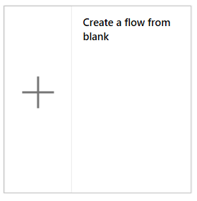
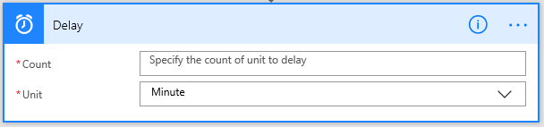

# Akışları bir zamanlamaya göre çalıştırma
Bir veya daha fazla görevi gerçekleştiren (örneğin e-postayla rapor gönderme) bir akış oluşturma:

* günde, saatte veya dakikada bir kez
* belirttiğiniz bir tarihte
* belirttiğiniz sayıda gün, saat veya dakika geçtikten sonra

## Yinelenen akış oluşturma
1. [Microsoft Flow](https://flow.microsoft.com)’da oturum açın ve üst gezinti çubuğunda bulunan **Akışlarım**’ı seçin.
   
    
2. **Boş akış oluştur**’u seçin.
   
    
3. **Tüm bağlayıcıları ve tetikleyicileri ara** kutusuna **Yinelenme** yazın ve **Zamanlama - Yinelenme**’yi seçin.
   
    
4. **Yinelenme** iletişim kutusunda, akışın ne sıklıkla çalıştırılmasını istediğinizi belirtin.
   
    Örneğin, akışın iki haftada bir çalıştırılmasını istiyorsanız **Aralık** için **2** seçeneğini ve **Sıklık** için **Hafta** seçeneğini belirtin.
   
    

## Gelişmiş seçenekleri belirtme
1. Önceki bölümdeki adımları izleyin ve **Gelişmiş seçenekleri göster**’i seçin.
   
    **Not**: Bu seçenekler **Aralık** ve **Sıklık** için ayarlanan değerlere göre değişir. Ekranınız aşağıdaki grafikle eşleşmiyorsa, **Aralık** ve **Sıklık** öğelerinin grafikte gösterilen değerlerle eşleştiğinden emin olun.
2. **Başlangıç saatinin** yerel bir saat dilimini, Evrensel Eşgüdümlü Saati (UTC) vb. yansıtıp yansıtmayacağını belirtmek için bir **Saat dilimi** seçin.
3. Aşağıdaki biçimde bir **Başlangıç saati** belirtin:
    YYYY-MM-DDTHH:MM:SSZ
4. **Sıklık** bölümünde **Gün** seçeneğini belirttiyseniz, akışın günün hangi saatinde çalıştırılacağını belirtin.
5. **Sıklık** bölümünde **Hafta** seçeneğini belirttiyseniz, akışın haftanın hangi gününde veya günlerinde ve günün hangi saatinde veya saatlerinde çalıştırılacağını belirtin.
   
    Örneğin, 1 Ocak 2018 Pazartesi tarihinde öğlen saatinden (Pasifik saati) önce başlamayacak bir akış belirtmek ve iki haftada bir Salı günleri 17:30’da (Pasifik saati) akışı çalıştırmak için seçenekleri gösterildiği gibi yapılandırın.
   
    
6. Akışın almasını istediğiniz eylemi veya eylemleri, [Sıfırdan akış oluşturma](get-started-logic-flow.md) bölümünde açıklandığı şekilde ekleyin.

## Bir akışı geciktirme
1. [Microsoft Flow](https://flow.microsoft.com)’da oturum açın ve üst gezinti çubuğunda bulunan **Akışlarım**’ı seçin.
   
    
2. **Boş akış oluştur**’u seçin.
   
    
3. [Sıfırdan akış oluşturma](get-started-logic-flow.md) bölümünde açıklanan şekilde, bir olay belirtin.
4. **Yeni adım**'ı ve ardından **Eylem ekle**'yi seçin.
   
    
5. Eylemler listesinde şunlardan birini yapın:
   
   * **Gecikme**’yi seçin, bir **Sayı** belirtin ve saniye, dakika veya saat gibi bir **Birim** belirleyin.
   * **Geciktir:** öğesini seçin ve ardından bu biçimde bir tarih belirtin. YYYY-MM-DDTHH:MM:SSZ
     
     
     
     

## Daha fazla bilgi

[Gelişmiş seçenekler](https://docs.microsoft.com/azure/connectors/connectors-native-recurrence) ve bunların nasıl yapılandırılacağı hakkında daha fazla bilgi edinin.

