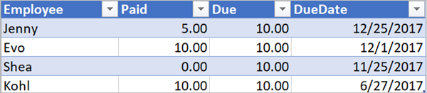

# <a name="use-expressions-in-conditions-to-check-multiple-values"></a>Birden çok değeri denetlemek için koşullarda ifadeleri kullanma
[!INCLUDE [view-pending-approvals](includes/cc-rebrand.md)]
Bu kılavuzda, **Gelişmiş modda**birden çok değeri karşılaştırmak için Ifadeleri ve **Koşulları** kullanmayı öğreneceksiniz.

Bir akış oluşturduğunuzda, tek bir değeri başka bir değerle hızlıca karşılaştırmak için temel moddaki [**koşul**](add-condition.md#add-a-condition) kartını kullanabilirsiniz. Ancak, birden çok değeri karşılaştırmanız gerektiğinde zaman vardır. Örneğin, bir elektronik tablodaki veya veritabanı tablosundaki birkaç sütunun değerini denetlemek isteyebilirsiniz.

Koşullarınız içinde aşağıdaki mantıksal ifadelerin herhangi bir birleşimini kullanabilirsiniz.

ifadesini|Açıklaması|Örneğinde
--------|-----------|-------
|['](#use-the-and-expression)|İki bağımsız değişken alır ve her iki değer de true olduğunda true değerini döndürür.<br><b>Note</b>: her iki bağımsız değişken de Boole olmalıdır.|Bu ifade yanlış değerini döndürür: <br>ve (daha büyük (1, 10), eşittir (0, 0))
|[veya](#use-the-or-expression)|İki bağımsız değişken alır ve bağımsız değişken true ise true değeri döndürür. <br><b>Note</b>: her iki bağımsız değişken de Boole olmalıdır.|Bu ifade true değerini döndürür:<br>veya (büyük (1, 10), eşittir (0, 0))
|eşittir|İki değer eşitse true değerini döndürür.|Örneğin, parametre1 değeri bir değer ise, bu ifade true değerini döndürür:<br>eşittir (Parametreler (' parametre1 '), ' someValue ')
|[büyüktür](#use-the-less-expression)|İki bağımsız değişkeni alır ve ilk bağımsız değişken ikinci bağımsız değişkenden küçükse true değerini döndürür. <br><b>Note</b>: desteklenen türler Integer, float ve String.|Bu ifade true değerini döndürür:<br>daha az (10100)
|Lessotalals|İki bağımsız değişkeni alır ve ilk bağımsız değişken ikinci bağımsız değişkenden küçük veya ona eşitse true değerini döndürür. <br><b>Note</b>: desteklenen türler Integer, float ve String.|Bu ifade true değerini döndürür:<br>Azaltısallar (10, 10)
|[ilerisi](#use-the-greater-expression)|İki bağımsız değişkeni alır ve ilk bağımsız değişken ikinci bağımsız değişkenden büyükse true değerini döndürür. <br><b>Note</b>: desteklenen türler Integer, float ve String.|Bu ifade yanlış değerini döndürür:<br>daha büyük (10, 10)
|greaterOrEquals|İki bağımsız değişkeni alır ve ilk bağımsız değişken ikinci bağımsız değişkenden büyük veya buna eşitse true değerini döndürür. <br><b>Note</b>: desteklenen türler Integer, float ve String.|Bu ifade yanlış değerini döndürür:<br>greaterOrEquals (10100)
|[olmamalıdır](#use-the-empty-expression)|Nesne, dizi veya dize boşsa true döndürür.|Bu ifade true değerini döndürür:<br>boş (' ')
|Başlatılmadı|Boole değerinin tersini döndürür. |Bu ifade true değerini döndürür:<br>Not (içerir (' 200 Success ', ' Fail '))
|kullandıysanız|İfade true veya false olarak sonuçlanırsa belirli bir değeri döndürür.|Bu ifade "Yes" döndürür:<br>if (eşittir (1, 1), ' Yes ', ' No ')

## <a name="prerequisites"></a>Kaynakları
* Microsoft Flow erişim.
* Bu izlenecek yolda daha sonra açıklanan tabloları içeren bir elektronik tablo. Microsoft Flow, çalışma alanınızı Dropbox veya Microsoft OneDrive gibi bir konuma kaydettiğinizden emin olun.
* Microsoft Office 365 Outlook (Office 365 Outlook 'u kullanırken akışlarınızda desteklenen herhangi bir e-posta hizmetini kullanabilirsiniz.)

## <a name="use-the-or-expression"></a>Or ifadesini kullanın
Bazen bir öğenin değeri Value EA **veya** valueb ise, iş akışınızın bir eylem yapması gerekir. Örneğin, bir elektronik tablo tablosundaki görevlerin durumunu izlemeyebilirsiniz. Tablonun *durum* adlı bir sütunu olduğunu ve *durum* sütunundaki olası değerleri olduğunu varsayalım:

* **dım**
* **engellendiğini**
* **siyse**
* **başlatılmadı**

Aşağıda, elektronik tablonun nasıl görünebileceğini bir örnek verilmiştir:


Önceki elektronik tablo verildiğinde, *tamamlandı* veya *gereksiz*olarak ayarlanmış bir *durum* sütunuyla tüm satırları kaldırmak için Microsoft Flow kullanmak istersiniz.

Flow oluşturalım.

### <a name="start-with-a-blank-flow"></a>Boş bir akış ile başlayın
1. [Microsoft Flow](https://flow.microsoft.com)oturum açın.

    
2. **Akışlarım** sekmesini seçin.

    
3. **Boş oluştur**' u seçin.

    

### <a name="add-a-trigger-to-your-flow"></a>Akışınız için bir tetikleyici ekleme
1. **Zamanlama**araması yapın ve sonra **zamanlama-yinelenme** tetikleyicisini seçin

    
2. Zamanlamayı her gün çalışacak şekilde ayarlayın.

    

### <a name="select-the-spreadsheet-and-get-all-rows"></a>Elektronik tabloyu seçin ve tüm satırları al
1. **Eylem eklemek** > **yeni adım** ' ı seçin.

    
2. **Satırları**arayın ve sonra **Excel-satırları al**' ı seçin.

    Note: kullanmakta olduğunuz elektronik tabloya karşılık gelen "satırları al" eylemini seçin. Örneğin, Google sayfaları kullanıyorsanız **Google sayfaları-satırları al**' ı seçin.

    
3. **Dosya adı** kutusunda klasör simgesini seçin, öğesine gidin ve ardından verilerinizi içeren elektronik tabloyu seçin.

    
4. **Tablo adı** listesinden verilerinizi içeren tabloyu seçin.

    

### <a name="check-the-status-column-of-each-row"></a>Her satırın durum sütununu denetleyin
1. **Yeni adım** > **daha fazlasını** seçin > **her birine Uygula**' yı ekleyin.

    
2. **Değer** belirtecini **önceki adımlardan bir çıkış seçin** kutusuna ekleyin.

    
3. **Gelişmiş modda düzenle** > **Koşul Ekle** ' yi seçin.
4. Aşağıdaki **veya** ifadesini ekleyin. Bu **veya** ifade, tablodaki her satırın değerini denetler (bir satır bir ifadede erişildiğinde öğe olarak bilinir). **Durum** sütununun değeri *tamamlanırsa* **veya** *gereksiz*ise, **veya** ifadesi "true" olarak değerlendirilir.

    **Or** ifadesi burada gösterildiği gibi görünür:

    ````@or(equals(item()?['status'], 'unnecessary'), equals(item()?['status'], 'completed'))````

    **Koşul** kartınız şu resme benzer:

    

### <a name="delete-matching-rows-from-the-spreadsheet"></a>Elektronik tablodan eşleşen satırları sil
1. Evet Ise **Eylem Ekle** **' yi SEÇIN, koşulun hiçbir şey yapmayın** .
2. **Satırı sil**' i arayın ve sonra **Excel-satırı sil**' i seçin.

    
3. **Dosya adı** kutusunda, öğesini arayın ve silmek istediğiniz verileri içeren elektronik tablo dosyasını seçin.
4. **Tablo adı** listesinde, verilerinizi içeren tabloyu seçin.
5. **Satır kimliği kutusunda** **satır kimliği** simgesine yerleştirin.

    

### <a name="name-the-flow-and-save-it"></a>Akışı adlandırın ve kaydedin
1. Akışınıza bir ad verin ve ardından **akış oluştur** düğmesini seçin.

    

### <a name="run-the-flow-with-the-or-expression"></a>Akışı veya ifadesiyle çalıştırma
Akış kaydettikten sonra çalışır. Bu izlenecek yolda daha önce gösterilen elektronik tabloyu oluşturduysanız, çalıştırma tamamlandıktan sonra şöyle görünür:


Durum sütununda "tamamlandı" veya "gereksiz" olan satırlardan tüm verilerin silindiğini görürsünüz.

## <a name="use-the-and-expression"></a>Ve ifadesini kullanın
İki sütunlu bir elektronik tablo tablonuz olduğunu varsayalım. Sütun adları durum ve atandı ' dir. Durum sütununun değeri "engellendi" ise ve atanan sütunun değeri "John merak" ise, tüm satırları silmek istediğinizi de varsayın.  Bu görevi gerçekleştirmek için bu kılavuzda daha önce açıklanan tüm adımları izleyin, ancak **koşul** kartını gelişmiş modda düzenlerken burada gösterilen **ve** ifadesini kullanın:

````@and(equals(item()?['Status'], 'blocked'), equals(item()?['Assigned'], 'John Wonder'))````

**Koşul** kartınız şu resme benzer:


### <a name="run-the-flow-with-the-and-expression"></a>Akışı ve ifadesiyle çalıştırma
Daha sonra, elektronik tablonuz şu resme benzer şekilde görünür:


Akışınız çalıştıktan sonra, elektronik tablonuz şu resme benzer şekilde görünür:


## <a name="use-the-empty-expression"></a>Boş ifadeyi kullan
Artık elektronik tabloda birkaç boş satır olduğuna dikkat edin. Bunları kaldırmak için, atanan ve durum sütunlarında metin olmayan tüm satırları tanımlamak üzere **boş** ifadeyi kullanın.

Bu görevi gerçekleştirmek için bu kılavuzda daha önce verilen **ve Expression bölümünü kullanın** bölümünde listelenen tüm adımları izleyin, ancak **koşul** kartını gelişmiş modda düzenlediğinizde, boş ifadeyi bu şekilde kullanın:

````@and(empty(item()?['Status']), empty(item()?['Assigned']))````

**Koşul** kartınız şu resme benzer:


Akışınız çalıştıktan sonra, elektronik tablo şu resme benzer şekilde görünür:


Daha fazla satır tablodan kaldırılır.

## <a name="use-the-greater-expression"></a>Daha büyük ifadeyi kullanın
İş arkadaşlarınız için bez bileti satın aldığınızı ve her bir kişi tarafından geri olduğunuzdan emin olmak için bir elektronik tablo kullandığınızı düşünün. Tam miktarı ödememiş olan her kişiye günlük bir e-posta gönderen bir akışı hızlı bir şekilde oluşturabilirsiniz.

Tam miktarı ödememiş çalışanları belirlemek için **daha fazla** ifadeyi kullanın. Daha sonra, tam olarak ödememiş kişilere otomatik olarak kolay bir anımsatıcı e-postası gönderebilirsiniz.

Elektronik tablonun bir görünümü aşağıda verilmiştir:


Bundan sonra miktardan daha az ödememiş olan tüm kişileri tanımlayan **daha büyük** ifadenin uygulanması aşağıda verilmiştir:

````@greater(item()?['Due'], item()?['Paid'])````

## <a name="use-the-less-expression"></a>Daha az ifadeyi kullanın
İş arkadaşlarınız için bir beki bileti satın aldığınızı ve herkesin kabul ettiğindeki tarihe göre her bir kişiye göre geri olduğunuzdan emin olmak için bir elektronik tablo kullandığınızı varsayalım. Geçerli tarihin son tarihten önce bir günden daha az olması durumunda, tam miktarı ödememiş olan her kişiye bir anımsatıcı e-postası gönderen bir akış oluşturabilirsiniz.

Doğrulanan iki koşul olduğundan, **ve** ifadesini **Less** ifadesiyle birlikte kullanın:


|          Doğrulanacak koşul          | kullanılacak ifade |                    Örneğinde                     |
|-----------------------------------------|-------------------|------------------------------------------------|
|   Ödenmesi gereken miktarın tamamı ödensin mi?    |      ilerisi      |   @greater(öğe ()? [' Bitiş '], öğe ()? [' Ücretli '])    |
| Son Tarih bir günden daha az mı? |       büyüktür        | @less(öğe ()? [' DueDate '], addDays (utcNow (), 1)) |

## <a name="combine-the-greater-and-less-expressions-in-an-and-expression"></a>Ve ifadesinde daha büyük ve daha az ifadeleri birleştirin
Tüm tutardan daha az ödenen çalışanları belirlemek için **daha fazla** ifadeyi kullanın ve ödemenin son tarihinin geçerli tarihten bir günden daha az olup olmadığını belirlemek için **daha az** ifadeyi kullanın. Daha sonra, tam olarak ödememiş olan ve son tarih bir günden daha kısa olan bir e-posta göndermek için **e-posta gönder** eylemi yapabilirsiniz.

Elektronik tablo tablosunun bir görünümü aşağıda verilmiştir:



Bu, ve son tarih, geçerli tarihten itibaren tutardan daha az bir günden daha az olan tüm kişileri tanımlayan **ve** ifadesinin uygulanması:

````@and(greater(item()?['Due'], item()?['Paid']), less(item()?['dueDate'], addDays(utcNow(),1)))````

## <a name="use-functions-in-expressions"></a>Deyimlerdeki işlevleri kullanma

Bazı ifadeler, bir akış çalışmaya başladığında henüz mevcut olmayan çalışma zamanı eylemlerinden değerlerini alır. Deyimlerdeki bu değerlere başvurmak veya bunlarla çalışmak için, Iş akışı tanımı dilinin sağladığı işlevleri kullanabilirsiniz. Daha fazla bilgi: [Microsoft Flow Iş akışı tanımlama dili Için işlevler başvurusu](https://docs.microsoft.com/azure/logic-apps/workflow-definition-language-functions-reference)
