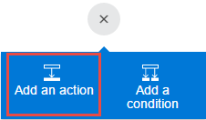

# Microsoft Flow'da onay bekleme
<iframe width="560" height="315" src="https://www.youtube.com/embed/W6oxcYRtW-8?list=PL8nfc9haGeb55I9wL9QnWyHp3ctU2_ThF" frameborder="0" allowfullscreen></iframe>

SharePoint'te öğe oluşturduğunuzda size bir onay e-postası gönderecek ve ardından öğenizin onaylandığını veya reddedildiğini bildirecek bir akış oluşturun. Bu öğreticiyi tam olarak uygulamak için, tetikleyici eylem olarak basit bir SharePoint listesi oluşturun; Dropbox veya OneDrive gibi farklı bir veri kaynağı kullanabilirsiniz.

**Önkoşullar**

* **Title** (Başlık) adlı bir sütunun bulunduğu, **Project Tracker** (Proje İzleyici) adlı basit bir SharePoint Online listesi oluşturun ve **Assigned To** (Atanan) adlı bir Kişi veya Grup sütunu ekleyin.
  
   

## Akışı tetiklemek için bir olay ekleme
1. [flow.microsoft.com](https://flow.microsoft.com)'da üst gezinti çubuğunda bulunan **Akışlarım**'ı ve ardından **Yeni akış oluştur**'u seçin.
   
    
2. **How would you like to start?** (Nasıl başlamak istersiniz?) kutusuna, **new item** (yeni öğe) yazın veya yapıştırın; ardından, **SharePoint Online - Yeni bir öğe oluşturulduğunda**'yı seçin.
   
    
3. İstenirse SharePoint Online'da oturum açın.
4. **Site url** (Site URL'si) altına, listenizin bulunduğu sitenin URL'sini yazın veya yapıştırın.
   
    
5. **List name** (Liste adı) altında, bir liste (örneğin, **Project Tracker** (Proje İzleyici)) seçin.
   
    

## Sonuç eylemini ekleme
1. **+** düğmesini ve ardından **Eylem ekle**'yi seçin.
   
    
2. **Şimdi ne yapmak istiyorsunuz?** kutusuna **e-posta gönder** yazın veya yapıştırın ve ardından **Office 365 Outlook - Onay e-postası gönder**'i seçin.
   
    
3. İstenirse Office 365 Outlook'ta oturum açın.
4. **Kime** alanını seçin ve ardından **Assigned to EMail**'i (Atanan E-posta) seçin.
   
    **Atanan** sütunundaki kullanıcı, öğeyi onaylamak veya reddetmek üzere bir e-posta alır. Akışı test etmek için bir öğe oluşturduğunuzda, bu alanda kendinizi belirtirsiniz. Bu şekilde, öğeyi yalnızca onaylamak veya reddetmekle kalmaz ve bir bildirim e-postası da alırsınız.
   
    **Not**: **Konu** ve **Kullanıcı Seçenekleri** alanlarını, ihtiyaçlarınıza uygun şekilde özelleştirebilirsiniz.
   
    

## Koşul ekleme
1. **+** düğmesini ve ardından **Koşul ekle**'yi seçin.
   
    
2. **Object Name** (Nesne Adı) alanında, **SelectedOption**'ı (Belirtilen Seçenek) seçin.
3. **Value** (Değer) alanına **Approve** (Onayla) yazın veya yapıştırın.
   
    
4. **Evet ise** alanında, **Eylem ekle**'yi seçin.
   
    
5. **Şimdi ne yapmak istiyorsunuz?** kutusuna **e-posta gönder** yazın veya yapıştırın ve ardından **Office 365 Outlook - E-posta gönder**'i seçin.
   
    
6. **Konu** kutusunda bir konu belirtin.
   
    Örneğin, **Assigned To DisplayName**'i (Atanan Görünen Adı) seçip her iki tarafında boşluk olacak şekilde **has approved** (şunu onayladı:) yazın ve ardından **Title**'ı (Başlık) seçin.
7. **Gövde** kutusunda, **Projenin bir sonraki aşamasına geçilebilir** gibi bir e-posta gövdesi belirtin.
8. **Kime** alanına **Created by EMail** (Oluşturan E-posta) gibi bir alıcı girin.
   
    SharePoint listesinde öğeyi oluşturan kullanıcıya, projenin onaylandığı veya reddedildiği bildirilir.
   
    
9. **Hayır ise** alanında, projenin reddedildiğini belirtmek için **Konu** ve **Gövde**'yi değiştirme dışındaki son beş adımı tekrar edin.
   
     

## Akışınızı sonlandırma ve test etme
1. Akışınıza bir ad verin ve ardından **Akış oluştur**'u seçin.
   
     
2. SharePoint listenizde bir öğe oluşturun.
   
    Belirttiğiniz alıcıya bir onay e-postası gönderilir. Alıcı, e-postadaki **Onayla** veya **Reddet** seçeneğini belirlediğinde alıcının yanıtını gösteren bir e-posta alırsınız. 

